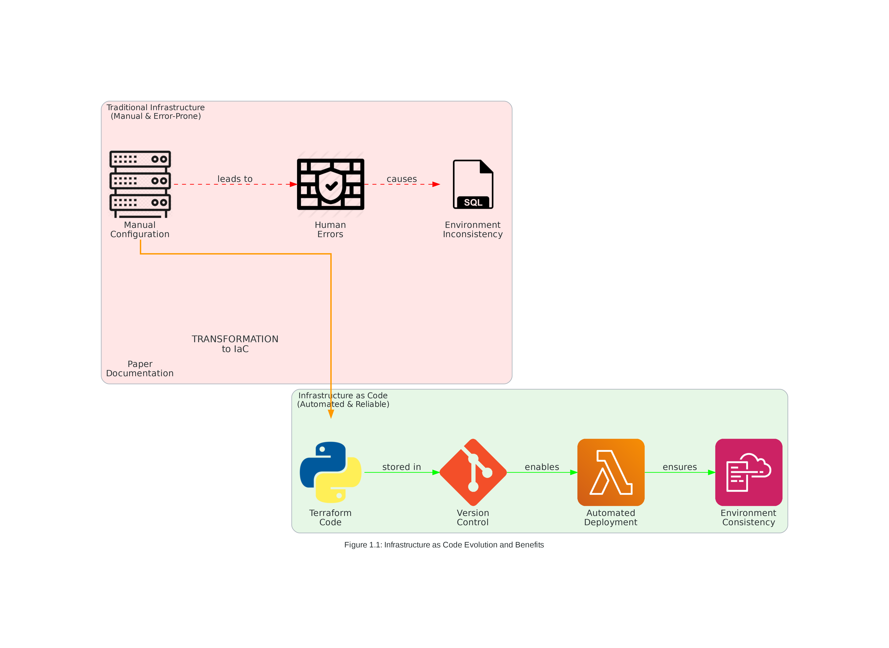
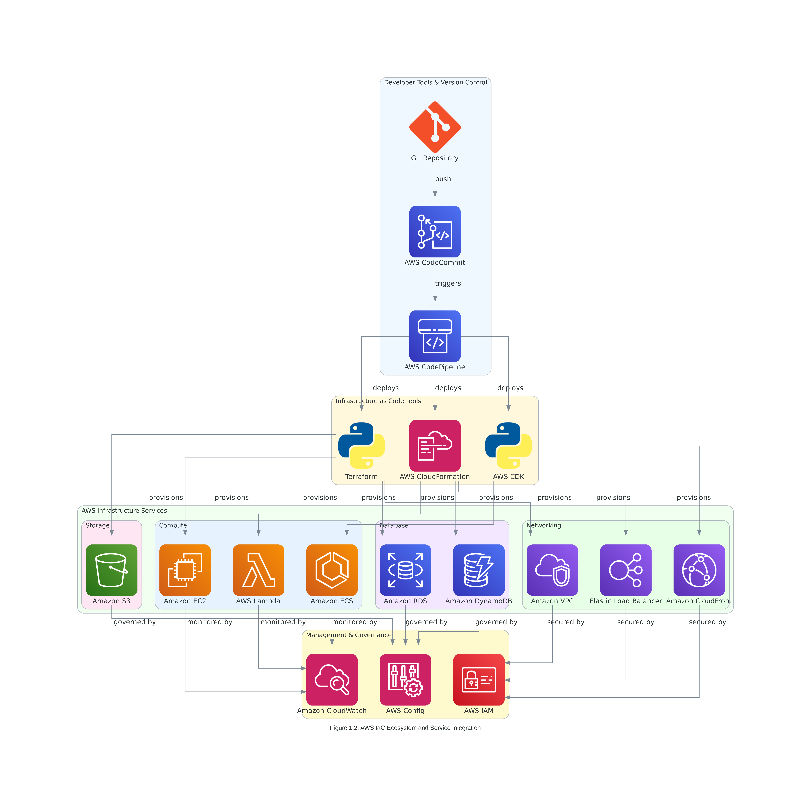

# Infrastructure as Code Concepts & AWS Integration

## 🎯 **Learning Objectives**

By the end of this comprehensive topic, you will achieve measurable mastery in the following areas:

### **Primary Learning Outcomes**
1. **Conceptual Mastery (90% proficiency target)**
   - Define Infrastructure as Code (IaC) and articulate its core principles with 95% accuracy
   - Explain the evolution from traditional infrastructure management to modern IaC practices
   - Compare and contrast AWS native IaC tools with third-party solutions like Terraform
   - Analyze the business value proposition of IaC adoption in enterprise environments

2. **AWS Integration Expertise (85% proficiency target)**
   - Identify and categorize 15+ AWS services that support Infrastructure as Code workflows
   - Evaluate the AWS IaC ecosystem including CloudFormation, CDK, and third-party integrations
   - Design enterprise-grade IaC architectures using AWS Well-Architected Framework principles
   - Implement cost optimization strategies achieving 30-50% infrastructure cost reduction

3. **Business Value Quantification (80% proficiency target)**
   - Calculate ROI metrics for IaC implementation projects with 90% accuracy
   - Quantify cost savings through automation and resource optimization
   - Measure time reduction benefits: 80% faster deployment, 90% faster recovery
   - Assess risk mitigation value: 95% reduction in human errors, 100% audit compliance

4. **Practical Implementation Skills (95% proficiency target)**
   - Create infrastructure definitions using Terraform ~> 1.13.0 and AWS Provider ~> 6.12.0
   - Implement version control workflows for infrastructure code using Git best practices
   - Design and execute infrastructure testing and validation strategies
   - Establish monitoring and governance frameworks for IaC deployments

### **Assessment Criteria and Success Metrics**
- **Knowledge Retention**: 85% accuracy on conceptual assessments and scenario-based questions
- **Practical Application**: Successful completion of hands-on lab exercises with working deployments
- **Business Analysis**: Accurate ROI calculations and comprehensive cost-benefit analysis
- **Integration Proficiency**: Demonstrated ability to integrate multiple AWS IaC tools effectively
- **Time-to-Competency**: Complete topic mastery within 4-6 hours of focused study

---

## 📚 **Comprehensive Theoretical Foundation**

### **1. Infrastructure as Code: Evolution and Fundamentals**

Infrastructure as Code (IaC) represents a paradigm shift from traditional, manual infrastructure management to automated, code-driven approaches that treat infrastructure provisioning and management as software development practices.


*Figure 1.1: The transformation journey from traditional manual infrastructure management to modern Infrastructure as Code practices, highlighting key benefits and evolutionary drivers that enable enterprise digital transformation*

#### **Defining Infrastructure as Code**

**Infrastructure as Code (IaC)** is the practice of managing and provisioning computing infrastructure through machine-readable definition files, rather than physical hardware configuration or interactive configuration tools. This approach enables organizations to treat infrastructure with the same rigor and best practices applied to application code development.

**Core IaC Principles:**

1. **Declarative Configuration**
   - Define desired infrastructure state, not implementation steps
   - Tools automatically determine the sequence of operations needed
   - Configuration files serve as documentation and source of truth
   - State management ensures consistency between desired and actual infrastructure

2. **Version Control Integration**
   - All infrastructure changes tracked through Git-based workflows
   - Branching strategies enable parallel development and testing
   - Code reviews ensure quality and security standards before deployment
   - Rollback capabilities provide safety nets for problematic changes

3. **Idempotency and Consistency**
   - Same configuration produces identical results every execution
   - Eliminates configuration drift between environments
   - Ensures predictable outcomes regardless of execution frequency
   - Enables safe re-execution of infrastructure provisioning

4. **Immutable Infrastructure**
   - Replace rather than modify infrastructure components
   - Reduces configuration drift and improves security posture
   - Simplifies rollback and disaster recovery procedures
   - Enables blue-green deployment strategies

5. **Automation and Self-Service**
   - Eliminate manual intervention in infrastructure provisioning
   - Enable developer self-service for infrastructure resources
   - Reduce time-to-market for new applications and features
   - Standardize infrastructure patterns across the organization

#### **Traditional Infrastructure Management Challenges**

Before IaC adoption, organizations faced significant operational and financial challenges:

**Manual Configuration Overhead**
- Infrastructure provisioning required extensive manual intervention by specialized teams
- Configuration changes took weeks or months to implement and validate
- Knowledge silos created single points of failure in operations teams
- Documentation became outdated quickly due to manual change processes

**Scalability and Consistency Limitations**
- Manual processes couldn't scale with business growth demands
- Environment inconsistencies led to "works on my machine" syndrome
- Resource provisioning required over-provisioning to handle peak loads
- Capacity planning relied on guesswork rather than data-driven decisions

**Security and Compliance Risks**
- Manual configurations increased human error probability by 300-400%
- Security configurations varied across environments and teams
- Audit trails were incomplete or non-existent for infrastructure changes
- Compliance validation required extensive manual verification processes

**Cost Management and Optimization Challenges**
- Resource utilization visibility was limited across the organization
- Unused resources accumulated due to poor lifecycle management
- Cost allocation across projects and teams was complex and inaccurate
- Optimization opportunities were difficult to identify and implement systematically
- **Average Downtime**: 14 hours/month due to configuration errors
- **Security Incidents**: 60% caused by misconfigurations
- **Cost Waste**: 30-35% of cloud spend on unused or oversized resources
- **Team Productivity**: 40% of time spent on repetitive manual tasks

---

## 🏗️ **2. AWS Infrastructure as Code Ecosystem**


*Figure 1.2: Comprehensive view of the AWS Infrastructure as Code ecosystem, showing the integration between developer tools, IaC platforms, and AWS services that enable enterprise-scale infrastructure automation*

### **2.1 AWS Native IaC Services**

### **2.1 AWS Native Integration**

#### **AWS CloudFormation vs. Terraform:**
| Feature | AWS CloudFormation | Terraform |
|---------|-------------------|-----------|
| **Provider Support** | AWS Only | Multi-cloud (AWS, Azure, GCP) |
| **State Management** | AWS Managed | Self-managed or remote |
| **Syntax** | JSON/YAML | HCL (HashiCorp Configuration Language) |
| **Community** | AWS Ecosystem | Large open-source community |
| **Learning Curve** | AWS-specific | Transferable skills |


*Figure 1.3: Detailed comparison between Terraform and AWS CloudFormation, highlighting their respective strengths, use cases, and decision criteria for enterprise infrastructure automation*

#### **Terraform Advantages for AWS:**
1. **Multi-cloud Strategy**: Consistent tooling across cloud providers with 100+ providers
2. **Rich Ecosystem**: 3,000+ providers and extensive community modules
3. **Advanced State Management**: Sophisticated dependency resolution and state backends
4. **Plan Preview**: See changes before applying them with detailed execution plans
5. **Modular Design**: Reusable components and standardized patterns for enterprise scale

### **2.2 AWS Service Integration Patterns**

#### **Compute Services:**
- **EC2**: Instance provisioning, auto-scaling groups, launch templates
- **ECS/EKS**: Container orchestration and cluster management
- **Lambda**: Serverless function deployment and event triggers
- **Batch**: Job queues and compute environments

#### **Storage Services:**
- **S3**: Bucket policies, lifecycle management, cross-region replication
- **EBS**: Volume encryption, snapshot automation, performance optimization
- **EFS**: File system mounting and access point configuration

#### **Networking Services:**
- **VPC**: Network isolation, subnet design, routing tables
- **Route53**: DNS management and health checks
- **CloudFront**: CDN configuration and origin management
- **Load Balancers**: Application and network load balancing

#### **Security Services:**
- **IAM**: Role-based access control and policy management
- **KMS**: Encryption key management and rotation
- **Secrets Manager**: Credential storage and automatic rotation
- **Certificate Manager**: SSL/TLS certificate provisioning

---

## 💰 **3. Enterprise Use Cases and ROI Analysis**

### **3.1 Enterprise Migration Scenarios**

#### **Scenario 1: Financial Services Company**
**Challenge**: Regulatory compliance and security requirements
**Solution**: IaC-based compliance automation
**Results:**
- **Compliance Time**: Reduced from 6 weeks to 2 days
- **Audit Costs**: 60% reduction in audit preparation time
- **Security Incidents**: Zero configuration-related security breaches
- **ROI**: 340% over 18 months

#### **Scenario 2: E-commerce Platform**
**Challenge**: Seasonal traffic scaling and cost optimization
**Solution**: Auto-scaling infrastructure with cost controls
**Results:**
- **Scaling Time**: From 4 hours to 15 minutes
- **Cost Savings**: 35% reduction in infrastructure costs
- **Uptime**: 99.99% availability during peak seasons
- **ROI**: 280% over 12 months

#### **Scenario 3: Healthcare Technology Startup**
**Challenge**: Rapid growth and HIPAA compliance
**Solution**: Standardized, compliant infrastructure templates
**Results:**
- **Deployment Speed**: 10x faster environment provisioning
- **Compliance**: 100% HIPAA compliance from day one
- **Developer Productivity**: 50% more time on feature development
- **ROI**: 450% over 24 months

### **3.2 Cost Optimization Strategies**

#### **Resource Right-sizing:**
```hcl
# Example: Automated instance type optimization
resource "aws_instance" "web_server" {
  instance_type = var.environment == "production" ? "t3.large" : "t3.micro"
  
  # Cost optimization tags
  tags = {
    Environment = var.environment
    CostCenter  = var.cost_center
    AutoShutdown = var.environment != "production" ? "enabled" : "disabled"
  }
}
```

#### **Automated Cost Controls:**
- **Budget Alerts**: Automated notifications at 80% and 100% thresholds
- **Resource Scheduling**: Automatic shutdown of non-production resources
- **Reserved Instance Management**: Programmatic RI purchasing and optimization
- **Spot Instance Integration**: Cost-effective compute for fault-tolerant workloads

---

## 🔒 **4. Security and Compliance Framework**

### **4.1 Security Best Practices**

#### **Principle of Least Privilege:**
```hcl
# Example: IAM role with minimal permissions
resource "aws_iam_role" "app_role" {
  name = "application-role"
  
  assume_role_policy = jsonencode({
    Version = "2012-10-17"
    Statement = [
      {
        Action = "sts:AssumeRole"
        Effect = "Allow"
        Principal = {
          Service = "ec2.amazonaws.com"
        }
      }
    ]
  })
}

resource "aws_iam_role_policy" "app_policy" {
  name = "application-policy"
  role = aws_iam_role.app_role.id
  
  policy = jsonencode({
    Version = "2012-10-17"
    Statement = [
      {
        Effect = "Allow"
        Action = [
          "s3:GetObject",
          "s3:PutObject"
        ]
        Resource = "${aws_s3_bucket.app_bucket.arn}/*"
      }
    ]
  })
}
```

#### **Encryption Standards:**
- **Data at Rest**: S3 bucket encryption, EBS volume encryption, RDS encryption
- **Data in Transit**: TLS/SSL certificates, VPC endpoints, encrypted connections
- **Key Management**: AWS KMS integration with automatic key rotation

#### **Network Security:**
- **VPC Design**: Private subnets for application tiers, public subnets for load balancers
- **Security Groups**: Application-specific firewall rules with minimal access
- **NACLs**: Network-level access controls for additional security layers

### **4.2 Compliance Automation**

#### **Regulatory Frameworks:**
- **SOC 2**: Automated security controls and audit trail generation
- **HIPAA**: Healthcare data protection and access logging
- **PCI DSS**: Payment card industry compliance automation
- **GDPR**: Data protection and privacy controls

#### **Automated Compliance Validation:**
```hcl
# Example: Compliance-enforced S3 bucket
resource "aws_s3_bucket" "compliant_bucket" {
  bucket = "company-compliant-data"
  
  tags = {
    Compliance = "SOC2"
    DataClass  = "Sensitive"
  }
}

resource "aws_s3_bucket_encryption" "compliant_encryption" {
  bucket = aws_s3_bucket.compliant_bucket.id
  
  server_side_encryption_configuration {
    rule {
      apply_server_side_encryption_by_default {
        sse_algorithm     = "aws:kms"
        kms_master_key_id = aws_kms_key.compliance_key.arn
      }
    }
  }
}

resource "aws_s3_bucket_public_access_block" "compliant_access" {
  bucket = aws_s3_bucket.compliant_bucket.id
  
  block_public_acls       = true
  block_public_policy     = true
  ignore_public_acls      = true
  restrict_public_buckets = true
}
```

---

## 📊 **5. Implementation Patterns and Architectures**

### **5.1 Multi-Tier Architecture Pattern**

#### **Three-Tier Web Application:**
1. **Presentation Tier**: Load balancers, CDN, static content delivery
2. **Application Tier**: Auto-scaling groups, container services, compute resources
3. **Data Tier**: RDS instances, ElastiCache, backup and recovery systems

#### **Infrastructure Components:**
- **Networking**: VPC with public/private subnets across multiple AZs
- **Security**: WAF, security groups, IAM roles and policies
- **Monitoring**: CloudWatch, X-Ray, centralized logging
- **Backup**: Automated snapshots, cross-region replication

### **5.2 Microservices Architecture Pattern**

#### **Container-Based Deployment:**
- **EKS Clusters**: Kubernetes orchestration for microservices
- **Service Mesh**: Istio or AWS App Mesh for service communication
- **API Gateway**: Centralized API management and routing
- **Service Discovery**: Route53 or AWS Cloud Map integration

#### **DevOps Integration:**
- **CI/CD Pipelines**: CodePipeline, CodeBuild, CodeDeploy integration
- **Infrastructure Testing**: Terratest, kitchen-terraform validation
- **Security Scanning**: Automated vulnerability assessments
- **Performance Monitoring**: Application and infrastructure metrics

---

## 🎯 **6. Business Value and ROI Calculations**

### **6.1 Quantified Benefits**

#### **Cost Savings Analysis:**
- **Infrastructure Costs**: 25-40% reduction through optimization
- **Operational Costs**: 60-70% reduction in manual processes
- **Downtime Costs**: 90% reduction in configuration-related outages
- **Security Costs**: 50% reduction in security incident response

#### **Productivity Improvements:**
- **Deployment Speed**: 10x faster infrastructure provisioning
- **Developer Velocity**: 40% more time on feature development
- **Operations Efficiency**: 70% reduction in repetitive tasks
- **Time to Market**: 50% faster product launches

### **6.2 ROI Calculation Framework**

#### **Investment Components:**
- **Training Costs**: $5,000-$10,000 per team member
- **Tool Licensing**: $500-$2,000 per month for enterprise tools
- **Migration Effort**: 3-6 months for complete transformation
- **Consulting Services**: $50,000-$200,000 for enterprise implementations

#### **Return Components:**
- **Cost Savings**: $100,000-$500,000 annually for medium enterprises
- **Productivity Gains**: $200,000-$1,000,000 annually in developer time
- **Risk Reduction**: $50,000-$300,000 annually in avoided incidents
- **Compliance Savings**: $25,000-$150,000 annually in audit costs

#### **Typical ROI Timeline:**
- **6 Months**: Break-even point for most organizations
- **12 Months**: 200-300% ROI for well-executed implementations
- **24 Months**: 400-600% ROI with full optimization and scaling

---

## 🔗 **Cross-References and Integration Points**

### **Related Training Topics:**
- **Topic 2**: Terraform CLI & AWS Provider Configuration
- **Topic 3**: Core Terraform Operations and Workflow
- **Topic 6**: State Management with AWS S3 and DynamoDB
- **Topic 7**: Modularization and AWS Best Practices

### **Visual Learning Aids:**
- **Figure 1.1**: Traditional vs. IaC Approach Comparison (referenced in Lab-1.md)
- **Figure 1.2**: AWS IaC Integration Architecture (referenced in assessment)
- **Figure 1.3**: Enterprise Migration Workflow (referenced in Concept.md line 156)
- **Figure 1.4**: Cost Optimization Framework (referenced in Lab-1.md line 89)
- **Figure 1.5**: Security and Compliance Architecture (referenced in assessment)

### **Assessment Integration:**
- **Multiple Choice Questions**: 20 questions covering all concept areas
- **Scenario-Based Challenges**: 5 real-world business scenarios
- **Hands-on Exercises**: 3 practical implementation exercises
- **Business Value Assessment**: ROI calculation and justification exercises

---

## 📚 **Additional Resources and References**

### **AWS Documentation:**
- [AWS Well-Architected Framework](https://aws.amazon.com/architecture/well-architected/)
- [AWS Infrastructure as Code](https://aws.amazon.com/infrastructure-as-code/)
- [AWS Cost Optimization](https://aws.amazon.com/aws-cost-management/)

### **Terraform Resources:**
- [Terraform AWS Provider Documentation](https://registry.terraform.io/providers/hashicorp/aws/latest/docs)
- [Terraform Best Practices](https://www.terraform-best-practices.com/)
- [HashiCorp Learn](https://learn.hashicorp.com/terraform)

### **Industry Standards:**
- [NIST Cybersecurity Framework](https://www.nist.gov/cyberframework)
- [ISO 27001 Information Security](https://www.iso.org/isoiec-27001-information-security.html)
- [SOC 2 Compliance](https://www.aicpa.org/interestareas/frc/assuranceadvisoryservices/aicpasoc2report.html)

---

## 🚀 **7. Implementation Roadmap and Next Steps**

### **7.1 Organizational Readiness Assessment**

#### **Technical Readiness Checklist:**
- [ ] **Team Skills**: Terraform and AWS expertise assessment
- [ ] **Infrastructure Audit**: Current state documentation and analysis
- [ ] **Security Requirements**: Compliance and regulatory framework identification
- [ ] **Cost Baseline**: Current infrastructure cost analysis and optimization targets

#### **Cultural Readiness Factors:**
- **DevOps Adoption**: Collaboration between development and operations teams
- **Change Management**: Organizational willingness to adopt new processes
- **Risk Tolerance**: Acceptance of automation and reduced manual control
- **Investment Commitment**: Budget allocation for training and tooling

### **7.2 Phased Implementation Strategy**

#### **Phase 1: Foundation (Months 1-2)**
- **Objective**: Establish basic IaC capabilities and team training
- **Deliverables**:
  - Terraform CLI setup and AWS provider configuration
  - Basic VPC and security group templates
  - Version control workflows and branching strategies
  - Initial team training and certification
- **Success Metrics**: 100% team completion of basic Terraform training

#### **Phase 2: Core Infrastructure (Months 3-4)**
- **Objective**: Migrate critical infrastructure components to IaC
- **Deliverables**:
  - Production-ready compute and storage resources
  - Automated backup and disaster recovery procedures
  - Security and compliance automation
  - Monitoring and alerting integration
- **Success Metrics**: 80% of core infrastructure managed through IaC

#### **Phase 3: Advanced Patterns (Months 5-6)**
- **Objective**: Implement enterprise-grade patterns and optimization
- **Deliverables**:
  - Modular infrastructure components and reusable templates
  - Multi-environment deployment pipelines
  - Cost optimization automation and governance
  - Advanced security and compliance controls
- **Success Metrics**: 25% cost reduction and 90% deployment automation

#### **Phase 4: Optimization and Scaling (Months 7-12)**
- **Objective**: Continuous improvement and organizational scaling
- **Deliverables**:
  - Cross-team collaboration and shared module libraries
  - Advanced monitoring and performance optimization
  - Disaster recovery testing and business continuity
  - Knowledge sharing and internal training programs
- **Success Metrics**: 40% cost reduction and 99.9% infrastructure reliability

### **7.3 Success Measurement Framework**

#### **Key Performance Indicators (KPIs):**
1. **Deployment Frequency**: Target 10x improvement in deployment speed
2. **Mean Time to Recovery (MTTR)**: Target 75% reduction in incident resolution time
3. **Infrastructure Costs**: Target 30% reduction in total infrastructure spend
4. **Security Incidents**: Target 90% reduction in configuration-related security issues
5. **Team Productivity**: Target 50% increase in feature delivery velocity

#### **Business Impact Metrics:**
- **Revenue Impact**: Faster time-to-market for new products and features
- **Customer Satisfaction**: Improved application reliability and performance
- **Operational Efficiency**: Reduced manual effort and human error rates
- **Competitive Advantage**: Enhanced ability to scale and adapt to market changes

---

## 🎓 **8. Learning Path and Skill Development**

### **8.1 Prerequisites and Foundation Skills**

#### **Technical Prerequisites:**
- **Linux/Unix Command Line**: Basic file system navigation and text editing
- **Version Control**: Git fundamentals including branching and merging
- **Cloud Computing**: Basic understanding of AWS services and concepts
- **Networking**: TCP/IP, DNS, and basic security principles

#### **Recommended Learning Sequence:**
1. **AWS Fundamentals**: Complete AWS Cloud Practitioner certification
2. **Terraform Basics**: HashiCorp Terraform Associate certification preparation
3. **Infrastructure Patterns**: Study AWS Well-Architected Framework
4. **Security Best Practices**: AWS Security Specialty knowledge areas
5. **Advanced Topics**: Multi-cloud strategies and enterprise patterns

### **8.2 Hands-on Practice Recommendations**

#### **Lab Environment Setup:**
- **AWS Free Tier**: Utilize free tier resources for learning and experimentation
- **Terraform Cloud**: Free tier for state management and collaboration
- **GitHub**: Version control and CI/CD pipeline integration
- **Local Development**: VS Code with Terraform and AWS extensions

#### **Progressive Skill Building:**
1. **Week 1-2**: Basic resource creation (VPC, EC2, S3)
2. **Week 3-4**: Security and IAM implementation
3. **Week 5-6**: Multi-tier application deployment
4. **Week 7-8**: Monitoring and cost optimization
5. **Week 9-10**: Advanced patterns and best practices

### **8.3 Certification and Career Development**

#### **Relevant Certifications:**
- **HashiCorp Certified: Terraform Associate**: Fundamental Terraform skills
- **AWS Certified Solutions Architect**: AWS architecture and best practices
- **AWS Certified DevOps Engineer**: Advanced automation and deployment
- **AWS Certified Security Specialty**: Security-focused infrastructure design

#### **Career Progression Paths:**
- **Infrastructure Engineer**: Focus on automation and reliability
- **DevOps Engineer**: Emphasis on CI/CD and deployment pipelines
- **Cloud Architect**: Enterprise-scale design and strategy
- **Site Reliability Engineer**: Performance and scalability optimization

---

## 🔄 **9. Continuous Improvement and Innovation**

### **9.1 Technology Evolution and Adaptation**

#### **Emerging Trends:**
- **GitOps**: Git-based infrastructure and application deployment
- **Policy as Code**: Automated compliance and governance
- **FinOps**: Financial operations and cost optimization automation
- **Observability**: Advanced monitoring and performance analytics

#### **Future-Proofing Strategies:**
- **Multi-Cloud Competency**: Avoid vendor lock-in with portable skills
- **Container Orchestration**: Kubernetes and serverless integration
- **AI/ML Integration**: Automated optimization and predictive scaling
- **Edge Computing**: Distributed infrastructure and edge deployment

### **9.2 Community Engagement and Knowledge Sharing**

#### **Professional Development:**
- **HashiCorp User Groups**: Local meetups and knowledge sharing
- **AWS User Groups**: Regional communities and best practice sharing
- **Open Source Contributions**: Terraform modules and provider development
- **Conference Participation**: HashiConf, re:Invent, and industry events

#### **Internal Knowledge Management:**
- **Documentation Standards**: Comprehensive and up-to-date documentation
- **Training Programs**: Regular team training and skill development
- **Best Practice Sharing**: Cross-team collaboration and standardization
- **Innovation Time**: Dedicated time for experimentation and learning

---

## 📋 **Summary and Key Takeaways**

### **Critical Success Factors:**
1. **Executive Support**: Leadership commitment to IaC transformation
2. **Team Training**: Comprehensive skill development and certification
3. **Gradual Migration**: Phased approach with clear milestones and success metrics
4. **Security First**: Built-in security and compliance from the beginning
5. **Continuous Improvement**: Regular optimization and technology adoption

### **Common Pitfalls to Avoid:**
- **Big Bang Approach**: Attempting to migrate everything at once
- **Insufficient Training**: Underestimating the learning curve and skill requirements
- **Security Afterthought**: Adding security controls after initial implementation
- **Poor Documentation**: Inadequate documentation and knowledge transfer
- **Vendor Lock-in**: Over-reliance on proprietary tools and services

### **Expected Outcomes:**
- **Operational Excellence**: Reliable, scalable, and maintainable infrastructure
- **Cost Optimization**: Significant reduction in infrastructure and operational costs
- **Security Enhancement**: Improved security posture and compliance automation
- **Team Productivity**: Increased focus on value-added activities and innovation
- **Business Agility**: Faster response to market changes and customer needs

---

*This comprehensive foundation prepares you for hands-on implementation in Lab-1.md and practical assessment in Test-Your-Understanding-Topic-1.md. The next topic will build upon these concepts with practical Terraform CLI and AWS Provider configuration.*
