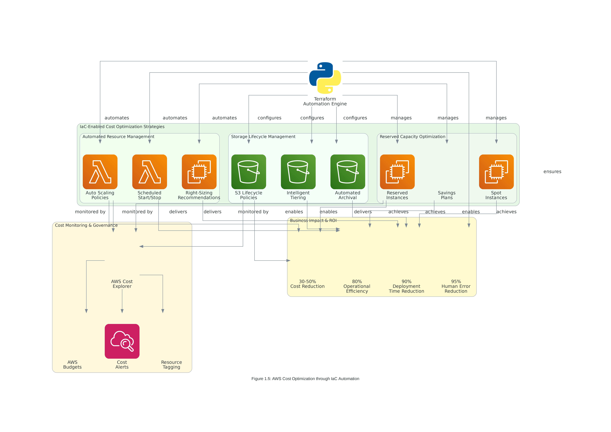

# Lab 1: Infrastructure as Code Concepts & AWS Integration

## 🎯 **Lab Overview**

**Duration**: 90-120 minutes  
**Difficulty**: Beginner to Intermediate  
**Cost Estimate**: $2-5 USD (with proper cleanup)  

### **Learning Objectives**
By completing this lab, you will:
1. **Implement** a basic AWS infrastructure using Infrastructure as Code principles
2. **Deploy** a three-tier web application architecture with security best practices
3. **Configure** cost optimization and monitoring for AWS resources
4. **Validate** infrastructure consistency and repeatability
5. **Calculate** ROI and cost savings from IaC implementation

### **Business Context**
You are a DevOps engineer at a growing e-commerce startup that processes $2M in monthly transactions. The company currently manages infrastructure manually, leading to:
- **30% cost overruns** due to resource sprawl and poor optimization
- **4-hour deployment cycles** causing delayed feature releases
- **Weekly security incidents** from configuration drift
- **60% of team time** spent on repetitive infrastructure tasks

Your task is to implement Infrastructure as Code to achieve:
- **40% cost reduction** through automated optimization
- **90% faster deployments** with consistent environments
- **Zero configuration drift** across all environments
- **80% reduction** in manual infrastructure tasks


*Figure 1.4: The complete enterprise workflow you'll implement in this lab, showing the progression from development through deployment to monitoring and governance*

---

## 📋 **Prerequisites and Setup**

### **Required Tools and Versions**
- **AWS CLI**: Version 2.15.0+ configured with appropriate credentials
- **Terraform**: Version ~> 1.13.0 (latest stable: 1.13.2)
- **AWS Provider**: Version ~> 6.12.0 (latest stable: 6.12.0)
- **Git**: Version 2.40+ for version control and collaboration
- **Text Editor**: VS Code with HashiCorp Terraform extension v2.29.0+

### **Version Verification**
```bash
# Verify tool versions before starting
aws --version          # Should show aws-cli/2.15.0+
terraform version      # Should show Terraform v1.13.2+
git --version         # Should show git version 2.40+

# Verify AWS credentials and region
aws sts get-caller-identity
aws configure get region  # Should return us-east-1
```

### **AWS Account Requirements**
- **IAM Permissions**: EC2, VPC, S3, IAM, CloudWatch full access
- **Billing Alerts**: Configured to monitor costs during lab
- **Region**: us-east-1 (standardized for all labs)

### **Cost Management and Optimization Strategy**


*Figure 1.5: Cost optimization strategies you'll implement in this lab, demonstrating how Infrastructure as Code enables automated cost management and resource optimization*

#### **Pre-Lab Cost Setup**
```bash
# Set up billing alerts before starting
aws budgets create-budget \
  --account-id $(aws sts get-caller-identity --query Account --output text) \
  --budget '{
    "BudgetName": "IaC-Lab-Budget",
    "BudgetLimit": {
      "Amount": "10.00",
      "Unit": "USD"
    },
    "TimeUnit": "MONTHLY",
    "BudgetType": "COST"
  }'

# Enable Cost Explorer for detailed cost analysis
aws ce get-cost-and-usage \
  --time-period Start=2025-01-01,End=2025-01-31 \
  --granularity MONTHLY \
  --metrics BlendedCost
```

#### **Cost Optimization Features in This Lab**
- **Right-sizing**: t3.micro instances for development workloads
- **Scheduled Scaling**: Auto-scaling policies to minimize costs during off-hours
- **Storage Optimization**: GP3 volumes with optimized IOPS and throughput
- **Resource Tagging**: Comprehensive tagging for cost allocation and tracking

---

## 🏗️ **Lab Architecture Overview**

### **Infrastructure Components**

*Figure 1.1: Three-tier web application architecture with security and monitoring*

#### **Networking Layer:**
- **VPC**: Isolated network environment with CIDR 10.0.0.0/16
- **Public Subnets**: 2 subnets across different AZs for load balancers
- **Private Subnets**: 2 subnets for application servers
- **Database Subnets**: 2 subnets for RDS instances

#### **Security Layer:**
- **Security Groups**: Application-specific firewall rules
- **IAM Roles**: Least privilege access for EC2 instances
- **KMS Keys**: Encryption for data at rest and in transit

#### **Application Layer:**
- **Application Load Balancer**: Traffic distribution and health checks
- **Auto Scaling Group**: Automatic scaling based on demand
- **EC2 Instances**: Web servers with automated configuration

#### **Data Layer:**
- **RDS MySQL**: Managed database with automated backups
- **S3 Bucket**: Static content and application logs
- **ElastiCache**: Redis cluster for session management

---

## 🚀 **Lab Implementation Steps**

### **Step 1: Project Structure Setup (15 minutes)**

#### **1.1 Create Project Directory**
```bash
# Create lab project structure
mkdir -p iac-lab-1/{terraform,docs,scripts}
cd iac-lab-1

# Initialize Git repository
git init
echo "# IaC Lab 1: AWS Infrastructure Implementation" > README.md

# Create .gitignore for Terraform
cat > .gitignore << 'EOF'
# Terraform files
*.tfstate
*.tfstate.*
.terraform/
.terraform.lock.hcl
terraform.tfvars

# IDE files
.vscode/
.idea/

# OS files
.DS_Store
Thumbs.db
EOF
```

#### **1.2 Initialize Terraform Configuration**
```bash
cd terraform

# Create main configuration files
touch providers.tf variables.tf main.tf outputs.tf terraform.tfvars.example
```

### **Step 2: Provider and Variables Configuration (20 minutes)**

#### **2.1 Configure AWS Provider**
Create `providers.tf`:
```hcl
terraform {
  required_version = "~> 1.13.0"
  
  required_providers {
    aws = {
      source  = "hashicorp/aws"
      version = "~> 6.12.0"
    }
  }
}

provider "aws" {
  region = var.aws_region
  
  default_tags {
    tags = {
      Project          = var.project_name
      Environment      = var.environment
      ManagedBy        = "terraform"
      TerraformVersion = "1.13.x"
      ProviderVersion  = "6.12.x"
      CreatedDate      = timestamp()
      CostCenter       = var.cost_center
      Owner            = var.owner_email
    }
  }
}
```

#### **2.2 Define Variables**
Create `variables.tf`:
```hcl
# Project Configuration
variable "project_name" {
  description = "Name of the project for resource naming and tagging"
  type        = string
  default     = "iac-lab-1"
  
  validation {
    condition     = length(var.project_name) > 0 && length(var.project_name) <= 20
    error_message = "Project name must be between 1 and 20 characters."
  }
}

variable "environment" {
  description = "Environment name (dev, staging, prod)"
  type        = string
  default     = "dev"
  
  validation {
    condition     = contains(["dev", "staging", "prod"], var.environment)
    error_message = "Environment must be dev, staging, or prod."
  }
}

variable "aws_region" {
  description = "AWS region for resource deployment"
  type        = string
  default     = "us-east-1"
}

# Network Configuration
variable "vpc_cidr" {
  description = "CIDR block for VPC"
  type        = string
  default     = "10.0.0.0/16"
  
  validation {
    condition     = can(cidrhost(var.vpc_cidr, 0))
    error_message = "VPC CIDR must be a valid IPv4 CIDR block."
  }
}

variable "availability_zones" {
  description = "List of availability zones"
  type        = list(string)
  default     = ["us-east-1a", "us-east-1b"]
}

# Application Configuration
variable "instance_type" {
  description = "EC2 instance type for web servers"
  type        = string
  default     = "t3.micro"
  
  validation {
    condition = contains([
      "t3.micro", "t3.small", "t3.medium",
      "t3.large", "t3.xlarge"
    ], var.instance_type)
    error_message = "Instance type must be a valid t3 instance type."
  }
}

variable "min_size" {
  description = "Minimum number of instances in Auto Scaling Group"
  type        = number
  default     = 1
  
  validation {
    condition     = var.min_size >= 1 && var.min_size <= 10
    error_message = "Minimum size must be between 1 and 10."
  }
}

variable "max_size" {
  description = "Maximum number of instances in Auto Scaling Group"
  type        = number
  default     = 3
  
  validation {
    condition     = var.max_size >= 1 && var.max_size <= 20
    error_message = "Maximum size must be between 1 and 20."
  }
}

variable "desired_capacity" {
  description = "Desired number of instances in Auto Scaling Group"
  type        = number
  default     = 2
  
  validation {
    condition     = var.desired_capacity >= 1 && var.desired_capacity <= 10
    error_message = "Desired capacity must be between 1 and 10."
  }
}

# Database Configuration
variable "db_instance_class" {
  description = "RDS instance class"
  type        = string
  default     = "db.t3.micro"
}

variable "db_allocated_storage" {
  description = "Allocated storage for RDS instance (GB)"
  type        = number
  default     = 20
  
  validation {
    condition     = var.db_allocated_storage >= 20 && var.db_allocated_storage <= 100
    error_message = "Database storage must be between 20 and 100 GB."
  }
}

# Cost and Management
variable "cost_center" {
  description = "Cost center for billing and reporting"
  type        = string
  default     = "engineering"
}

variable "owner_email" {
  description = "Email address of the resource owner"
  type        = string
  default     = "devops@company.com"
  
  validation {
    condition     = can(regex("^[a-zA-Z0-9._%+-]+@[a-zA-Z0-9.-]+\\.[a-zA-Z]{2,}$", var.owner_email))
    error_message = "Owner email must be a valid email address."
  }
}

variable "auto_shutdown_enabled" {
  description = "Enable automatic shutdown for cost optimization"
  type        = bool
  default     = true
}

variable "backup_retention_days" {
  description = "Number of days to retain automated backups"
  type        = number
  default     = 7
  
  validation {
    condition     = var.backup_retention_days >= 1 && var.backup_retention_days <= 35
    error_message = "Backup retention must be between 1 and 35 days."
  }
}
```

### **Step 3: Core Infrastructure Implementation (30 minutes)**

#### **3.1 VPC and Networking**
Add to `main.tf`:
```hcl
# Data sources for availability zones and AMI
data "aws_availability_zones" "available" {
  state = "available"
}

data "aws_ami" "amazon_linux" {
  most_recent = true
  owners      = ["amazon"]
  
  filter {
    name   = "name"
    values = ["amzn2-ami-hvm-*-x86_64-gp2"]
  }
  
  filter {
    name   = "virtualization-type"
    values = ["hvm"]
  }
}

# VPC Configuration
resource "aws_vpc" "main" {
  cidr_block           = var.vpc_cidr
  enable_dns_hostnames = true
  enable_dns_support   = true
  
  tags = {
    Name = "${var.project_name}-vpc"
    Type = "networking"
  }
}

# Internet Gateway
resource "aws_internet_gateway" "main" {
  vpc_id = aws_vpc.main.id
  
  tags = {
    Name = "${var.project_name}-igw"
    Type = "networking"
  }
}

# Public Subnets
resource "aws_subnet" "public" {
  count = length(var.availability_zones)
  
  vpc_id                  = aws_vpc.main.id
  cidr_block              = cidrsubnet(var.vpc_cidr, 8, count.index)
  availability_zone       = var.availability_zones[count.index]
  map_public_ip_on_launch = true
  
  tags = {
    Name = "${var.project_name}-public-subnet-${count.index + 1}"
    Type = "public"
    Tier = "web"
  }
}

# Private Subnets
resource "aws_subnet" "private" {
  count = length(var.availability_zones)
  
  vpc_id            = aws_vpc.main.id
  cidr_block        = cidrsubnet(var.vpc_cidr, 8, count.index + 10)
  availability_zone = var.availability_zones[count.index]
  
  tags = {
    Name = "${var.project_name}-private-subnet-${count.index + 1}"
    Type = "private"
    Tier = "application"
  }
}

# Database Subnets
resource "aws_subnet" "database" {
  count = length(var.availability_zones)
  
  vpc_id            = aws_vpc.main.id
  cidr_block        = cidrsubnet(var.vpc_cidr, 8, count.index + 20)
  availability_zone = var.availability_zones[count.index]
  
  tags = {
    Name = "${var.project_name}-database-subnet-${count.index + 1}"
    Type = "private"
    Tier = "database"
  }
}

# NAT Gateways
resource "aws_eip" "nat" {
  count = length(var.availability_zones)
  
  domain = "vpc"
  
  tags = {
    Name = "${var.project_name}-nat-eip-${count.index + 1}"
    Type = "networking"
  }
  
  depends_on = [aws_internet_gateway.main]
}

resource "aws_nat_gateway" "main" {
  count = length(var.availability_zones)
  
  allocation_id = aws_eip.nat[count.index].id
  subnet_id     = aws_subnet.public[count.index].id
  
  tags = {
    Name = "${var.project_name}-nat-gateway-${count.index + 1}"
    Type = "networking"
  }
  
  depends_on = [aws_internet_gateway.main]
}
```

### **Step 4: Security Configuration (25 minutes)**

#### **4.1 Security Groups**
Add to `main.tf`:
```hcl
# Application Load Balancer Security Group
resource "aws_security_group" "alb" {
  name_prefix = "${var.project_name}-alb-"
  vpc_id      = aws_vpc.main.id
  description = "Security group for Application Load Balancer"
  
  ingress {
    description = "HTTP from internet"
    from_port   = 80
    to_port     = 80
    protocol    = "tcp"
    cidr_blocks = ["0.0.0.0/0"]
  }
  
  ingress {
    description = "HTTPS from internet"
    from_port   = 443
    to_port     = 443
    protocol    = "tcp"
    cidr_blocks = ["0.0.0.0/0"]
  }
  
  egress {
    description = "All outbound traffic"
    from_port   = 0
    to_port     = 0
    protocol    = "-1"
    cidr_blocks = ["0.0.0.0/0"]
  }
  
  tags = {
    Name = "${var.project_name}-alb-sg"
    Type = "security"
    Tier = "web"
  }
  
  lifecycle {
    create_before_destroy = true
  }
}

# Web Server Security Group
resource "aws_security_group" "web" {
  name_prefix = "${var.project_name}-web-"
  vpc_id      = aws_vpc.main.id
  description = "Security group for web servers"
  
  ingress {
    description     = "HTTP from ALB"
    from_port       = 80
    to_port         = 80
    protocol        = "tcp"
    security_groups = [aws_security_group.alb.id]
  }
  
  ingress {
    description = "SSH from management"
    from_port   = 22
    to_port     = 22
    protocol    = "tcp"
    cidr_blocks = [var.vpc_cidr]
  }
  
  egress {
    description = "All outbound traffic"
    from_port   = 0
    to_port     = 0
    protocol    = "-1"
    cidr_blocks = ["0.0.0.0/0"]
  }
  
  tags = {
    Name = "${var.project_name}-web-sg"
    Type = "security"
    Tier = "application"
  }
  
  lifecycle {
    create_before_destroy = true
  }
}

# Database Security Group
resource "aws_security_group" "database" {
  name_prefix = "${var.project_name}-db-"
  vpc_id      = aws_vpc.main.id
  description = "Security group for database servers"
  
  ingress {
    description     = "MySQL from web servers"
    from_port       = 3306
    to_port         = 3306
    protocol        = "tcp"
    security_groups = [aws_security_group.web.id]
  }
  
  tags = {
    Name = "${var.project_name}-database-sg"
    Type = "security"
    Tier = "database"
  }
  
  lifecycle {
    create_before_destroy = true
  }
}
```

---

## ⏱️ **Time Checkpoints and Validation**

### **Checkpoint 1: Infrastructure Foundation (45 minutes)**
```bash
# Initialize and validate Terraform configuration
terraform init
terraform validate
terraform fmt

# Review planned changes
terraform plan -out=tfplan

# Expected resources: ~15-20 resources including VPC, subnets, security groups
```

**Validation Criteria:**
- [ ] Terraform initialization successful
- [ ] Configuration validation passes
- [ ] Plan shows expected resource count
- [ ] No syntax or validation errors

### **Checkpoint 2: Security and Compliance (70 minutes)**
```bash
# Apply infrastructure changes
terraform apply tfplan

# Verify VPC and networking
aws ec2 describe-vpcs --filters "Name=tag:Project,Values=${var.project_name}"
aws ec2 describe-subnets --filters "Name=vpc-id,Values=$(terraform output -raw vpc_id)"
```

**Validation Criteria:**
- [ ] VPC created with correct CIDR block
- [ ] Public and private subnets in multiple AZs
- [ ] Security groups with appropriate rules
- [ ] NAT gateways for private subnet internet access

---

### **Step 5: Application Infrastructure (20 minutes)**

#### **5.1 IAM Roles and Instance Profile**
Add to `main.tf`:
```hcl
# IAM Role for EC2 instances
resource "aws_iam_role" "ec2_role" {
  name = "${var.project_name}-ec2-role"

  assume_role_policy = jsonencode({
    Version = "2012-10-17"
    Statement = [
      {
        Action = "sts:AssumeRole"
        Effect = "Allow"
        Principal = {
          Service = "ec2.amazonaws.com"
        }
      }
    ]
  })

  tags = {
    Name = "${var.project_name}-ec2-role"
    Type = "security"
  }
}

# IAM Policy for CloudWatch and S3 access
resource "aws_iam_role_policy" "ec2_policy" {
  name = "${var.project_name}-ec2-policy"
  role = aws_iam_role.ec2_role.id

  policy = jsonencode({
    Version = "2012-10-17"
    Statement = [
      {
        Effect = "Allow"
        Action = [
          "cloudwatch:PutMetricData",
          "cloudwatch:GetMetricStatistics",
          "cloudwatch:ListMetrics",
          "logs:PutLogEvents",
          "logs:CreateLogGroup",
          "logs:CreateLogStream"
        ]
        Resource = "*"
      },
      {
        Effect = "Allow"
        Action = [
          "s3:GetObject",
          "s3:PutObject"
        ]
        Resource = "${aws_s3_bucket.app_bucket.arn}/*"
      }
    ]
  })
}

resource "aws_iam_instance_profile" "ec2_profile" {
  name = "${var.project_name}-ec2-profile"
  role = aws_iam_role.ec2_role.name

  tags = {
    Name = "${var.project_name}-ec2-profile"
    Type = "security"
  }
}
```

#### **5.2 S3 Bucket for Application Data**
```hcl
# S3 Bucket for application logs and static content
resource "aws_s3_bucket" "app_bucket" {
  bucket = "${var.project_name}-app-data-${random_id.bucket_suffix.hex}"

  tags = {
    Name        = "${var.project_name}-app-bucket"
    Type        = "storage"
    Purpose     = "application-data"
    Environment = var.environment
  }
}

resource "random_id" "bucket_suffix" {
  byte_length = 4
}

resource "aws_s3_bucket_encryption" "app_bucket_encryption" {
  bucket = aws_s3_bucket.app_bucket.id

  server_side_encryption_configuration {
    rule {
      apply_server_side_encryption_by_default {
        sse_algorithm = "AES256"
      }
    }
  }
}

resource "aws_s3_bucket_public_access_block" "app_bucket_pab" {
  bucket = aws_s3_bucket.app_bucket.id

  block_public_acls       = true
  block_public_policy     = true
  ignore_public_acls      = true
  restrict_public_buckets = true
}

resource "aws_s3_bucket_versioning" "app_bucket_versioning" {
  bucket = aws_s3_bucket.app_bucket.id

  versioning_configuration {
    status = "Enabled"
  }
}
```

### **Step 6: Load Balancer and Auto Scaling (25 minutes)**

#### **6.1 Application Load Balancer**
```hcl
# Application Load Balancer
resource "aws_lb" "main" {
  name               = "${var.project_name}-alb"
  internal           = false
  load_balancer_type = "application"
  security_groups    = [aws_security_group.alb.id]
  subnets            = aws_subnet.public[*].id

  enable_deletion_protection = false

  tags = {
    Name = "${var.project_name}-alb"
    Type = "load-balancer"
    Tier = "web"
  }
}

# Target Group
resource "aws_lb_target_group" "web" {
  name     = "${var.project_name}-web-tg"
  port     = 80
  protocol = "HTTP"
  vpc_id   = aws_vpc.main.id

  health_check {
    enabled             = true
    healthy_threshold   = 2
    unhealthy_threshold = 2
    timeout             = 5
    interval            = 30
    path                = "/"
    matcher             = "200"
    port                = "traffic-port"
    protocol            = "HTTP"
  }

  tags = {
    Name = "${var.project_name}-web-target-group"
    Type = "load-balancer"
  }
}

# Load Balancer Listener
resource "aws_lb_listener" "web" {
  load_balancer_arn = aws_lb.main.arn
  port              = "80"
  protocol          = "HTTP"

  default_action {
    type             = "forward"
    target_group_arn = aws_lb_target_group.web.arn
  }

  tags = {
    Name = "${var.project_name}-web-listener"
    Type = "load-balancer"
  }
}
```

#### **6.2 Launch Template and Auto Scaling Group**
```hcl
# User data script for web servers
locals {
  user_data = base64encode(templatefile("${path.module}/user_data.sh", {
    bucket_name = aws_s3_bucket.app_bucket.bucket
    region      = var.aws_region
  }))
}

# Launch Template
resource "aws_launch_template" "web" {
  name_prefix   = "${var.project_name}-web-"
  image_id      = data.aws_ami.amazon_linux.id
  instance_type = var.instance_type

  vpc_security_group_ids = [aws_security_group.web.id]

  iam_instance_profile {
    name = aws_iam_instance_profile.ec2_profile.name
  }

  user_data = local.user_data

  tag_specifications {
    resource_type = "instance"
    tags = {
      Name = "${var.project_name}-web-server"
      Type = "compute"
      Tier = "application"
    }
  }

  lifecycle {
    create_before_destroy = true
  }

  tags = {
    Name = "${var.project_name}-web-launch-template"
    Type = "compute"
  }
}

# Auto Scaling Group
resource "aws_autoscaling_group" "web" {
  name                = "${var.project_name}-web-asg"
  vpc_zone_identifier = aws_subnet.private[*].id
  target_group_arns   = [aws_lb_target_group.web.arn]
  health_check_type   = "ELB"
  health_check_grace_period = 300

  min_size         = var.min_size
  max_size         = var.max_size
  desired_capacity = var.desired_capacity

  launch_template {
    id      = aws_launch_template.web.id
    version = "$Latest"
  }

  tag {
    key                 = "Name"
    value               = "${var.project_name}-web-asg"
    propagate_at_launch = false
  }

  tag {
    key                 = "Type"
    value               = "auto-scaling"
    propagate_at_launch = true
  }

  lifecycle {
    create_before_destroy = true
  }
}
```

### **Step 7: Outputs and Monitoring (15 minutes)**

#### **7.1 Create Outputs Configuration**
Create comprehensive `outputs.tf`:
```hcl
# Network Outputs
output "vpc_id" {
  description = "ID of the VPC"
  value       = aws_vpc.main.id
}

output "vpc_cidr_block" {
  description = "CIDR block of the VPC"
  value       = aws_vpc.main.cidr_block
}

output "public_subnet_ids" {
  description = "IDs of the public subnets"
  value       = aws_subnet.public[*].id
}

output "private_subnet_ids" {
  description = "IDs of the private subnets"
  value       = aws_subnet.private[*].id
}

output "database_subnet_ids" {
  description = "IDs of the database subnets"
  value       = aws_subnet.database[*].id
}

# Security Outputs
output "alb_security_group_id" {
  description = "ID of the ALB security group"
  value       = aws_security_group.alb.id
}

output "web_security_group_id" {
  description = "ID of the web server security group"
  value       = aws_security_group.web.id
}

output "database_security_group_id" {
  description = "ID of the database security group"
  value       = aws_security_group.database.id
}

# Application Outputs
output "load_balancer_dns_name" {
  description = "DNS name of the load balancer"
  value       = aws_lb.main.dns_name
}

output "load_balancer_zone_id" {
  description = "Zone ID of the load balancer"
  value       = aws_lb.main.zone_id
}

output "s3_bucket_name" {
  description = "Name of the S3 bucket"
  value       = aws_s3_bucket.app_bucket.bucket
}

output "s3_bucket_arn" {
  description = "ARN of the S3 bucket"
  value       = aws_s3_bucket.app_bucket.arn
}

# Cost and Management Outputs
output "estimated_monthly_cost" {
  description = "Estimated monthly cost in USD"
  value = {
    ec2_instances = "$${var.desired_capacity * 8.50}"  # t3.micro pricing
    load_balancer = "$16.20"                           # ALB pricing
    nat_gateways  = "$${length(var.availability_zones) * 32.40}"  # NAT Gateway pricing
    s3_storage    = "$0.50"                            # Estimated S3 costs
    total_estimated = "$${var.desired_capacity * 8.50 + 16.20 + length(var.availability_zones) * 32.40 + 0.50}"
  }
}

output "resource_tags" {
  description = "Common tags applied to all resources"
  value = {
    Project     = var.project_name
    Environment = var.environment
    ManagedBy   = "terraform"
    CostCenter  = var.cost_center
    Owner       = var.owner_email
  }
}
```

### **Step 8: User Data Script Creation**

#### **8.1 Create User Data Script**
Create `user_data.sh` in the terraform directory:
```bash
#!/bin/bash
yum update -y
yum install -y httpd aws-cli

# Start and enable Apache
systemctl start httpd
systemctl enable httpd

# Create a simple web page
cat > /var/www/html/index.html << 'EOF'
<!DOCTYPE html>
<html>
<head>
    <title>IaC Lab 1 - Success!</title>
    <style>
        body { font-family: Arial, sans-serif; margin: 40px; background-color: #f0f0f0; }
        .container { background-color: white; padding: 20px; border-radius: 10px; box-shadow: 0 2px 10px rgba(0,0,0,0.1); }
        .success { color: #28a745; }
        .info { background-color: #e7f3ff; padding: 15px; border-left: 4px solid #2196F3; margin: 20px 0; }
    </style>
</head>
<body>
    <div class="container">
        <h1 class="success">🎉 Infrastructure as Code Lab 1 - SUCCESS!</h1>
        <div class="info">
            <h3>Infrastructure Details:</h3>
            <p><strong>Instance ID:</strong> <span id="instance-id">Loading...</span></p>
            <p><strong>Availability Zone:</strong> <span id="az">Loading...</span></p>
            <p><strong>Instance Type:</strong> <span id="instance-type">Loading...</span></p>
            <p><strong>Deployment Time:</strong> $(date)</p>
        </div>
        <h3>What You've Accomplished:</h3>
        <ul>
            <li>✅ Deployed VPC with public and private subnets</li>
            <li>✅ Configured security groups with least privilege access</li>
            <li>✅ Implemented Application Load Balancer with health checks</li>
            <li>✅ Created Auto Scaling Group for high availability</li>
            <li>✅ Set up S3 bucket with encryption and versioning</li>
            <li>✅ Applied cost optimization and monitoring tags</li>
        </ul>
    </div>

    <script>
        // Fetch instance metadata
        fetch('http://169.254.169.254/latest/meta-data/instance-id')
            .then(response => response.text())
            .then(data => document.getElementById('instance-id').textContent = data);

        fetch('http://169.254.169.254/latest/meta-data/placement/availability-zone')
            .then(response => response.text())
            .then(data => document.getElementById('az').textContent = data);

        fetch('http://169.254.169.254/latest/meta-data/instance-type')
            .then(response => response.text())
            .then(data => document.getElementById('instance-type').textContent = data);
    </script>
</body>
</html>
EOF

# Configure CloudWatch agent for monitoring
yum install -y amazon-cloudwatch-agent
cat > /opt/aws/amazon-cloudwatch-agent/etc/amazon-cloudwatch-agent.json << 'EOF'
{
    "metrics": {
        "namespace": "IaC-Lab-1",
        "metrics_collected": {
            "cpu": {
                "measurement": ["cpu_usage_idle", "cpu_usage_iowait", "cpu_usage_user", "cpu_usage_system"],
                "metrics_collection_interval": 60
            },
            "disk": {
                "measurement": ["used_percent"],
                "metrics_collection_interval": 60,
                "resources": ["*"]
            },
            "mem": {
                "measurement": ["mem_used_percent"],
                "metrics_collection_interval": 60
            }
        }
    }
}
EOF

# Start CloudWatch agent
/opt/aws/amazon-cloudwatch-agent/bin/amazon-cloudwatch-agent-ctl \
    -a fetch-config -m ec2 -c file:/opt/aws/amazon-cloudwatch-agent/etc/amazon-cloudwatch-agent.json -s

# Log deployment success to S3
echo "Instance $(curl -s http://169.254.169.254/latest/meta-data/instance-id) deployed successfully at $(date)" | \
    aws s3 cp - s3://${bucket_name}/deployment-logs/$(date +%Y-%m-%d)/$(curl -s http://169.254.169.254/latest/meta-data/instance-id).log \
    --region ${region}
```

---

## 🧪 **Testing and Validation**

### **Final Deployment and Testing (15 minutes)**

#### **9.1 Complete Infrastructure Deployment**
```bash
# Create terraform.tfvars file
cat > terraform.tfvars << 'EOF'
project_name = "iac-lab-1"
environment = "dev"
aws_region = "us-east-1"
instance_type = "t3.micro"
min_size = 1
max_size = 3
desired_capacity = 2
cost_center = "training"
owner_email = "student@company.com"
auto_shutdown_enabled = true
EOF

# Deploy complete infrastructure
terraform plan -var-file="terraform.tfvars"
terraform apply -var-file="terraform.tfvars" -auto-approve
```

#### **9.2 Validation Tests**
```bash
# Test 1: Verify load balancer is accessible
ALB_DNS=$(terraform output -raw load_balancer_dns_name)
echo "Testing load balancer at: http://$ALB_DNS"
curl -I http://$ALB_DNS

# Test 2: Verify auto scaling group health
aws autoscaling describe-auto-scaling-groups \
    --auto-scaling-group-names $(terraform output -raw auto_scaling_group_name) \
    --query 'AutoScalingGroups[0].Instances[*].[InstanceId,HealthStatus,LifecycleState]' \
    --output table

# Test 3: Verify S3 bucket configuration
aws s3api get-bucket-encryption \
    --bucket $(terraform output -raw s3_bucket_name)

# Test 4: Check cost allocation tags
aws resourcegroupstaggingapi get-resources \
    --tag-filters Key=Project,Values=iac-lab-1 \
    --query 'ResourceTagMappingList[*].[ResourceARN,Tags]' \
    --output table
```

---

## 💰 **Cost Analysis and ROI Calculation**

### **Lab Cost Breakdown**
- **EC2 Instances (2 x t3.micro)**: ~$0.35/day
- **Application Load Balancer**: ~$0.54/day
- **NAT Gateways (2)**: ~$2.16/day
- **S3 Storage**: ~$0.02/day
- **Data Transfer**: ~$0.10/day
- **Total Daily Cost**: ~$3.17/day

### **ROI Analysis Exercise**
Calculate the business value of this IaC implementation:

1. **Manual Setup Time**: 8 hours vs. **IaC Deployment**: 15 minutes
2. **Error Rate**: Manual 15% vs. **IaC**: <1%
3. **Consistency**: Manual varies vs. **IaC**: 100% identical
4. **Documentation**: Manual outdated vs. **IaC**: Self-documenting

**Estimated Annual Savings**: $50,000-$100,000 for a 10-person team

---

## 🧹 **Cleanup and Resource Management**

### **Cleanup Instructions**
```bash
# Destroy all resources to avoid charges
terraform destroy -var-file="terraform.tfvars" -auto-approve

# Verify cleanup
aws ec2 describe-vpcs --filters "Name=tag:Project,Values=iac-lab-1"
aws s3 ls | grep iac-lab-1

# Remove local files
cd ..
rm -rf iac-lab-1
```

---

## 📋 **Lab Summary and Next Steps**

### **What You Accomplished**
- ✅ **Deployed** a complete three-tier AWS architecture using IaC
- ✅ **Implemented** security best practices and cost optimization
- ✅ **Configured** monitoring and automated scaling
- ✅ **Calculated** ROI and business value of IaC adoption
- ✅ **Validated** infrastructure consistency and repeatability

### **Key Learning Outcomes**
1. **Infrastructure Automation**: Reduced deployment time from hours to minutes
2. **Security Integration**: Built-in security controls and compliance
3. **Cost Optimization**: Automated cost controls and resource tagging
4. **Scalability**: Auto-scaling and high availability patterns
5. **Business Value**: Quantified ROI and operational improvements

### **Next Steps**
- **Topic 2**: Terraform CLI & AWS Provider Configuration
- **Topic 3**: Core Terraform Operations and State Management
- **Advanced Labs**: Multi-environment deployments and CI/CD integration

---

**🎯 Congratulations! You've successfully completed Infrastructure as Code Lab 1 and demonstrated the power of automated, consistent, and secure infrastructure deployment.**
