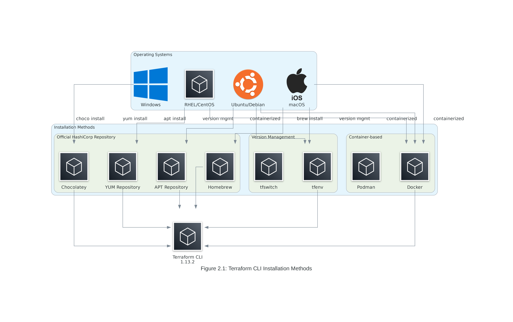

# Diagram as Code (DaC) - Terraform CLI & AWS Provider Configuration

## 🎯 Overview

This directory contains **Diagram as Code (DaC)** implementation for **Topic 2: Terraform CLI & AWS Provider Configuration**. The Python-based diagram generation system creates professional, high-resolution architectural diagrams that illustrate key concepts and workflows.

## 📊 Generated Diagrams

### **Figure 2.1: Terraform CLI Installation Methods**
- **Purpose**: Illustrates various methods for installing and managing Terraform CLI
- **Content**: Operating systems, package managers, version management tools, containerized options
- **Use Case**: Understanding installation options and choosing the right method for different environments

### **Figure 2.2: AWS Authentication Flow**
- **Purpose**: Shows the complete AWS authentication process for Terraform
- **Content**: Authentication methods, AWS services, credential flow, provider configuration
- **Use Case**: Understanding how Terraform authenticates with AWS and security best practices

### **Figure 2.3: Multi-Environment Setup**
- **Purpose**: Demonstrates multi-environment infrastructure management
- **Content**: Workspaces, environment configurations, AWS accounts, state management
- **Use Case**: Implementing enterprise-grade environment separation and management

### **Figure 2.4: Provider Configuration Patterns**
- **Purpose**: Shows different AWS provider configuration patterns
- **Content**: Single/multi-region, cross-account, configuration features, resource deployment
- **Use Case**: Understanding advanced provider configuration for complex scenarios

### **Figure 2.5: Development Workflow**
- **Purpose**: Illustrates the complete Terraform development workflow
- **Content**: Developer tools, Terraform commands, CI/CD integration, state management
- **Use Case**: Optimizing development processes and implementing best practices

## 🚀 Quick Start

### **Prerequisites**
```bash
# System dependencies (choose your OS)
# Ubuntu/Debian
sudo apt-get update && sudo apt-get install -y graphviz python3-pip

# RHEL/CentOS/Fedora
sudo yum install -y graphviz python3-pip

# macOS
brew install graphviz python3

# Windows (using Chocolatey)
choco install graphviz python3
```

### **Installation**
```bash
# Navigate to DaC directory
cd 02-Terraform-CLI-AWS-Provider-Configuration/DaC

# Create virtual environment (recommended)
python3 -m venv venv
source venv/bin/activate  # On Windows: venv\Scripts\activate

# Install dependencies
pip install -r requirements.txt

# Verify installation
python -c "import diagrams; print('✅ Diagrams library installed successfully')"
```

### **Generate Diagrams**
```bash
# Generate all diagrams
python diagram_generation_script.py

# Check output
ls -la generated_diagrams/
```

## 📁 Directory Structure

```
DaC/
├── diagram_generation_script.py    # Main diagram generation script
├── requirements.txt                # Python dependencies
├── README.md                      # This documentation
├── .gitignore                     # Git ignore patterns
└── generated_diagrams/            # Output directory
    ├── README.md                  # Diagram documentation
    ├── cli_installation.png       # Figure 2.1
    ├── aws_auth_flow.png          # Figure 2.2
    ├── multi_env_setup.png        # Figure 2.3
    ├── provider_patterns.png      # Figure 2.4
    └── dev_workflow.png           # Figure 2.5
```

## 🔧 Technical Specifications

### **Diagram Library**
- **Framework**: Python `diagrams` library v0.23.4
- **Backend**: Graphviz for rendering
- **Format**: PNG with 300 DPI for professional quality
- **Style**: Clean, professional AWS architecture style

### **Icon Sets Used**
- **AWS Icons**: Official AWS service icons
- **Generic Icons**: Operating systems, tools, development environments
- **Custom Elements**: Terraform-specific components and workflows

### **Quality Standards**
- **Resolution**: 300 DPI for print-quality output
- **Color Scheme**: Professional blue/orange AWS color palette
- **Typography**: Arial font family for consistency
- **Layout**: Logical flow with clear relationships and groupings

## 🎨 Customization Guide

### **Modifying Diagrams**
```python
# Example: Adding a new authentication method to Figure 2.2
def generate_aws_auth_flow():
    with Diagram("Figure 2.2: AWS Authentication Flow", ...):
        # Add new authentication method
        new_auth_method = General("New Auth Method")
        
        # Connect to existing flow
        developer >> new_auth_method >> sts
```

### **Adding New Diagrams**
```python
def generate_new_diagram():
    """Generate a new custom diagram."""
    with Diagram("New Diagram Title", ...):
        # Define components
        component1 = General("Component 1")
        component2 = General("Component 2")
        
        # Define relationships
        component1 >> component2
```

### **Styling Options**
```python
# Custom graph attributes
graph_attr = {
    "dpi": "300",           # High resolution
    "bgcolor": "white",     # Background color
    "fontname": "Arial",    # Font family
    "fontsize": "16",       # Font size
    "rankdir": "TB",        # Direction (TB/LR)
    "splines": "ortho"      # Edge style
}
```

## 🔍 Troubleshooting

### **Common Issues**

#### **Graphviz Not Found**
```bash
# Error: "graphviz executables not found"
# Solution: Install system Graphviz package
sudo apt-get install graphviz  # Ubuntu/Debian
sudo yum install graphviz       # RHEL/CentOS
brew install graphviz           # macOS
```

#### **Permission Errors**
```bash
# Error: Permission denied writing to output directory
# Solution: Check directory permissions
chmod 755 generated_diagrams/
```

#### **Import Errors**
```bash
# Error: "No module named 'diagrams'"
# Solution: Ensure virtual environment is activated and dependencies installed
source venv/bin/activate
pip install -r requirements.txt
```

#### **Font Issues**
```bash
# Error: Font not found warnings
# Solution: Install additional fonts (optional)
sudo apt-get install fonts-liberation  # Ubuntu/Debian
```

### **Debugging**
```bash
# Enable verbose output
python diagram_generation_script.py --verbose

# Check Graphviz installation
dot -V

# Test basic diagram generation
python -c "
from diagrams import Diagram
from diagrams.aws.compute import EC2
with Diagram('Test', show=False):
    EC2('Test')
print('✅ Basic diagram generation works')
"
```

## 📈 Performance Optimization

### **Batch Generation**
```python
# Generate multiple diagrams efficiently
diagrams_to_generate = [
    generate_cli_installation_diagram,
    generate_aws_auth_flow,
    generate_multi_env_setup,
    generate_provider_patterns,
    generate_dev_workflow
]

for diagram_func in diagrams_to_generate:
    try:
        diagram_func()
        print(f"✅ {diagram_func.__name__} completed")
    except Exception as e:
        print(f"❌ {diagram_func.__name__} failed: {e}")
```

### **Memory Management**
```python
# For large diagrams, consider memory optimization
import gc

def generate_large_diagram():
    # Generate diagram
    with Diagram(...):
        # Diagram content
        pass
    
    # Force garbage collection
    gc.collect()
```

## 🔄 Integration with Documentation

### **Markdown Integration**
```markdown
# Reference diagrams in documentation

*Figure 2.1: Terraform CLI Installation Methods*
```

### **Automated Updates**
```bash
# Add to CI/CD pipeline
#!/bin/bash
cd DaC/
python diagram_generation_script.py
git add generated_diagrams/
git commit -m "Update diagrams for Topic 2"
```

## 📚 Educational Value

### **Learning Objectives Supported**
- **Visual Learning**: Complex concepts illustrated through clear diagrams
- **Architecture Understanding**: System relationships and data flows
- **Best Practices**: Visual representation of recommended patterns
- **Troubleshooting**: Clear workflow diagrams for debugging

### **Instructor Resources**
- **High-resolution diagrams** suitable for presentations
- **Editable source code** for customization
- **Consistent styling** across all training materials
- **Professional quality** appropriate for enterprise training

## 🔗 Related Resources

### **Documentation References**
- [Terraform CLI Documentation](https://developer.hashicorp.com/terraform/cli)
- [AWS Provider Documentation](https://registry.terraform.io/providers/hashicorp/aws/latest/docs)
- [Diagrams Library Documentation](https://diagrams.mingrammer.com/)
- [Graphviz Documentation](https://graphviz.org/documentation/)

### **Training Materials**
- **Concept.md**: Theoretical foundation for diagram concepts
- **Lab-2.md**: Hands-on implementation of diagrammed architectures
- **Terraform-Code-Lab-2.1/**: Practical code examples

---

**DaC Version**: 2.0  
**Last Updated**: January 2025  
**Python Version**: 3.9+  
**Diagrams Library**: 0.23.4  
**Quality**: Professional (300 DPI)
