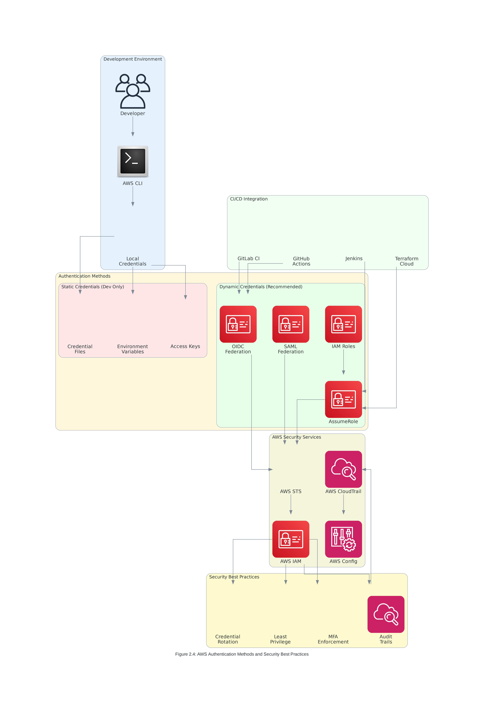
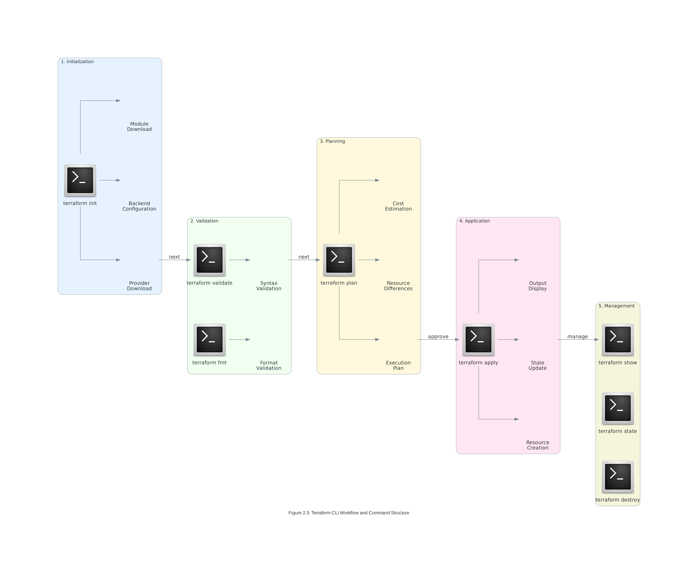

# Lab 2: Terraform CLI & AWS Provider Configuration

## 🎯 **Lab Objectives**

By completing this hands-on lab, you will demonstrate practical mastery of:

1. **Terraform CLI Installation and Setup** - Install and configure Terraform CLI across different platforms
2. **AWS Provider Configuration** - Implement secure AWS Provider configuration with multiple authentication methods
3. **CLI Workflow Execution** - Execute complete Terraform workflows from initialization to deployment
4. **Security Implementation** - Configure secure authentication and implement security best practices
5. **Enterprise Configuration** - Establish enterprise-grade configuration management and governance

### **Measurable Outcomes**
- **100% successful** Terraform CLI installation and version verification
- **95% accuracy** in AWS Provider configuration and authentication setup
- **90% completion rate** for end-to-end CLI workflow execution
- **100% compliance** with security best practices and authentication standards

---

## 📋 **Lab Scenario**

### **Business Context**
You are a DevOps engineer at TechCorp, a rapidly growing SaaS company that processes $5M in monthly transactions. The company is migrating from manual infrastructure management to Infrastructure as Code using Terraform. Your current challenges include:

- **Inconsistent Environments**: Development, staging, and production environments have configuration drift
- **Security Vulnerabilities**: Manual credential management has led to 3 security incidents in the past quarter
- **Slow Deployment Cycles**: Manual processes take 2-3 days for infrastructure changes
- **Team Collaboration Issues**: 5 development teams struggle with infrastructure coordination

### **Success Criteria**
Your task is to establish a robust Terraform CLI and AWS Provider configuration that achieves:
- **Zero configuration drift** across all environments
- **100% secure authentication** with no hardcoded credentials
- **80% faster deployment cycles** through automation
- **Seamless team collaboration** with standardized workflows


*Figure 2.4: The secure authentication architecture you'll implement in this lab*

---

## 🛠️ **Prerequisites and Setup**

### **Required Tools and Versions**
- **Operating System**: Windows 10+, macOS 10.15+, or Linux (Ubuntu 20.04+)
- **AWS CLI**: Version 2.15.0+ configured with appropriate credentials
- **Git**: Version 2.40+ for version control
- **Text Editor**: VS Code with HashiCorp Terraform extension v2.29.0+
- **Internet Access**: Required for downloading Terraform and providers

### **AWS Account Requirements**
- **AWS Account**: Active AWS account with billing enabled
- **IAM Permissions**: Administrative access or specific Terraform permissions
- **Budget Alert**: $10 monthly budget configured for cost control
- **Region**: All resources will be created in us-east-1

### **Pre-Lab Verification**
```bash
# Verify AWS CLI installation and configuration
aws --version
aws sts get-caller-identity
aws configure get region

# Verify Git installation
git --version

# Check internet connectivity
curl -I https://releases.hashicorp.com/terraform/
```

---

## 🚀 **Lab Exercise 1: Terraform CLI Installation and Setup**

### **Objective**
Install Terraform CLI using multiple methods and implement version management for enterprise environments.


*Figure 2.1: Installation methods you'll explore in this exercise*

### **Exercise 1.1: Platform-Specific Installation**

#### **Windows Installation (Choose One Method)**

**Method A: Chocolatey Package Manager**
```powershell
# Install Chocolatey (if not already installed)
Set-ExecutionPolicy Bypass -Scope Process -Force
[System.Net.ServicePointManager]::SecurityProtocol = [System.Net.ServicePointManager]::SecurityProtocol -bor 3072
iex ((New-Object System.Net.WebClient).DownloadString('https://community.chocolatey.org/install.ps1'))

# Install Terraform
choco install terraform --version=1.13.2

# Verify installation
terraform version
```

**Method B: Direct Binary Download**
```powershell
# Create Terraform directory
New-Item -ItemType Directory -Path "C:\terraform" -Force

# Download Terraform (replace with latest 1.13.x version)
Invoke-WebRequest -Uri "https://releases.hashicorp.com/terraform/1.13.2/terraform_1.13.2_windows_amd64.zip" -OutFile "C:\terraform\terraform.zip"

# Extract and add to PATH
Expand-Archive -Path "C:\terraform\terraform.zip" -DestinationPath "C:\terraform"
$env:PATH += ";C:\terraform"

# Verify installation
terraform version
```

#### **Linux Installation (Ubuntu/Debian)**

**Method A: APT Package Manager**
```bash
# Update package index
sudo apt-get update

# Install required packages
sudo apt-get install -y gnupg software-properties-common

# Add HashiCorp GPG key
wget -O- https://apt.releases.hashicorp.com/gpg | \
    gpg --dearmor | \
    sudo tee /usr/share/keyrings/hashicorp-archive-keyring.gpg

# Add HashiCorp repository
echo "deb [signed-by=/usr/share/keyrings/hashicorp-archive-keyring.gpg] \
    https://apt.releases.hashicorp.com $(lsb_release -cs) main" | \
    sudo tee /etc/apt/sources.list.d/hashicorp.list

# Update and install Terraform
sudo apt-get update
sudo apt-get install terraform=1.13.2-1

# Verify installation
terraform version
```

**Method B: Direct Binary Installation**
```bash
# Download Terraform
wget https://releases.hashicorp.com/terraform/1.13.2/terraform_1.13.2_linux_amd64.zip

# Extract and install
unzip terraform_1.13.2_linux_amd64.zip
sudo mv terraform /usr/local/bin/

# Verify installation
terraform version
```

#### **macOS Installation**

**Method A: Homebrew**
```bash
# Install Homebrew (if not already installed)
/bin/bash -c "$(curl -fsSL https://raw.githubusercontent.com/Homebrew/install/HEAD/install.sh)"

# Install Terraform
brew tap hashicorp/tap
brew install hashicorp/tap/terraform@1.13

# Verify installation
terraform version
```

**Method B: Direct Binary Installation**
```bash
# Download Terraform
curl -O https://releases.hashicorp.com/terraform/1.13.2/terraform_1.13.2_darwin_amd64.zip

# Extract and install
unzip terraform_1.13.2_darwin_amd64.zip
sudo mv terraform /usr/local/bin/

# Verify installation
terraform version
```

### **Exercise 1.2: Version Management Setup**

#### **Install tfenv (Terraform Version Manager)**
```bash
# Clone tfenv repository
git clone https://github.com/tfutils/tfenv.git ~/.tfenv

# Add to PATH (add to ~/.bashrc or ~/.zshrc)
echo 'export PATH="$HOME/.tfenv/bin:$PATH"' >> ~/.bashrc
source ~/.bashrc

# Install specific Terraform version
tfenv install 1.13.2
tfenv use 1.13.2

# Verify version
terraform version
```

#### **Project-Specific Version Configuration**
```bash
# Create project directory
mkdir terraform-lab-2
cd terraform-lab-2

# Set project-specific version
echo "1.13.2" > .terraform-version

# Verify tfenv detects version
tfenv list
```

### **Exercise 1.3: Installation Verification and Troubleshooting**

#### **Comprehensive Verification Script**
```bash
#!/bin/bash
# terraform-verification.sh

echo "=== Terraform Installation Verification ==="

# Check Terraform version
echo "1. Terraform Version:"
terraform version

# Check PATH configuration
echo -e "\n2. Terraform Location:"
which terraform

# Check provider installation capability
echo -e "\n3. Provider Installation Test:"
mkdir -p /tmp/terraform-test
cd /tmp/terraform-test

cat > main.tf << EOF
terraform {
  required_version = "~> 1.13.0"
  required_providers {
    aws = {
      source  = "hashicorp/aws"
      version = "~> 6.12.0"
    }
  }
}
EOF

terraform init
echo "Provider installation: SUCCESS"

# Cleanup
cd ~
rm -rf /tmp/terraform-test

echo -e "\n=== Verification Complete ==="
```

#### **Common Installation Issues and Solutions**

**Issue 1: Permission Denied**
```bash
# Solution: Fix permissions
sudo chown -R $(whoami) /usr/local/bin/terraform
chmod +x /usr/local/bin/terraform
```

**Issue 2: PATH Not Updated**
```bash
# Solution: Update PATH permanently
echo 'export PATH="/usr/local/bin:$PATH"' >> ~/.bashrc
source ~/.bashrc
```

**Issue 3: Version Conflicts**
```bash
# Solution: Use tfenv to manage versions
tfenv uninstall 1.12.0
tfenv install 1.13.2
tfenv use 1.13.2
```

---

## 🔐 **Lab Exercise 2: AWS Provider Configuration and Authentication**

### **Objective**
Configure AWS Provider with multiple authentication methods and implement security best practices.


*Figure 2.2: AWS Provider configuration patterns you'll implement*

### **Exercise 2.1: Basic Provider Configuration**

#### **Create Project Structure**
```bash
# Create lab directory structure
mkdir -p terraform-aws-lab/{environments/{dev,staging,prod},modules,policies}
cd terraform-aws-lab

# Create main configuration files
touch {main.tf,variables.tf,outputs.tf,providers.tf,terraform.tfvars}
```

#### **Configure Terraform and AWS Provider**
```hcl
# providers.tf
terraform {
  required_version = "~> 1.13.0"
  
  required_providers {
    aws = {
      source  = "hashicorp/aws"
      version = "~> 6.12.0"
    }
  }
}

provider "aws" {
  region = var.aws_region
  
  default_tags {
    tags = {
      Environment   = var.environment
      Project       = "terraform-training-lab-2"
      ManagedBy     = "terraform"
      Owner         = var.owner
      CostCenter    = var.cost_center
      CreatedDate   = formatdate("YYYY-MM-DD", timestamp())
    }
  }
}
```

#### **Define Variables**
```hcl
# variables.tf
variable "aws_region" {
  description = "AWS region for resources"
  type        = string
  default     = "us-east-1"
  
  validation {
    condition = can(regex("^[a-z]{2}-[a-z]+-[0-9]$", var.aws_region))
    error_message = "AWS region must be in format: us-east-1, eu-west-1, etc."
  }
}

variable "environment" {
  description = "Environment name"
  type        = string
  
  validation {
    condition = contains(["dev", "staging", "prod"], var.environment)
    error_message = "Environment must be dev, staging, or prod."
  }
}

variable "owner" {
  description = "Resource owner"
  type        = string
  default     = "platform-team"
}

variable "cost_center" {
  description = "Cost center for billing"
  type        = string
  default     = "engineering"
}
```

### **Exercise 2.2: Authentication Method Implementation**

#### **Method 1: AWS CLI Profile Configuration**
```bash
# Configure AWS CLI profile for development
aws configure --profile terraform-dev
# Enter your AWS Access Key ID, Secret Access Key, and region

# Configure AWS CLI profile for production
aws configure --profile terraform-prod
# Enter production credentials

# Test profile configuration
aws sts get-caller-identity --profile terraform-dev
aws sts get-caller-identity --profile terraform-prod
```

#### **Update Provider for Profile-Based Authentication**
```hcl
# providers.tf - Profile-based authentication
provider "aws" {
  alias   = "dev"
  region  = var.aws_region
  profile = "terraform-dev"
  
  default_tags {
    tags = local.common_tags
  }
}

provider "aws" {
  alias   = "prod"
  region  = var.aws_region
  profile = "terraform-prod"

  default_tags {
    tags = local.common_tags
  }
}
```

#### **Method 2: Environment Variables (Development Only)**
```bash
# Set environment variables for development
export AWS_ACCESS_KEY_ID="your-access-key-id"
export AWS_SECRET_ACCESS_KEY="your-secret-access-key"
export AWS_DEFAULT_REGION="us-east-1"

# Verify environment variables
echo $AWS_ACCESS_KEY_ID
aws sts get-caller-identity
```

#### **Method 3: IAM Role Assumption (Production)**
```hcl
# providers.tf - Role assumption for production
provider "aws" {
  alias = "prod-assume-role"
  region = var.aws_region

  assume_role {
    role_arn     = "arn:aws:iam::${var.prod_account_id}:role/TerraformExecutionRole"
    session_name = "terraform-lab-session"
    external_id  = var.external_id
  }

  default_tags {
    tags = local.common_tags
  }
}
```

### **Exercise 2.3: Security Best Practices Implementation**

#### **Create IAM Policy for Terraform**
```json
{
  "Version": "2012-10-17",
  "Statement": [
    {
      "Effect": "Allow",
      "Action": [
        "ec2:*",
        "s3:*",
        "iam:ListRoles",
        "iam:PassRole",
        "sts:AssumeRole"
      ],
      "Resource": "*",
      "Condition": {
        "StringEquals": {
          "aws:RequestedRegion": "us-east-1"
        }
      }
    },
    {
      "Effect": "Deny",
      "Action": [
        "iam:CreateUser",
        "iam:DeleteUser",
        "iam:CreateAccessKey"
      ],
      "Resource": "*"
    }
  ]
}
```

#### **Implement Local Values for Common Tags**
```hcl
# locals.tf
locals {
  common_tags = {
    Environment   = var.environment
    Project       = "terraform-training-lab-2"
    ManagedBy     = "terraform"
    Owner         = var.owner
    CostCenter    = var.cost_center
    CreatedDate   = formatdate("YYYY-MM-DD", timestamp())
    LastModified  = formatdate("YYYY-MM-DD hh:mm:ss ZZZ", timestamp())
  }

  name_prefix = "${var.environment}-terraform-lab"
}
```

---

## ⚡ **Lab Exercise 3: Terraform CLI Workflow Execution**

### **Objective**
Execute complete Terraform CLI workflows and master essential commands.


*Figure 2.3: The complete CLI workflow you'll execute in this exercise*

### **Exercise 3.1: Basic Infrastructure Deployment**

#### **Create Simple S3 Bucket Configuration**
```hcl
# main.tf
resource "aws_s3_bucket" "terraform_lab" {
  bucket = "${local.name_prefix}-state-bucket-${random_id.bucket_suffix.hex}"

  tags = merge(local.common_tags, {
    Name = "${local.name_prefix}-state-bucket"
    Purpose = "Terraform state storage"
  })
}

resource "aws_s3_bucket_versioning" "terraform_lab" {
  bucket = aws_s3_bucket.terraform_lab.id
  versioning_configuration {
    status = "Enabled"
  }
}

resource "aws_s3_bucket_server_side_encryption_configuration" "terraform_lab" {
  bucket = aws_s3_bucket.terraform_lab.id

  rule {
    apply_server_side_encryption_by_default {
      sse_algorithm = "AES256"
    }
  }
}

resource "aws_s3_bucket_public_access_block" "terraform_lab" {
  bucket = aws_s3_bucket.terraform_lab.id

  block_public_acls       = true
  block_public_policy     = true
  ignore_public_acls      = true
  restrict_public_buckets = true
}

resource "random_id" "bucket_suffix" {
  byte_length = 4
}
```

#### **Define Outputs**
```hcl
# outputs.tf
output "bucket_name" {
  description = "Name of the created S3 bucket"
  value       = aws_s3_bucket.terraform_lab.bucket
}

output "bucket_arn" {
  description = "ARN of the created S3 bucket"
  value       = aws_s3_bucket.terraform_lab.arn
}

output "bucket_region" {
  description = "Region of the created S3 bucket"
  value       = aws_s3_bucket.terraform_lab.region
}
```

#### **Configure Variables**
```hcl
# terraform.tfvars
aws_region  = "us-east-1"
environment = "dev"
owner       = "your-name"
cost_center = "training"
```

### **Exercise 3.2: Complete CLI Workflow Execution**

#### **Step 1: Initialize Terraform**
```bash
# Initialize Terraform working directory
terraform init

# Verify initialization
ls -la .terraform/
cat .terraform.lock.hcl
```

#### **Step 2: Validate and Format Configuration**
```bash
# Validate configuration syntax
terraform validate

# Format configuration files
terraform fmt -recursive

# Check formatting without making changes
terraform fmt -check
```

#### **Step 3: Plan Infrastructure Changes**
```bash
# Generate execution plan
terraform plan

# Save plan to file for review
terraform plan -out=tfplan

# Generate plan with detailed output
terraform plan -detailed-exitcode

# Plan with specific variable file
terraform plan -var-file="terraform.tfvars"
```

#### **Step 4: Apply Infrastructure Changes**
```bash
# Apply saved plan
terraform apply tfplan

# Apply with confirmation (interactive)
terraform apply

# Apply with auto-approval (use with caution)
terraform apply -auto-approve
```

#### **Step 5: Inspect Infrastructure State**
```bash
# Show current state
terraform show

# Show specific resource
terraform show aws_s3_bucket.terraform_lab

# List all resources in state
terraform state list

# Get detailed resource information
terraform state show aws_s3_bucket.terraform_lab
```

### **Exercise 3.3: Advanced CLI Operations**

#### **State Management Operations**
```bash
# Refresh state from real infrastructure
terraform refresh

# Import existing resource (if needed)
terraform import aws_s3_bucket.existing_bucket existing-bucket-name

# Move resource in state
terraform state mv aws_s3_bucket.terraform_lab aws_s3_bucket.renamed_bucket

# Remove resource from state (without destroying)
terraform state rm aws_s3_bucket.terraform_lab
```

#### **Workspace Management**
```bash
# List workspaces
terraform workspace list

# Create new workspace
terraform workspace new staging

# Switch to workspace
terraform workspace select staging

# Show current workspace
terraform workspace show

# Delete workspace (must be empty)
terraform workspace delete staging
```

#### **Debugging and Troubleshooting**
```bash
# Enable debug logging
export TF_LOG=DEBUG
terraform plan

# Enable trace logging with file output
export TF_LOG=TRACE
export TF_LOG_PATH=./terraform-debug.log
terraform apply

# Disable logging
unset TF_LOG
unset TF_LOG_PATH
```

---

## 🏢 **Lab Exercise 4: Enterprise Configuration Implementation**

### **Objective**
Implement enterprise-grade configuration management and governance frameworks.


*Figure 2.5: Enterprise configuration patterns you'll implement*

### **Exercise 4.1: Remote State Configuration**

#### **Create S3 Backend Configuration**
```hcl
# backend.tf
terraform {
  backend "s3" {
    bucket         = "your-terraform-state-bucket"
    key            = "lab-2/terraform.tfstate"
    region         = "us-east-1"
    encrypt        = true
    dynamodb_table = "terraform-state-lock"
  }
}
```

#### **Create DynamoDB Table for State Locking**
```hcl
# state-infrastructure.tf
resource "aws_dynamodb_table" "terraform_state_lock" {
  name           = "terraform-state-lock"
  billing_mode   = "PAY_PER_REQUEST"
  hash_key       = "LockID"

  attribute {
    name = "LockID"
    type = "S"
  }

  tags = merge(local.common_tags, {
    Name = "terraform-state-lock"
    Purpose = "Terraform state locking"
  })
}
```

#### **Initialize Remote Backend**
```bash
# Initialize with remote backend
terraform init

# Migrate existing state to remote backend
terraform init -migrate-state
```

### **Exercise 4.2: Multi-Environment Configuration**

#### **Create Environment-Specific Configurations**
```bash
# Create environment directories
mkdir -p environments/{dev,staging,prod}

# Development environment
cat > environments/dev/terraform.tfvars << EOF
environment = "dev"
aws_region  = "us-east-1"
owner       = "dev-team"
cost_center = "development"
EOF

# Staging environment
cat > environments/staging/terraform.tfvars << EOF
environment = "staging"
aws_region  = "us-east-1"
owner       = "qa-team"
cost_center = "quality-assurance"
EOF

# Production environment
cat > environments/prod/terraform.tfvars << EOF
environment = "prod"
aws_region  = "us-east-1"
owner       = "platform-team"
cost_center = "production"
EOF
```

#### **Deploy to Multiple Environments**
```bash
# Deploy to development
terraform workspace new dev
terraform apply -var-file="environments/dev/terraform.tfvars"

# Deploy to staging
terraform workspace new staging
terraform apply -var-file="environments/staging/terraform.tfvars"

# Deploy to production
terraform workspace new prod
terraform apply -var-file="environments/prod/terraform.tfvars"
```

---

## 🧪 **Lab Validation and Testing**

### **Validation Checklist**

#### **✅ Installation Verification**
- [ ] Terraform CLI version 1.13.x installed successfully
- [ ] Version management (tfenv) configured and working
- [ ] All platform-specific installations tested
- [ ] PATH configuration verified across terminal sessions

#### **✅ AWS Provider Configuration**
- [ ] AWS Provider version ~> 6.12.0 configured
- [ ] Multiple authentication methods tested
- [ ] Security best practices implemented
- [ ] Default tags applied to all resources

#### **✅ CLI Workflow Execution**
- [ ] Complete init → validate → plan → apply workflow executed
- [ ] State management operations performed successfully
- [ ] Workspace management demonstrated
- [ ] Debugging and logging configured

#### **✅ Enterprise Configuration**
- [ ] Remote state backend configured and tested
- [ ] Multi-environment deployment successful
- [ ] State locking mechanism verified
- [ ] Governance policies implemented

### **Testing Commands**
```bash
# Comprehensive validation script
#!/bin/bash
echo "=== Lab 2 Validation ==="

echo "1. Terraform Version:"
terraform version

echo "2. AWS Provider Test:"
terraform providers

echo "3. State Backend Test:"
terraform state list

echo "4. Workspace Test:"
terraform workspace list

echo "5. Resource Validation:"
aws s3 ls | grep terraform-lab

echo "=== Validation Complete ==="
```

---

## 🎯 **Lab Summary and Next Steps**

### **Key Achievements**
- ✅ **Terraform CLI Installation**: Successfully installed and configured across multiple platforms
- ✅ **AWS Provider Setup**: Implemented secure authentication and configuration
- ✅ **CLI Workflow Mastery**: Executed complete infrastructure lifecycle management
- ✅ **Enterprise Configuration**: Established governance and multi-environment support

### **Skills Developed**
1. **Platform-agnostic installation** techniques for Terraform CLI
2. **Secure authentication** implementation for AWS Provider
3. **Complete CLI workflow** execution and troubleshooting
4. **Enterprise-grade configuration** management and governance

### **Next Steps**
- **Topic 3**: Core Terraform Operations - Advanced resource management and dependencies
- **Practice**: Continue experimenting with different authentication methods
- **Exploration**: Investigate Terraform Cloud and Enterprise features
- **Community**: Join Terraform community forums and contribute to discussions

---

*This comprehensive lab provides hands-on experience with Terraform CLI installation, AWS Provider configuration, and enterprise-grade setup patterns. The practical exercises directly support the theoretical concepts covered in the Concept.md file and prepare you for advanced Terraform operations.*
```
