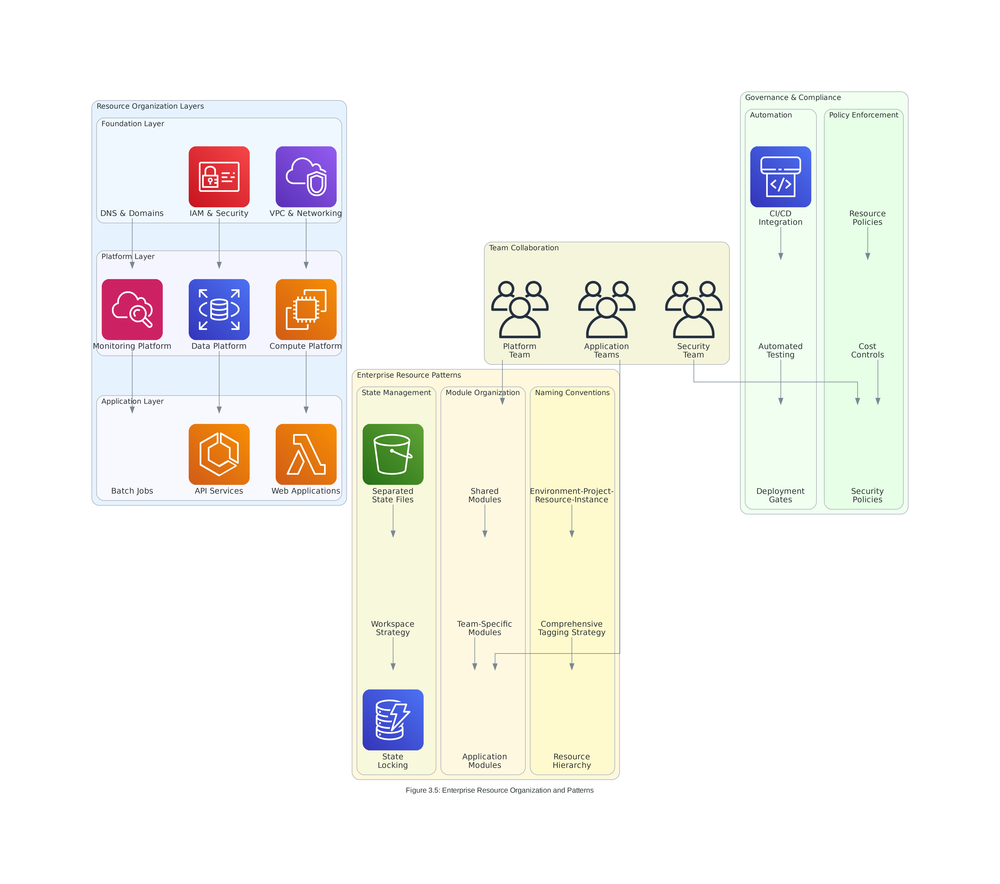

# Topic 3: Core Terraform Operations

## 📋 **Learning Objectives**

By mastering this topic, you will develop comprehensive expertise in:

1. **Resource Lifecycle Management** - Understanding the complete lifecycle of Terraform resources from creation to destruction
2. **Data Source Integration** - Leveraging data sources for dynamic configuration and external data integration
3. **Provisioner Implementation** - Implementing configuration management through local and remote provisioners
4. **Meta-Argument Mastery** - Advanced resource control using count, for_each, depends_on, and lifecycle rules
5. **Enterprise Resource Organization** - Implementing scalable patterns for large-scale infrastructure management

### **Professional Competency Standards**
- **95% accuracy** in resource lifecycle management and state operations
- **90% efficiency** in implementing data source integrations and dependencies
- **100% compliance** with enterprise security and governance standards
- **85% optimization** in resource organization and performance patterns

---

## 🏗️ **Core Terraform Resource Management**

### **Understanding Resource Blocks**

Terraform resources are the fundamental building blocks of infrastructure as code. Each resource block describes a piece of infrastructure and its desired configuration state.

```hcl
# Basic resource syntax
resource "resource_type" "resource_name" {
  # Configuration arguments
  argument_name = argument_value
  
  # Meta-arguments (available for all resources)
  count      = number
  for_each   = set_or_map
  depends_on = [list_of_resources]
  provider   = provider_alias
  
  # Lifecycle management
  lifecycle {
    create_before_destroy = boolean
    prevent_destroy      = boolean
    ignore_changes      = [list_of_attributes]
    replace_triggered_by = [list_of_references]
  }
}
```

### **Resource Lifecycle Phases**


*Figure 3.1: Complete resource lifecycle from configuration through state management*

The Terraform resource lifecycle consists of four primary phases:

#### **1. Configuration Phase**
During this phase, Terraform parses your configuration files and builds an internal representation of your desired infrastructure state.

```hcl
# Example: VPC resource configuration
resource "aws_vpc" "main" {
  cidr_block           = "10.0.0.0/16"
  enable_dns_hostnames = true
  enable_dns_support   = true
  
  tags = {
    Name        = "main-vpc"
    Environment = var.environment
    Project     = var.project_name
  }
}
```

#### **2. Planning Phase**
Terraform compares the desired state (configuration) with the current state (state file) and creates an execution plan.

```bash
# Generate and review execution plan
terraform plan -out=tfplan

# Key planning outputs:
# + create    - Resource will be created
# ~ update    - Resource will be modified
# - destroy   - Resource will be destroyed
# +/- replace - Resource will be destroyed and recreated
```

#### **3. Apply Phase**
Terraform executes the plan, making the necessary API calls to create, update, or destroy resources.

```bash
# Apply the planned changes
terraform apply tfplan

# Real-time feedback during apply:
# aws_vpc.main: Creating...
# aws_vpc.main: Creation complete after 2s [id=vpc-12345678]
```

#### **4. State Management Phase**
Terraform updates the state file to reflect the current infrastructure state, enabling future planning and management operations.

```bash
# View current state
terraform show

# List all resources in state
terraform state list

# Show specific resource details
terraform state show aws_vpc.main
```

### **Resource Configuration Best Practices**

#### **Naming Conventions**
```hcl
# Follow consistent naming patterns
resource "aws_instance" "web_server" {          # Good: descriptive, snake_case
  # Configuration...
}

resource "aws_instance" "WebServer1" {          # Avoid: mixed case, numbers
  # Configuration...
}
```

#### **Resource Organization**
```hcl
# Group related resources logically
# Network resources
resource "aws_vpc" "main" { /* ... */ }
resource "aws_subnet" "private" { /* ... */ }
resource "aws_subnet" "public" { /* ... */ }

# Security resources
resource "aws_security_group" "web" { /* ... */ }
resource "aws_security_group" "database" { /* ... */ }

# Compute resources
resource "aws_instance" "web" { /* ... */ }
resource "aws_instance" "app" { /* ... */ }
```

#### **Configuration Validation**
```hcl
# Use validation blocks for input validation
variable "instance_type" {
  description = "EC2 instance type"
  type        = string
  default     = "t3.micro"
  
  validation {
    condition = contains([
      "t3.micro", "t3.small", "t3.medium",
      "t3.large", "t3.xlarge", "t3.2xlarge"
    ], var.instance_type)
    error_message = "Instance type must be a valid t3 instance type."
  }
}
```

---

## 📊 **Data Sources and External Integration**

### **Understanding Data Sources**

Data sources allow Terraform to fetch information from external systems, existing infrastructure, or computed values. Unlike resources, data sources are read-only and don't create or modify infrastructure.


*Figure 3.2: Data source integration patterns and dependency relationships*

### **Common Data Source Patterns**

#### **AWS Infrastructure Discovery**
```hcl
# Discover existing VPC
data "aws_vpc" "existing" {
  filter {
    name   = "tag:Name"
    values = ["production-vpc"]
  }
}

# Find available subnets
data "aws_subnets" "private" {
  filter {
    name   = "vpc-id"
    values = [data.aws_vpc.existing.id]
  }
  
  filter {
    name   = "tag:Type"
    values = ["private"]
  }
}

# Get latest AMI
data "aws_ami" "amazon_linux" {
  most_recent = true
  owners      = ["amazon"]
  
  filter {
    name   = "name"
    values = ["amzn2-ami-hvm-*-x86_64-gp2"]
  }
  
  filter {
    name   = "virtualization-type"
    values = ["hvm"]
  }
}
```

#### **External Data Integration**
```hcl
# External script execution
data "external" "environment_info" {
  program = ["python3", "${path.module}/scripts/get_env_info.py"]
  
  query = {
    environment = var.environment
    region      = var.aws_region
  }
}

# HTTP data source for API integration
data "http" "public_ip" {
  url = "https://ipv4.icanhazip.com"
  
  request_headers = {
    Accept = "text/plain"
  }
}

# Template rendering
data "template_file" "user_data" {
  template = file("${path.module}/templates/user_data.sh.tpl")
  
  vars = {
    environment = var.environment
    app_version = var.app_version
    database_url = aws_db_instance.main.endpoint
  }
}
```

### **Data Source Best Practices**

#### **Error Handling and Validation**
```hcl
# Use locals for data source validation
locals {
  vpc_id = data.aws_vpc.existing.id
  
  # Validate VPC exists
  vpc_validation = length(local.vpc_id) > 0 ? local.vpc_id : (
    # Trigger error if VPC not found
    file("ERROR: VPC not found with specified criteria")
  )
}
```

#### **Performance Optimization**
```hcl
# Cache expensive data source calls
data "aws_availability_zones" "available" {
  state = "available"
}

# Use locals to avoid repeated data source calls
locals {
  availability_zones = data.aws_availability_zones.available.names
  az_count          = length(local.availability_zones)
  
  # Create subnet CIDR blocks
  private_subnet_cidrs = [
    for i in range(local.az_count) :
    cidrsubnet(var.vpc_cidr, 8, i + 10)
  ]
}
```

---

## ⚙️ **Provisioners and Configuration Management**

### **Understanding Provisioners**

Provisioners are used to execute scripts or commands on local or remote machines as part of resource creation or destruction. They provide a bridge between Terraform's declarative resource management and imperative configuration tasks.


*Figure 3.3: Provisioner types and configuration management patterns*

### **Local Provisioners**

Local provisioners execute commands on the machine running Terraform, useful for local setup tasks, API calls, or triggering external systems.

#### **local-exec Provisioner**
```hcl
resource "aws_instance" "web" {
  ami           = data.aws_ami.amazon_linux.id
  instance_type = "t3.micro"
  
  # Execute local commands after instance creation
  provisioner "local-exec" {
    command = "echo 'Instance ${self.id} created at ${timestamp()}' >> deployment.log"
    
    # Working directory for command execution
    working_dir = "${path.module}/logs"
    
    # Environment variables
    environment = {
      INSTANCE_ID = self.id
      REGION      = var.aws_region
    }
  }
  
  # Cleanup on destruction
  provisioner "local-exec" {
    when    = destroy
    command = "echo 'Instance ${self.id} destroyed at ${timestamp()}' >> deployment.log"
  }
}
```

#### **Advanced Local Provisioner Patterns**
```hcl
# API integration example
resource "aws_s3_bucket" "data" {
  bucket = "${var.project_name}-data-${random_id.bucket_suffix.hex}"
  
  provisioner "local-exec" {
    command = <<-EOT
      # Notify external system of bucket creation
      curl -X POST https://api.example.com/buckets \
        -H "Content-Type: application/json" \
        -d '{
          "bucket_name": "${self.bucket}",
          "region": "${var.aws_region}",
          "environment": "${var.environment}"
        }'
    EOT
    
    # Only run if external API is available
    interpreter = ["bash", "-c"]
  }
}
```

### **Remote Provisioners**

Remote provisioners execute commands on remote resources, typically used for software installation, configuration, and application deployment.

#### **remote-exec Provisioner**
```hcl
resource "aws_instance" "web" {
  ami           = data.aws_ami.amazon_linux.id
  instance_type = "t3.micro"
  key_name      = aws_key_pair.deployer.key_name

  vpc_security_group_ids = [aws_security_group.web.id]
  subnet_id              = aws_subnet.public.id

  # Connection configuration for remote access
  connection {
    type        = "ssh"
    user        = "ec2-user"
    private_key = file("~/.ssh/deployer-key.pem")
    host        = self.public_ip
    timeout     = "5m"
  }

  # Install and configure software
  provisioner "remote-exec" {
    inline = [
      "sudo yum update -y",
      "sudo yum install -y httpd",
      "sudo systemctl start httpd",
      "sudo systemctl enable httpd",
      "echo '<h1>Web Server ${self.id}</h1>' | sudo tee /var/www/html/index.html"
    ]
  }

  # Alternative: Execute script file
  provisioner "remote-exec" {
    script = "${path.module}/scripts/configure_web_server.sh"
  }
}
```

#### **file Provisioner**
```hcl
resource "aws_instance" "app" {
  ami           = data.aws_ami.amazon_linux.id
  instance_type = "t3.micro"

  connection {
    type        = "ssh"
    user        = "ec2-user"
    private_key = file(var.private_key_path)
    host        = self.public_ip
  }

  # Upload configuration files
  provisioner "file" {
    source      = "${path.module}/configs/app.conf"
    destination = "/tmp/app.conf"
  }

  # Upload entire directory
  provisioner "file" {
    source      = "${path.module}/scripts/"
    destination = "/tmp/scripts"
  }

  # Upload content directly
  provisioner "file" {
    content = templatefile("${path.module}/templates/config.json.tpl", {
      database_url = aws_db_instance.main.endpoint
      api_key      = var.api_key
    })
    destination = "/tmp/config.json"
  }

  # Configure application after file upload
  provisioner "remote-exec" {
    inline = [
      "sudo mv /tmp/app.conf /etc/myapp/",
      "sudo mv /tmp/config.json /etc/myapp/",
      "sudo chmod +x /tmp/scripts/*.sh",
      "sudo /tmp/scripts/install_app.sh"
    ]
  }
}
```

### **Provisioner Best Practices and Alternatives**

#### **Idempotency and Error Handling**
```hcl
resource "aws_instance" "web" {
  # ... instance configuration ...

  provisioner "remote-exec" {
    inline = [
      # Check if service already exists before installation
      "if ! systemctl is-active --quiet httpd; then",
      "  sudo yum install -y httpd",
      "  sudo systemctl start httpd",
      "  sudo systemctl enable httpd",
      "fi",

      # Idempotent configuration
      "sudo mkdir -p /var/www/html/app",
      "echo 'Server configured at $(date)' | sudo tee -a /var/log/provisioning.log"
    ]

    # Retry on failure
    on_failure = continue
  }
}
```

#### **Modern Alternatives to Provisioners**
```hcl
# Preferred: Use cloud-init for instance configuration
resource "aws_instance" "web" {
  ami           = data.aws_ami.amazon_linux.id
  instance_type = "t3.micro"

  # Cloud-init user data (preferred over provisioners)
  user_data = base64encode(templatefile("${path.module}/user_data.sh", {
    environment = var.environment
    app_version = var.app_version
  }))

  # User data replacement triggers instance replacement
  user_data_replace_on_change = true

  tags = {
    Name = "web-server"
  }
}

# Alternative: Use AWS Systems Manager for configuration
resource "aws_ssm_document" "web_config" {
  name          = "WebServerConfiguration"
  document_type = "Command"
  document_format = "YAML"

  content = yamlencode({
    schemaVersion = "2.2"
    description   = "Configure web server"
    mainSteps = [{
      action = "aws:runShellScript"
      name   = "configureWebServer"
      inputs = {
        runCommand = [
          "yum update -y",
          "yum install -y httpd",
          "systemctl start httpd",
          "systemctl enable httpd"
        ]
      }
    }]
  })
}
```

---

## 🔧 **Resource Meta-Arguments and Advanced Control**

### **Understanding Meta-Arguments**

Meta-arguments are special arguments available for all resource types that control how Terraform manages resources. They provide advanced control over resource behavior, dependencies, and lifecycle management.


*Figure 3.4: Meta-arguments and lifecycle management for advanced resource control*

### **Count Meta-Argument**

The `count` meta-argument creates multiple instances of a resource based on a numeric value.

#### **Basic Count Usage**
```hcl
# Create multiple EC2 instances
resource "aws_instance" "web" {
  count         = 3
  ami           = data.aws_ami.amazon_linux.id
  instance_type = "t3.micro"

  tags = {
    Name = "web-server-${count.index + 1}"
    Index = count.index
  }
}

# Reference specific instances
output "first_instance_id" {
  value = aws_instance.web[0].id
}

output "all_instance_ids" {
  value = aws_instance.web[*].id
}
```

#### **Conditional Resource Creation**
```hcl
# Create resource only in production
resource "aws_db_instance" "main" {
  count = var.environment == "production" ? 1 : 0

  identifier = "main-database"
  engine     = "mysql"
  # ... other configuration ...
}

# Create different numbers based on environment
locals {
  instance_count = {
    development = 1
    staging     = 2
    production  = 3
  }
}

resource "aws_instance" "app" {
  count = local.instance_count[var.environment]

  ami           = data.aws_ami.amazon_linux.id
  instance_type = var.environment == "production" ? "t3.large" : "t3.micro"

  tags = {
    Name = "${var.environment}-app-${count.index + 1}"
  }
}
```

### **for_each Meta-Argument**

The `for_each` meta-argument creates multiple instances based on a set or map, providing more flexibility than `count`.

#### **for_each with Sets**
```hcl
# Create S3 buckets for different environments
variable "environments" {
  type    = set(string)
  default = ["dev", "staging", "prod"]
}

resource "aws_s3_bucket" "env_buckets" {
  for_each = var.environments

  bucket = "${var.project_name}-${each.key}-data"

  tags = {
    Environment = each.key
    Purpose     = "Environment-specific data storage"
  }
}

# Reference specific bucket
output "prod_bucket_name" {
  value = aws_s3_bucket.env_buckets["prod"].bucket
}
```

#### **for_each with Maps**
```hcl
# Create instances with different configurations
variable "instances" {
  type = map(object({
    instance_type = string
    disk_size     = number
    environment   = string
  }))

  default = {
    web = {
      instance_type = "t3.medium"
      disk_size     = 20
      environment   = "production"
    }
    api = {
      instance_type = "t3.large"
      disk_size     = 50
      environment   = "production"
    }
    worker = {
      instance_type = "t3.small"
      disk_size     = 30
      environment   = "production"
    }
  }
}

resource "aws_instance" "services" {
  for_each = var.instances

  ami           = data.aws_ami.amazon_linux.id
  instance_type = each.value.instance_type

  root_block_device {
    volume_size = each.value.disk_size
    volume_type = "gp3"
  }

  tags = {
    Name        = "${each.key}-server"
    Service     = each.key
    Environment = each.value.environment
  }
}
```

### **depends_on Meta-Argument**

The `depends_on` meta-argument creates explicit dependencies between resources when Terraform cannot automatically infer the relationship.

#### **Explicit Dependencies**
```hcl
# S3 bucket that must exist before EC2 instance
resource "aws_s3_bucket" "data" {
  bucket = "${var.project_name}-data-bucket"
}

resource "aws_s3_bucket_policy" "data_policy" {
  bucket = aws_s3_bucket.data.id

  policy = jsonencode({
    Version = "2012-10-17"
    Statement = [{
      Effect = "Allow"
      Principal = {
        AWS = aws_iam_role.ec2_role.arn
      }
      Action = [
        "s3:GetObject",
        "s3:PutObject"
      ]
      Resource = "${aws_s3_bucket.data.arn}/*"
    }]
  })
}

# EC2 instance that depends on S3 setup completion
resource "aws_instance" "processor" {
  ami           = data.aws_ami.amazon_linux.id
  instance_type = "t3.micro"
  iam_instance_profile = aws_iam_instance_profile.ec2_profile.name

  # Explicit dependency ensures S3 bucket and policy are ready
  depends_on = [
    aws_s3_bucket.data,
    aws_s3_bucket_policy.data_policy
  ]

  user_data = base64encode(templatefile("${path.module}/user_data.sh", {
    bucket_name = aws_s3_bucket.data.bucket
  }))

  tags = {
    Name = "data-processor"
  }
}
```

### **Lifecycle Meta-Argument**

The `lifecycle` meta-argument controls how Terraform manages resource lifecycle events.

#### **create_before_destroy**
```hcl
# Launch template that needs replacement strategy
resource "aws_launch_template" "app" {
  name_prefix   = "${var.project_name}-app-"
  image_id      = data.aws_ami.amazon_linux.id
  instance_type = var.instance_type

  # Ensure new template is created before destroying old one
  lifecycle {
    create_before_destroy = true
  }

  # Template versioning
  tag_specifications {
    resource_type = "instance"
    tags = {
      Name = "${var.project_name}-app"
      Version = var.app_version
    }
  }
}

# Auto Scaling Group using the launch template
resource "aws_autoscaling_group" "app" {
  name                = "${var.project_name}-app-asg"
  vpc_zone_identifier = aws_subnet.private[*].id
  target_group_arns   = [aws_lb_target_group.app.arn]

  min_size         = 2
  max_size         = 10
  desired_capacity = 3

  launch_template {
    id      = aws_launch_template.app.id
    version = "$Latest"
  }

  # Ensure smooth rolling updates
  lifecycle {
    create_before_destroy = true
  }

  tag {
    key                 = "Name"
    value               = "${var.project_name}-app-instance"
    propagate_at_launch = true
  }
}
```

#### **prevent_destroy**
```hcl
# Critical database with destruction protection
resource "aws_db_instance" "main" {
  identifier = "${var.project_name}-main-db"

  engine         = "mysql"
  engine_version = "8.0"
  instance_class = "db.t3.micro"

  allocated_storage     = 20
  max_allocated_storage = 100
  storage_encrypted     = true

  db_name  = var.database_name
  username = var.database_username
  password = var.database_password

  # Prevent accidental destruction
  lifecycle {
    prevent_destroy = true
  }

  # Enable backups
  backup_retention_period = 7
  backup_window          = "03:00-04:00"
  maintenance_window     = "sun:04:00-sun:05:00"

  tags = {
    Name        = "${var.project_name}-main-database"
    Environment = var.environment
    Critical    = "true"
  }
}
```

#### **ignore_changes**
```hcl
# Auto Scaling Group with ignored capacity changes
resource "aws_autoscaling_group" "app" {
  name                = "${var.project_name}-app-asg"
  vpc_zone_identifier = aws_subnet.private[*].id

  min_size         = 2
  max_size         = 10
  desired_capacity = 3

  # Ignore capacity changes made by auto scaling policies
  lifecycle {
    ignore_changes = [
      desired_capacity,
      target_group_arns
    ]
  }

  launch_template {
    id      = aws_launch_template.app.id
    version = "$Latest"
  }
}

# EC2 instance with ignored tag changes
resource "aws_instance" "web" {
  ami           = data.aws_ami.amazon_linux.id
  instance_type = "t3.micro"

  tags = {
    Name        = "web-server"
    Environment = var.environment
    # Other tags may be added by external systems
  }

  # Ignore tag changes made by external systems
  lifecycle {
    ignore_changes = [
      tags["LastPatched"],
      tags["PatchGroup"],
      tags["Monitoring"]
    ]
  }
}
```

---

## 🏢 **Enterprise Resource Organization and Patterns**

### **Scalable Resource Architecture**

Enterprise Terraform implementations require sophisticated organization patterns to manage complexity, ensure consistency, and enable team collaboration at scale.


*Figure 3.5: Enterprise patterns for organizing and managing resources at scale*

### **Layered Resource Architecture**

#### **Foundation Layer**
```hcl
# Foundation layer: Core networking and security
module "foundation" {
  source = "./modules/foundation"

  # Network configuration
  vpc_cidr             = var.vpc_cidr
  availability_zones   = data.aws_availability_zones.available.names
  enable_nat_gateway   = var.enable_nat_gateway
  enable_vpn_gateway   = var.enable_vpn_gateway

  # Security configuration
  enable_flow_logs     = true
  enable_config        = true
  enable_cloudtrail    = true

  # Tagging
  environment = var.environment
  project     = var.project_name
  cost_center = var.cost_center

  tags = local.common_tags
}
```

#### **Platform Layer**
```hcl
# Platform layer: Shared services and infrastructure
module "platform" {
  source = "./modules/platform"

  # Dependencies from foundation layer
  vpc_id              = module.foundation.vpc_id
  private_subnet_ids  = module.foundation.private_subnet_ids
  public_subnet_ids   = module.foundation.public_subnet_ids

  # Platform services
  enable_ecs_cluster  = true
  enable_eks_cluster  = var.enable_kubernetes
  enable_rds_cluster  = true
  enable_elasticache  = true

  # Monitoring and logging
  enable_prometheus   = true
  enable_grafana      = true
  enable_elk_stack    = true

  tags = local.common_tags
}
```

#### **Application Layer**
```hcl
# Application layer: Business applications
module "applications" {
  source = "./modules/applications"

  # Dependencies from platform layer
  ecs_cluster_id      = module.platform.ecs_cluster_id
  database_endpoint   = module.platform.database_endpoint
  cache_endpoint      = module.platform.cache_endpoint

  # Application configuration
  applications = var.applications

  # Scaling configuration
  min_capacity = var.min_capacity
  max_capacity = var.max_capacity

  tags = local.common_tags
}
```

### **Resource Naming and Tagging Strategies**

#### **Standardized Naming Conventions**
```hcl
# Naming convention: {environment}-{project}-{resource}-{instance}
locals {
  name_prefix = "${var.environment}-${var.project_name}"

  # Resource naming patterns
  naming = {
    vpc                = "${local.name_prefix}-vpc"
    public_subnet      = "${local.name_prefix}-public-subnet"
    private_subnet     = "${local.name_prefix}-private-subnet"
    database_subnet    = "${local.name_prefix}-db-subnet"
    security_group     = "${local.name_prefix}-sg"
    load_balancer      = "${local.name_prefix}-alb"
    auto_scaling_group = "${local.name_prefix}-asg"
    launch_template    = "${local.name_prefix}-lt"
  }
}

# Example implementation
resource "aws_vpc" "main" {
  cidr_block           = var.vpc_cidr
  enable_dns_hostnames = true
  enable_dns_support   = true

  tags = merge(local.common_tags, {
    Name = local.naming.vpc
    Type = "network"
  })
}
```

#### **Comprehensive Tagging Strategy**
```hcl
# Common tags applied to all resources
locals {
  common_tags = {
    # Organizational tags
    Environment   = var.environment
    Project       = var.project_name
    Owner         = var.owner
    CostCenter    = var.cost_center

    # Operational tags
    ManagedBy     = "terraform"
    CreatedDate   = formatdate("YYYY-MM-DD", timestamp())
    LastModified  = formatdate("YYYY-MM-DD hh:mm:ss ZZZ", timestamp())

    # Compliance tags
    DataClassification = var.data_classification
    BackupRequired     = var.backup_required
    MonitoringEnabled  = var.monitoring_enabled

    # Business tags
    BusinessUnit  = var.business_unit
    Application   = var.application_name
    ServiceLevel  = var.service_level
  }

  # Environment-specific tags
  environment_tags = var.environment == "production" ? {
    Criticality       = "high"
    MaintenanceWindow = "sunday-02:00-04:00"
    SupportLevel      = "24x7"
  } : {
    Criticality       = "low"
    MaintenanceWindow = "daily-01:00-02:00"
    SupportLevel      = "business-hours"
  }

  # Final tag combination
  final_tags = merge(local.common_tags, local.environment_tags)
}
```

### **Resource Dependencies and Ordering**

#### **Implicit Dependencies**
```hcl
# Terraform automatically detects dependencies through resource references
resource "aws_vpc" "main" {
  cidr_block = "10.0.0.0/16"

  tags = {
    Name = "main-vpc"
  }
}

# Subnet implicitly depends on VPC
resource "aws_subnet" "private" {
  count = length(var.availability_zones)

  vpc_id            = aws_vpc.main.id  # Implicit dependency
  cidr_block        = cidrsubnet(aws_vpc.main.cidr_block, 8, count.index + 10)
  availability_zone = var.availability_zones[count.index]

  tags = {
    Name = "private-subnet-${count.index + 1}"
    Type = "private"
  }
}

# Security group implicitly depends on VPC
resource "aws_security_group" "web" {
  name_prefix = "web-sg-"
  vpc_id      = aws_vpc.main.id  # Implicit dependency

  ingress {
    from_port   = 80
    to_port     = 80
    protocol    = "tcp"
    cidr_blocks = ["0.0.0.0/0"]
  }

  egress {
    from_port   = 0
    to_port     = 0
    protocol    = "-1"
    cidr_blocks = ["0.0.0.0/0"]
  }

  tags = {
    Name = "web-security-group"
  }
}
```

#### **Complex Dependency Management**
```hcl
# Multi-tier application with complex dependencies
resource "aws_db_subnet_group" "main" {
  name       = "${var.project_name}-db-subnet-group"
  subnet_ids = aws_subnet.database[*].id

  tags = {
    Name = "Main DB subnet group"
  }
}

resource "aws_db_instance" "main" {
  identifier = "${var.project_name}-main-db"

  engine         = "mysql"
  engine_version = "8.0"
  instance_class = "db.t3.micro"

  allocated_storage = 20
  storage_encrypted = true

  db_name  = var.database_name
  username = var.database_username
  password = var.database_password

  db_subnet_group_name   = aws_db_subnet_group.main.name
  vpc_security_group_ids = [aws_security_group.database.id]

  # Explicit dependencies for proper ordering
  depends_on = [
    aws_db_subnet_group.main,
    aws_security_group.database
  ]

  tags = {
    Name = "Main database"
  }
}

# Application servers that need database
resource "aws_instance" "app" {
  count = var.app_instance_count

  ami           = data.aws_ami.amazon_linux.id
  instance_type = "t3.micro"
  subnet_id     = aws_subnet.private[count.index % length(aws_subnet.private)].id

  vpc_security_group_ids = [aws_security_group.app.id]

  # Ensure database is ready before starting app servers
  depends_on = [aws_db_instance.main]

  user_data = base64encode(templatefile("${path.module}/user_data.sh", {
    database_endpoint = aws_db_instance.main.endpoint
    database_name     = aws_db_instance.main.db_name
  }))

  tags = {
    Name = "app-server-${count.index + 1}"
    Tier = "application"
  }
}
```

---

## 🔒 **Security and Best Practices**

### **Resource Security Patterns**

#### **Least Privilege Access**
```hcl
# IAM role with minimal required permissions
resource "aws_iam_role" "ec2_role" {
  name = "${var.project_name}-ec2-role"

  assume_role_policy = jsonencode({
    Version = "2012-10-17"
    Statement = [{
      Action = "sts:AssumeRole"
      Effect = "Allow"
      Principal = {
        Service = "ec2.amazonaws.com"
      }
    }]
  })

  tags = local.common_tags
}

# Specific policy for S3 access
resource "aws_iam_policy" "s3_access" {
  name        = "${var.project_name}-s3-access"
  description = "Allow access to specific S3 bucket"

  policy = jsonencode({
    Version = "2012-10-17"
    Statement = [{
      Effect = "Allow"
      Action = [
        "s3:GetObject",
        "s3:PutObject",
        "s3:DeleteObject"
      ]
      Resource = "${aws_s3_bucket.data.arn}/*"
    }, {
      Effect = "Allow"
      Action = [
        "s3:ListBucket"
      ]
      Resource = aws_s3_bucket.data.arn
    }]
  })
}

resource "aws_iam_role_policy_attachment" "ec2_s3_access" {
  role       = aws_iam_role.ec2_role.name
  policy_arn = aws_iam_policy.s3_access.arn
}
```

#### **Network Security**
```hcl
# Security group with restrictive rules
resource "aws_security_group" "web" {
  name_prefix = "${var.project_name}-web-"
  vpc_id      = aws_vpc.main.id

  # Allow HTTP from load balancer only
  ingress {
    from_port       = 80
    to_port         = 80
    protocol        = "tcp"
    security_groups = [aws_security_group.alb.id]
  }

  # Allow HTTPS from load balancer only
  ingress {
    from_port       = 443
    to_port         = 443
    protocol        = "tcp"
    security_groups = [aws_security_group.alb.id]
  }

  # Allow SSH from bastion host only
  ingress {
    from_port       = 22
    to_port         = 22
    protocol        = "tcp"
    security_groups = [aws_security_group.bastion.id]
  }

  # Outbound internet access for updates
  egress {
    from_port   = 443
    to_port     = 443
    protocol    = "tcp"
    cidr_blocks = ["0.0.0.0/0"]
  }

  egress {
    from_port   = 80
    to_port     = 80
    protocol    = "tcp"
    cidr_blocks = ["0.0.0.0/0"]
  }

  tags = merge(local.common_tags, {
    Name = "${var.project_name}-web-sg"
    Type = "security-group"
  })
}
```

### **Operational Excellence**

#### **Resource Monitoring and Alerting**
```hcl
# CloudWatch alarms for resource monitoring
resource "aws_cloudwatch_metric_alarm" "high_cpu" {
  alarm_name          = "${var.project_name}-high-cpu"
  comparison_operator = "GreaterThanThreshold"
  evaluation_periods  = "2"
  metric_name         = "CPUUtilization"
  namespace           = "AWS/EC2"
  period              = "120"
  statistic           = "Average"
  threshold           = "80"
  alarm_description   = "This metric monitors ec2 cpu utilization"

  dimensions = {
    AutoScalingGroupName = aws_autoscaling_group.app.name
  }

  alarm_actions = [aws_sns_topic.alerts.arn]

  tags = local.common_tags
}

# SNS topic for alerts
resource "aws_sns_topic" "alerts" {
  name = "${var.project_name}-alerts"

  tags = local.common_tags
}
```

#### **Backup and Disaster Recovery**
```hcl
# Automated EBS snapshots
resource "aws_dlm_lifecycle_policy" "ebs_backup" {
  description        = "EBS snapshot lifecycle policy"
  execution_role_arn = aws_iam_role.dlm_lifecycle_role.arn
  state              = "ENABLED"

  policy_details {
    resource_types   = ["VOLUME"]
    target_tags = {
      Environment = var.environment
      Backup      = "required"
    }

    schedule {
      name = "Daily snapshots"

      create_rule {
        interval      = 24
        interval_unit = "HOURS"
        times         = ["03:00"]
      }

      retain_rule {
        count = 7
      }

      copy_tags = true
    }
  }

  tags = local.common_tags
}
```

---

## 📚 **Summary and Next Steps**

### **Key Concepts Mastered**

1. **Resource Lifecycle Management**: Complete understanding of resource creation, updates, and destruction phases
2. **Data Source Integration**: Effective use of data sources for dynamic configuration and external system integration
3. **Provisioner Implementation**: Strategic use of provisioners for configuration management with modern alternatives
4. **Meta-Argument Mastery**: Advanced resource control using count, for_each, depends_on, and lifecycle rules
5. **Enterprise Organization**: Scalable patterns for large-scale infrastructure management and team collaboration

### **Best Practices Implemented**

- **Consistent Naming**: Standardized resource naming conventions across all environments
- **Comprehensive Tagging**: Enterprise-grade tagging strategies for governance and cost management
- **Security First**: Least privilege access and network security patterns
- **Operational Excellence**: Monitoring, alerting, and disaster recovery implementation
- **Code Organization**: Logical grouping and modular architecture for maintainability

### **Integration with Training Progression**

This topic builds upon the foundation established in Topics 1 and 2, providing the core operational knowledge needed for advanced Terraform usage. The concepts learned here directly support:

- **Topic 4**: Resource Management & Dependencies (advanced dependency patterns)
- **Topic 5**: Variables and Outputs (dynamic configuration patterns)
- **Topic 6**: State Management (enterprise state strategies)
- **Topic 7**: Modules and Development (modular resource organization)

### **Practical Application**

The patterns and practices covered in this topic enable you to:
- Design and implement scalable infrastructure architectures
- Manage complex resource dependencies and lifecycle requirements
- Implement enterprise-grade security and governance standards
- Optimize resource organization for team collaboration and operational efficiency

---

*This comprehensive foundation in core Terraform operations provides the essential knowledge and practical skills needed for advanced infrastructure as code implementation and enterprise-scale deployment patterns.*
```
```
```
