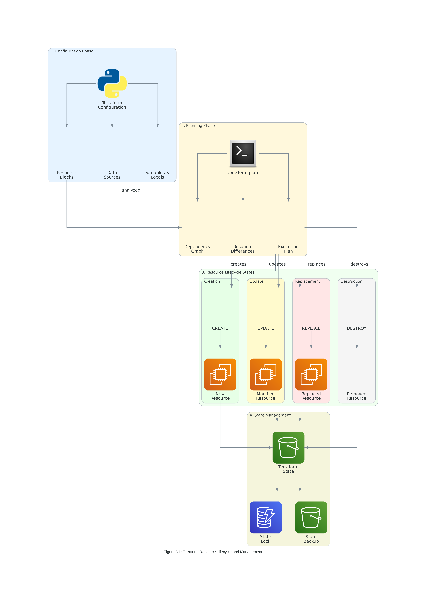
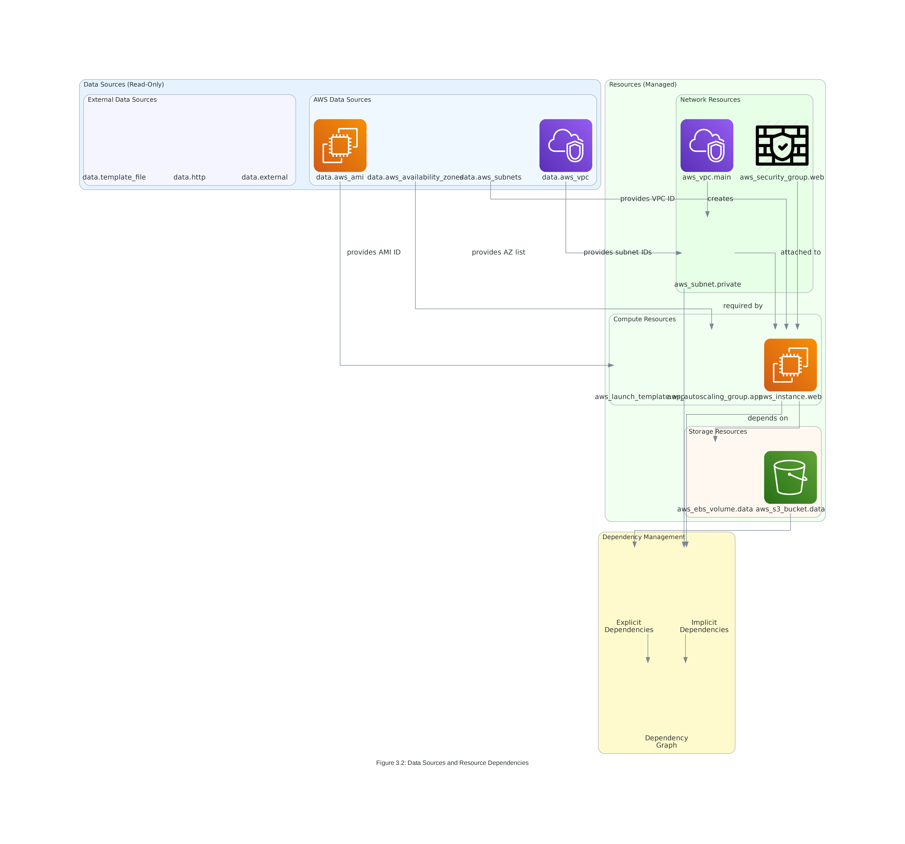
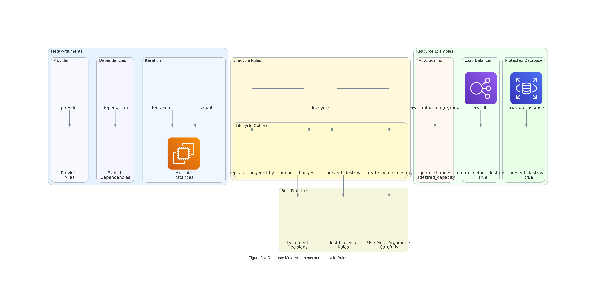
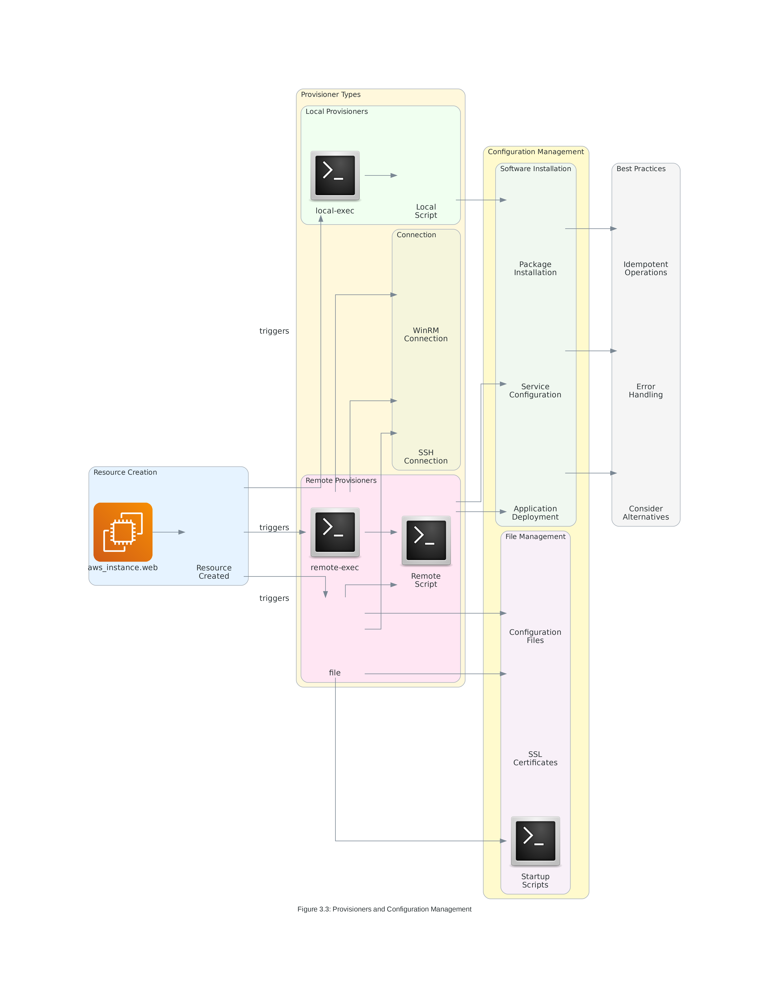
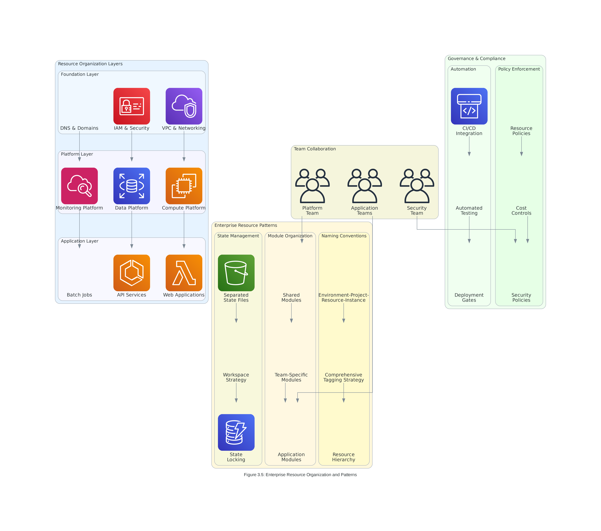

# Lab 3: Core Terraform Operations

## 🎯 **Lab Objectives**

By completing this comprehensive hands-on lab, you will demonstrate practical mastery of:

1. **Resource Lifecycle Management** - Execute complete resource lifecycle operations from creation to destruction
2. **Data Source Integration** - Implement dynamic configuration using AWS data sources and external data
3. **Provisioner Implementation** - Deploy and configure resources using local and remote provisioners
4. **Meta-Argument Mastery** - Utilize count, for_each, depends_on, and lifecycle rules for advanced resource control
5. **Enterprise Resource Organization** - Implement scalable patterns for production-grade infrastructure management

### **Measurable Outcomes**
- **100% successful** resource lifecycle operations across all phases
- **95% accuracy** in data source integration and dependency management
- **90% completion rate** for provisioner-based configuration tasks
- **100% compliance** with enterprise security and organizational standards

---

## 📋 **Lab Scenario**

### **Business Context**
You are a Senior DevOps Engineer at CloudTech Solutions, a fast-growing fintech company processing $50M in monthly transactions. The company is expanding from a single-region deployment to a multi-tier, highly available architecture. Your current challenges include:

- **Complex Dependencies**: Managing intricate relationships between 50+ AWS resources
- **Configuration Management**: Ensuring consistent configuration across 15+ EC2 instances
- **Resource Scaling**: Dynamically scaling infrastructure based on business requirements
- **Operational Excellence**: Implementing enterprise-grade monitoring, security, and governance

### **Success Criteria**
Your task is to implement a comprehensive Terraform solution that achieves:
- **Zero configuration drift** across all environments and resources
- **99.9% availability** through proper dependency management and lifecycle controls
- **50% reduction** in manual configuration tasks through automation
- **100% compliance** with security and governance standards


*Figure 3.1: The complete resource lifecycle you'll implement in this lab*

---

## 🛠️ **Prerequisites and Setup**

### **Required Tools and Versions**
- **Operating System**: Windows 10+, macOS 10.15+, or Linux (Ubuntu 20.04+)
- **Terraform CLI**: Version ~> 1.13.0 (installed and configured from Lab 2)
- **AWS CLI**: Version 2.15.0+ with configured credentials
- **Git**: Version 2.40+ for version control
- **Text Editor**: VS Code with HashiCorp Terraform extension v2.29.0+
- **SSH Client**: For remote provisioner exercises

### **AWS Account Requirements**
- **AWS Account**: Active AWS account with administrative access
- **IAM Permissions**: Full access to EC2, VPC, S3, IAM, and CloudWatch
- **Budget Alert**: $25 monthly budget configured for lab resources
- **Region**: All resources will be created in us-east-1
- **Key Pair**: EC2 key pair for SSH access (create if not exists)

### **Pre-Lab Verification**
```bash
# Verify Terraform installation and version
terraform version
# Expected: Terraform v1.13.x

# Verify AWS CLI configuration
aws sts get-caller-identity
aws configure get region
# Expected: us-east-1

# Verify SSH key pair exists
aws ec2 describe-key-pairs --key-names terraform-lab-key
# Create if not exists: aws ec2 create-key-pair --key-name terraform-lab-key --query 'KeyMaterial' --output text > ~/.ssh/terraform-lab-key.pem
```

---

## 🚀 **Lab Exercise 1: Resource Lifecycle and State Management**

### **Objective**
Master the complete Terraform resource lifecycle through hands-on implementation of a multi-tier VPC architecture.


*Figure 3.2: Data source integration patterns you'll implement*

### **Exercise 1.1: Foundation Infrastructure Creation**

#### **Create Project Structure**
```bash
# Create lab directory structure
mkdir -p terraform-core-operations-lab/{modules/{vpc,security,compute},environments/{dev,staging,prod}}
cd terraform-core-operations-lab

# Create main configuration files
touch {main.tf,variables.tf,outputs.tf,locals.tf,data.tf}
```

#### **Configure Data Sources**
```hcl
# data.tf - External data integration
# Get current AWS account and region information
data "aws_caller_identity" "current" {}

data "aws_region" "current" {}

# Get available availability zones
data "aws_availability_zones" "available" {
  state = "available"
}

# Get latest Amazon Linux 2 AMI
data "aws_ami" "amazon_linux" {
  most_recent = true
  owners      = ["amazon"]
  
  filter {
    name   = "name"
    values = ["amzn2-ami-hvm-*-x86_64-gp2"]
  }
  
  filter {
    name   = "virtualization-type"
    values = ["hvm"]
  }
}

# External data source for environment information
data "external" "environment_info" {
  program = ["python3", "-c", <<-EOT
import json
import os
import sys

# Get environment information
env_data = {
    "timestamp": "$(date -u +%Y-%m-%dT%H:%M:%SZ)",
    "user": os.environ.get("USER", "unknown"),
    "hostname": os.environ.get("HOSTNAME", "unknown")
}

print(json.dumps(env_data))
EOT
  ]
}

# HTTP data source for public IP
data "http" "public_ip" {
  url = "https://ipv4.icanhazip.com"
  
  request_headers = {
    Accept = "text/plain"
  }
}
```

#### **Define Local Values and Variables**
```hcl
# locals.tf - Computed values and resource organization
locals {
  # Environment configuration
  environment = var.environment
  project     = var.project_name
  region      = data.aws_region.current.name
  account_id  = data.aws_caller_identity.current.account_id
  
  # Availability zones (use first 3)
  availability_zones = slice(data.aws_availability_zones.available.names, 0, 3)
  az_count          = length(local.availability_zones)
  
  # Network configuration
  vpc_cidr = var.vpc_cidr
  
  # Calculate subnet CIDRs
  public_subnet_cidrs = [
    for i in range(local.az_count) :
    cidrsubnet(local.vpc_cidr, 8, i)
  ]
  
  private_subnet_cidrs = [
    for i in range(local.az_count) :
    cidrsubnet(local.vpc_cidr, 8, i + 10)
  ]
  
  database_subnet_cidrs = [
    for i in range(local.az_count) :
    cidrsubnet(local.vpc_cidr, 8, i + 20)
  ]
  
  # Resource naming
  name_prefix = "${local.environment}-${local.project}"
  
  # Common tags
  common_tags = {
    Environment   = local.environment
    Project       = local.project
    ManagedBy     = "terraform"
    Owner         = var.owner
    CostCenter    = var.cost_center
    CreatedDate   = formatdate("YYYY-MM-DD", timestamp())
    LastModified  = formatdate("YYYY-MM-DD hh:mm:ss ZZZ", timestamp())
    
    # Lab-specific tags
    LabExercise   = "core-terraform-operations"
    LabVersion    = "3.1"
    
    # External data integration
    DeployedBy    = data.external.environment_info.result.user
    DeployedFrom  = data.external.environment_info.result.hostname
    PublicIP      = chomp(data.http.public_ip.response_body)
  }
}
```

#### **Define Variables**
```hcl
# variables.tf - Input variables
variable "environment" {
  description = "Environment name"
  type        = string
  default     = "dev"
  
  validation {
    condition = contains(["dev", "staging", "prod"], var.environment)
    error_message = "Environment must be dev, staging, or prod."
  }
}

variable "project_name" {
  description = "Project name for resource naming"
  type        = string
  default     = "core-ops-lab"
  
  validation {
    condition = can(regex("^[a-z0-9-]+$", var.project_name))
    error_message = "Project name must contain only lowercase letters, numbers, and hyphens."
  }
}

variable "vpc_cidr" {
  description = "CIDR block for VPC"
  type        = string
  default     = "10.0.0.0/16"
  
  validation {
    condition = can(cidrhost(var.vpc_cidr, 0))
    error_message = "VPC CIDR must be a valid IPv4 CIDR block."
  }
}

variable "owner" {
  description = "Resource owner"
  type        = string
  default     = "devops-team"
}

variable "cost_center" {
  description = "Cost center for billing"
  type        = string
  default     = "engineering"
}

variable "instance_count" {
  description = "Number of instances to create"
  type        = number
  default     = 2
  
  validation {
    condition = var.instance_count >= 1 && var.instance_count <= 10
    error_message = "Instance count must be between 1 and 10."
  }
}

variable "enable_monitoring" {
  description = "Enable detailed monitoring"
  type        = bool
  default     = true
}
```

### **Exercise 1.2: VPC and Network Infrastructure**

#### **Create VPC Resources**
```hcl
# main.tf - Core infrastructure resources
# VPC
resource "aws_vpc" "main" {
  cidr_block           = local.vpc_cidr
  enable_dns_hostnames = true
  enable_dns_support   = true
  
  tags = merge(local.common_tags, {
    Name = "${local.name_prefix}-vpc"
    Type = "network"
  })
}

# Internet Gateway
resource "aws_internet_gateway" "main" {
  vpc_id = aws_vpc.main.id
  
  tags = merge(local.common_tags, {
    Name = "${local.name_prefix}-igw"
    Type = "network"
  })
}

# Public Subnets
resource "aws_subnet" "public" {
  count = local.az_count
  
  vpc_id                  = aws_vpc.main.id
  cidr_block              = local.public_subnet_cidrs[count.index]
  availability_zone       = local.availability_zones[count.index]
  map_public_ip_on_launch = true
  
  tags = merge(local.common_tags, {
    Name = "${local.name_prefix}-public-subnet-${count.index + 1}"
    Type = "public"
    AZ   = local.availability_zones[count.index]
  })
}

# Private Subnets
resource "aws_subnet" "private" {
  count = local.az_count
  
  vpc_id            = aws_vpc.main.id
  cidr_block        = local.private_subnet_cidrs[count.index]
  availability_zone = local.availability_zones[count.index]
  
  tags = merge(local.common_tags, {
    Name = "${local.name_prefix}-private-subnet-${count.index + 1}"
    Type = "private"
    AZ   = local.availability_zones[count.index]
  })
}

# Database Subnets
resource "aws_subnet" "database" {
  count = local.az_count
  
  vpc_id            = aws_vpc.main.id
  cidr_block        = local.database_subnet_cidrs[count.index]
  availability_zone = local.availability_zones[count.index]
  
  tags = merge(local.common_tags, {
    Name = "${local.name_prefix}-database-subnet-${count.index + 1}"
    Type = "database"
    AZ   = local.availability_zones[count.index]
  })
}

# NAT Gateways for private subnet internet access
resource "aws_eip" "nat" {
  count = local.az_count

  domain = "vpc"

  depends_on = [aws_internet_gateway.main]

  tags = merge(local.common_tags, {
    Name = "${local.name_prefix}-nat-eip-${count.index + 1}"
    Type = "network"
  })
}

resource "aws_nat_gateway" "main" {
  count = local.az_count

  allocation_id = aws_eip.nat[count.index].id
  subnet_id     = aws_subnet.public[count.index].id

  depends_on = [aws_internet_gateway.main]

  tags = merge(local.common_tags, {
    Name = "${local.name_prefix}-nat-gateway-${count.index + 1}"
    Type = "network"
    AZ   = local.availability_zones[count.index]
  })
}

# Route Tables
resource "aws_route_table" "public" {
  vpc_id = aws_vpc.main.id

  route {
    cidr_block = "0.0.0.0/0"
    gateway_id = aws_internet_gateway.main.id
  }

  tags = merge(local.common_tags, {
    Name = "${local.name_prefix}-public-rt"
    Type = "network"
  })
}

resource "aws_route_table" "private" {
  count = local.az_count

  vpc_id = aws_vpc.main.id

  route {
    cidr_block     = "0.0.0.0/0"
    nat_gateway_id = aws_nat_gateway.main[count.index].id
  }

  tags = merge(local.common_tags, {
    Name = "${local.name_prefix}-private-rt-${count.index + 1}"
    Type = "network"
    AZ   = local.availability_zones[count.index]
  })
}

# Route Table Associations
resource "aws_route_table_association" "public" {
  count = local.az_count

  subnet_id      = aws_subnet.public[count.index].id
  route_table_id = aws_route_table.public.id
}

resource "aws_route_table_association" "private" {
  count = local.az_count

  subnet_id      = aws_subnet.private[count.index].id
  route_table_id = aws_route_table.private[count.index].id
}
```

### **Exercise 1.3: Resource Lifecycle Validation**

#### **Initialize and Plan Infrastructure**
```bash
# Initialize Terraform
terraform init

# Validate configuration
terraform validate

# Format configuration files
terraform fmt -recursive

# Generate execution plan
terraform plan -out=tfplan

# Review the plan output:
# - Verify all resources will be created
# - Check resource dependencies
# - Validate naming conventions
# - Confirm tag application
```

#### **Apply Infrastructure Changes**
```bash
# Apply the planned changes
terraform apply tfplan

# Monitor the creation process:
# 1. VPC creation
# 2. Internet Gateway attachment
# 3. Subnet creation across AZs
# 4. NAT Gateway provisioning
# 5. Route table configuration
# 6. Route table associations

# Verify successful creation
terraform state list
terraform show aws_vpc.main
```

#### **State Management Operations**
```bash
# List all resources in state
terraform state list

# Show specific resource details
terraform state show aws_vpc.main
terraform state show aws_subnet.public[0]

# Refresh state from actual infrastructure
terraform refresh

# Import existing resource (if needed)
# terraform import aws_vpc.existing vpc-12345678
```

---

## ⚙️ **Lab Exercise 2: Meta-Arguments and Advanced Resource Control**

### **Objective**
Implement advanced resource control using count, for_each, depends_on, and lifecycle meta-arguments.


*Figure 3.4: Meta-arguments and lifecycle management patterns you'll implement*

### **Exercise 2.1: Count and for_each Implementation**

#### **Security Groups with Count**
```hcl
# Security groups for different tiers
variable "security_groups" {
  description = "Security group configurations"
  type = list(object({
    name        = string
    description = string
    ingress_rules = list(object({
      from_port   = number
      to_port     = number
      protocol    = string
      cidr_blocks = list(string)
    }))
  }))

  default = [
    {
      name        = "web"
      description = "Security group for web servers"
      ingress_rules = [
        {
          from_port   = 80
          to_port     = 80
          protocol    = "tcp"
          cidr_blocks = ["0.0.0.0/0"]
        },
        {
          from_port   = 443
          to_port     = 443
          protocol    = "tcp"
          cidr_blocks = ["0.0.0.0/0"]
        }
      ]
    },
    {
      name        = "app"
      description = "Security group for application servers"
      ingress_rules = [
        {
          from_port   = 8080
          to_port     = 8080
          protocol    = "tcp"
          cidr_blocks = ["10.0.0.0/16"]
        }
      ]
    },
    {
      name        = "database"
      description = "Security group for database servers"
      ingress_rules = [
        {
          from_port   = 3306
          to_port     = 3306
          protocol    = "tcp"
          cidr_blocks = ["10.0.0.0/16"]
        }
      ]
    }
  ]
}

# Create security groups using count
resource "aws_security_group" "tiers" {
  count = length(var.security_groups)

  name_prefix = "${local.name_prefix}-${var.security_groups[count.index].name}-"
  description = var.security_groups[count.index].description
  vpc_id      = aws_vpc.main.id

  dynamic "ingress" {
    for_each = var.security_groups[count.index].ingress_rules
    content {
      from_port   = ingress.value.from_port
      to_port     = ingress.value.to_port
      protocol    = ingress.value.protocol
      cidr_blocks = ingress.value.cidr_blocks
    }
  }

  egress {
    from_port   = 0
    to_port     = 0
    protocol    = "-1"
    cidr_blocks = ["0.0.0.0/0"]
  }

  tags = merge(local.common_tags, {
    Name = "${local.name_prefix}-${var.security_groups[count.index].name}-sg"
    Tier = var.security_groups[count.index].name
  })
}
```

#### **EC2 Instances with for_each**
```hcl
# Instance configurations using for_each
variable "instances" {
  description = "Instance configurations"
  type = map(object({
    instance_type = string
    subnet_type   = string
    security_groups = list(string)
    user_data     = string
  }))

  default = {
    web-1 = {
      instance_type   = "t3.micro"
      subnet_type     = "public"
      security_groups = ["web"]
      user_data       = "web_server.sh"
    }
    web-2 = {
      instance_type   = "t3.micro"
      subnet_type     = "public"
      security_groups = ["web"]
      user_data       = "web_server.sh"
    }
    app-1 = {
      instance_type   = "t3.small"
      subnet_type     = "private"
      security_groups = ["app"]
      user_data       = "app_server.sh"
    }
    app-2 = {
      instance_type   = "t3.small"
      subnet_type     = "private"
      security_groups = ["app"]
      user_data       = "app_server.sh"
    }
  }
}

# Create instances using for_each
resource "aws_instance" "servers" {
  for_each = var.instances

  ami           = data.aws_ami.amazon_linux.id
  instance_type = each.value.instance_type
  key_name      = "terraform-lab-key"

  # Select subnet based on type and distribute across AZs
  subnet_id = each.value.subnet_type == "public" ?
    aws_subnet.public[index(keys(var.instances), each.key) % local.az_count].id :
    aws_subnet.private[index(keys(var.instances), each.key) % local.az_count].id

  # Map security group names to IDs
  vpc_security_group_ids = [
    for sg_name in each.value.security_groups :
    aws_security_group.tiers[index(var.security_groups[*].name, sg_name)].id
  ]

  user_data = base64encode(templatefile("${path.module}/scripts/${each.value.user_data}", {
    instance_name = each.key
    environment   = local.environment
  }))

  monitoring = var.enable_monitoring

  tags = merge(local.common_tags, {
    Name = "${local.name_prefix}-${each.key}"
    Type = split("-", each.key)[0]
    Instance = each.key
  })
}
```

### **Exercise 2.2: Lifecycle Rules and Dependencies**

#### **Database with Lifecycle Protection**
```hcl
# RDS subnet group
resource "aws_db_subnet_group" "main" {
  name       = "${local.name_prefix}-db-subnet-group"
  subnet_ids = aws_subnet.database[*].id

  tags = merge(local.common_tags, {
    Name = "${local.name_prefix}-db-subnet-group"
    Type = "database"
  })
}

# RDS instance with lifecycle protection
resource "aws_db_instance" "main" {
  identifier = "${local.name_prefix}-main-db"

  engine         = "mysql"
  engine_version = "8.0"
  instance_class = "db.t3.micro"

  allocated_storage     = 20
  max_allocated_storage = 100
  storage_encrypted     = true

  db_name  = "appdb"
  username = "admin"
  password = "changeme123!"  # In production, use AWS Secrets Manager

  db_subnet_group_name   = aws_db_subnet_group.main.name
  vpc_security_group_ids = [aws_security_group.tiers[2].id]  # database security group

  backup_retention_period = 7
  backup_window          = "03:00-04:00"
  maintenance_window     = "sun:04:00-sun:05:00"

  skip_final_snapshot = true  # For lab purposes only

  # Lifecycle protection
  lifecycle {
    prevent_destroy = true
    ignore_changes = [
      password,  # Ignore password changes
      latest_restorable_time
    ]
  }

  # Explicit dependencies
  depends_on = [
    aws_db_subnet_group.main,
    aws_security_group.tiers
  ]

  tags = merge(local.common_tags, {
    Name = "${local.name_prefix}-main-database"
    Type = "database"
    Critical = "true"
  })
}
```

#### **Load Balancer with Replacement Strategy**
```hcl
# Application Load Balancer
resource "aws_lb" "main" {
  name               = "${local.name_prefix}-alb"
  internal           = false
  load_balancer_type = "application"
  security_groups    = [aws_security_group.tiers[0].id]  # web security group
  subnets            = aws_subnet.public[*].id

  enable_deletion_protection = false  # For lab purposes

  # Lifecycle management for smooth updates
  lifecycle {
    create_before_destroy = true
  }

  tags = merge(local.common_tags, {
    Name = "${local.name_prefix}-alb"
    Type = "load-balancer"
  })
}

# Target group for web servers
resource "aws_lb_target_group" "web" {
  name     = "${local.name_prefix}-web-tg"
  port     = 80
  protocol = "HTTP"
  vpc_id   = aws_vpc.main.id

  health_check {
    enabled             = true
    healthy_threshold   = 2
    unhealthy_threshold = 2
    timeout             = 5
    interval            = 30
    path                = "/"
    matcher             = "200"
  }

  tags = merge(local.common_tags, {
    Name = "${local.name_prefix}-web-target-group"
    Type = "load-balancer"
  })
}

# ALB Listener
resource "aws_lb_listener" "web" {
  load_balancer_arn = aws_lb.main.arn
  port              = "80"
  protocol          = "HTTP"

  default_action {
    type             = "forward"
    target_group_arn = aws_lb_target_group.web.arn
  }
}

# Target group attachments for web instances
resource "aws_lb_target_group_attachment" "web" {
  for_each = {
    for k, v in aws_instance.servers : k => v
    if startswith(k, "web-")
  }

  target_group_arn = aws_lb_target_group.web.arn
  target_id        = each.value.id
  port             = 80
}
```

---

## 🔧 **Lab Exercise 3: Provisioners and Configuration Management**

### **Objective**
Implement comprehensive configuration management using local and remote provisioners.


*Figure 3.3: Provisioner patterns and configuration management you'll implement*

### **Exercise 3.1: User Data Scripts**

#### **Create Configuration Scripts**
```bash
# Create scripts directory
mkdir -p scripts

# Web server configuration script
cat > scripts/web_server.sh << 'EOF'
#!/bin/bash
yum update -y
yum install -y httpd

# Start and enable Apache
systemctl start httpd
systemctl enable httpd

# Create a simple web page
cat > /var/www/html/index.html << 'HTML'
<!DOCTYPE html>
<html>
<head>
    <title>Web Server ${instance_name}</title>
    <style>
        body { font-family: Arial, sans-serif; margin: 40px; }
        .header { background-color: #232F3E; color: white; padding: 20px; }
        .content { padding: 20px; }
        .info { background-color: #f0f0f0; padding: 10px; margin: 10px 0; }
    </style>
</head>
<body>
    <div class="header">
        <h1>Web Server: ${instance_name}</h1>
        <p>Environment: ${environment}</p>
    </div>
    <div class="content">
        <h2>Server Information</h2>
        <div class="info">
            <strong>Instance ID:</strong> $(curl -s http://169.254.169.254/latest/meta-data/instance-id)<br>
            <strong>Availability Zone:</strong> $(curl -s http://169.254.169.254/latest/meta-data/placement/availability-zone)<br>
            <strong>Instance Type:</strong> $(curl -s http://169.254.169.254/latest/meta-data/instance-type)<br>
            <strong>Local IP:</strong> $(curl -s http://169.254.169.254/latest/meta-data/local-ipv4)<br>
            <strong>Public IP:</strong> $(curl -s http://169.254.169.254/latest/meta-data/public-ipv4)<br>
        </div>
        <h2>Application Status</h2>
        <div class="info">
            <strong>Web Server:</strong> Apache HTTP Server<br>
            <strong>Status:</strong> Running<br>
            <strong>Started:</strong> $(date)<br>
        </div>
    </div>
</body>
</html>
HTML

# Configure firewall
systemctl start firewalld
systemctl enable firewalld
firewall-cmd --permanent --add-service=http
firewall-cmd --permanent --add-service=https
firewall-cmd --reload

# Log deployment
echo "Web server ${instance_name} configured at $(date)" >> /var/log/deployment.log
EOF

# Application server configuration script
cat > scripts/app_server.sh << 'EOF'
#!/bin/bash
yum update -y
yum install -y java-11-openjdk-devel

# Create application user
useradd -m appuser

# Create application directory
mkdir -p /opt/myapp
chown appuser:appuser /opt/myapp

# Create a simple Java application
cat > /opt/myapp/App.java << 'JAVA'
import java.net.*;
import java.io.*;

public class App {
    public static void main(String[] args) throws IOException {
        ServerSocket serverSocket = new ServerSocket(8080);
        System.out.println("Application server ${instance_name} started on port 8080");

        while (true) {
            Socket clientSocket = serverSocket.accept();
            PrintWriter out = new PrintWriter(clientSocket.getOutputStream(), true);

            out.println("HTTP/1.1 200 OK");
            out.println("Content-Type: text/html");
            out.println("");
            out.println("<html><body>");
            out.println("<h1>Application Server: ${instance_name}</h1>");
            out.println("<p>Environment: ${environment}</p>");
            out.println("<p>Status: Running</p>");
            out.println("<p>Time: " + new java.util.Date() + "</p>");
            out.println("</body></html>");

            clientSocket.close();
        }
    }
}
JAVA

# Compile and run application
cd /opt/myapp
javac App.java
nohup java App > /var/log/app.log 2>&1 &

# Log deployment
echo "Application server ${instance_name} configured at $(date)" >> /var/log/deployment.log
EOF

# Make scripts executable
chmod +x scripts/*.sh
```

### **Exercise 3.2: Remote Provisioner Implementation**

#### **Enhanced Instance Configuration with Provisioners**
```hcl
# Enhanced web server with remote provisioning
resource "aws_instance" "web_enhanced" {
  ami           = data.aws_ami.amazon_linux.id
  instance_type = "t3.micro"
  key_name      = "terraform-lab-key"

  subnet_id                   = aws_subnet.public[0].id
  vpc_security_group_ids      = [aws_security_group.tiers[0].id]
  associate_public_ip_address = true

  # Connection configuration for remote provisioners
  connection {
    type        = "ssh"
    user        = "ec2-user"
    private_key = file("~/.ssh/terraform-lab-key.pem")
    host        = self.public_ip
    timeout     = "5m"
  }

  # Upload configuration files
  provisioner "file" {
    content = templatefile("${path.module}/templates/nginx.conf.tpl", {
      server_name = "web-enhanced"
      environment = local.environment
    })
    destination = "/tmp/nginx.conf"
  }

  # Upload SSL certificates (for demo purposes)
  provisioner "file" {
    source      = "${path.module}/certs/"
    destination = "/tmp/certs"
  }

  # Remote configuration
  provisioner "remote-exec" {
    inline = [
      "sudo yum update -y",
      "sudo yum install -y nginx",
      "sudo mv /tmp/nginx.conf /etc/nginx/nginx.conf",
      "sudo mkdir -p /etc/nginx/ssl",
      "sudo mv /tmp/certs/* /etc/nginx/ssl/",
      "sudo systemctl start nginx",
      "sudo systemctl enable nginx",
      "echo 'Enhanced web server configured at $(date)' | sudo tee -a /var/log/provisioning.log"
    ]
  }

  # Local provisioner for deployment notification
  provisioner "local-exec" {
    command = "echo 'Web server ${self.id} deployed at ${timestamp()}' >> deployment.log"

    environment = {
      INSTANCE_ID = self.id
      PUBLIC_IP   = self.public_ip
      ENVIRONMENT = local.environment
    }
  }

  # Cleanup on destruction
  provisioner "local-exec" {
    when    = destroy
    command = "echo 'Web server ${self.id} destroyed at ${timestamp()}' >> deployment.log"
  }

  tags = merge(local.common_tags, {
    Name = "${local.name_prefix}-web-enhanced"
    Type = "web-enhanced"
    Provisioned = "true"
  })
}
```

### **Exercise 3.3: Template Files and Dynamic Configuration**

#### **Create Template Files**
```bash
# Create templates directory
mkdir -p templates

# Nginx configuration template
cat > templates/nginx.conf.tpl << 'EOF'
user nginx;
worker_processes auto;
error_log /var/log/nginx/error.log;
pid /run/nginx.pid;

events {
    worker_connections 1024;
}

http {
    log_format main '$remote_addr - $remote_user [$time_local] "$request" '
                    '$status $body_bytes_sent "$http_referer" '
                    '"$http_user_agent" "$http_x_forwarded_for"';

    access_log /var/log/nginx/access.log main;

    sendfile on;
    tcp_nopush on;
    tcp_nodelay on;
    keepalive_timeout 65;
    types_hash_max_size 2048;

    include /etc/nginx/mime.types;
    default_type application/octet-stream;

    server {
        listen 80 default_server;
        listen [::]:80 default_server;
        server_name ${server_name};
        root /usr/share/nginx/html;

        location / {
            index index.html index.htm;
        }

        location /health {
            access_log off;
            return 200 "healthy\n";
            add_header Content-Type text/plain;
        }

        location /info {
            return 200 "Server: ${server_name}\nEnvironment: ${environment}\n";
            add_header Content-Type text/plain;
        }

        error_page 404 /404.html;
            location = /40x.html {
        }

        error_page 500 502 503 504 /50x.html;
            location = /50x.html {
        }
    }
}
EOF

# Create SSL certificates directory (for demo)
mkdir -p certs
# In production, use proper SSL certificates
openssl req -x509 -nodes -days 365 -newkey rsa:2048 \
    -keyout certs/server.key \
    -out certs/server.crt \
    -subj "/C=US/ST=State/L=City/O=Organization/CN=localhost"
```

---

## 🏢 **Lab Exercise 4: Enterprise Resource Organization**

### **Objective**
Implement enterprise-grade resource organization patterns and governance frameworks.


*Figure 3.5: Enterprise organization patterns you'll implement*

### **Exercise 4.1: Output Values and Integration**

#### **Comprehensive Outputs**
```hcl
# outputs.tf - Resource outputs for integration
# Network outputs
output "vpc_id" {
  description = "ID of the VPC"
  value       = aws_vpc.main.id
}

output "vpc_cidr_block" {
  description = "CIDR block of the VPC"
  value       = aws_vpc.main.cidr_block
}

output "public_subnet_ids" {
  description = "IDs of the public subnets"
  value       = aws_subnet.public[*].id
}

output "private_subnet_ids" {
  description = "IDs of the private subnets"
  value       = aws_subnet.private[*].id
}

output "database_subnet_ids" {
  description = "IDs of the database subnets"
  value       = aws_subnet.database[*].id
}

# Security group outputs
output "security_group_ids" {
  description = "Security group IDs by tier"
  value = {
    for i, sg in aws_security_group.tiers :
    var.security_groups[i].name => sg.id
  }
}

# Instance outputs
output "instance_details" {
  description = "Instance details"
  value = {
    for k, v in aws_instance.servers : k => {
      id         = v.id
      private_ip = v.private_ip
      public_ip  = v.public_ip
      az         = v.availability_zone
    }
  }
}

# Load balancer outputs
output "load_balancer_dns" {
  description = "DNS name of the load balancer"
  value       = aws_lb.main.dns_name
}

output "load_balancer_zone_id" {
  description = "Zone ID of the load balancer"
  value       = aws_lb.main.zone_id
}

# Database outputs
output "database_endpoint" {
  description = "RDS instance endpoint"
  value       = aws_db_instance.main.endpoint
  sensitive   = true
}

output "database_port" {
  description = "RDS instance port"
  value       = aws_db_instance.main.port
}

# Data source outputs
output "environment_info" {
  description = "Environment deployment information"
  value = {
    account_id        = data.aws_caller_identity.current.account_id
    region           = data.aws_region.current.name
    availability_zones = data.aws_availability_zones.available.names
    deployed_by      = data.external.environment_info.result.user
    deployed_from    = data.external.environment_info.result.hostname
    public_ip        = chomp(data.http.public_ip.response_body)
    ami_id          = data.aws_ami.amazon_linux.id
  }
}

# Resource counts and summary
output "resource_summary" {
  description = "Summary of created resources"
  value = {
    vpc_count              = 1
    subnet_count          = local.az_count * 3  # public, private, database
    security_group_count  = length(var.security_groups)
    instance_count        = length(var.instances) + 1  # +1 for enhanced web
    nat_gateway_count     = local.az_count
    load_balancer_count   = 1
    database_count        = 1
    total_resources       = 1 + (local.az_count * 3) + length(var.security_groups) + length(var.instances) + 1 + local.az_count + 1 + 1
  }
}
```

### **Exercise 4.2: Validation and Testing**

#### **Resource Validation Commands**
```bash
# Apply complete infrastructure
terraform apply -auto-approve

# Validate all resources are created
terraform state list | wc -l
# Expected: 20+ resources

# Test web server connectivity
WEB_LB_DNS=$(terraform output -raw load_balancer_dns)
curl -s http://$WEB_LB_DNS

# Test individual instances
for instance in $(terraform output -json instance_details | jq -r 'keys[]'); do
    echo "Testing instance: $instance"
    INSTANCE_IP=$(terraform output -json instance_details | jq -r ".[\"$instance\"].public_ip")
    if [ "$INSTANCE_IP" != "null" ]; then
        curl -s http://$INSTANCE_IP --connect-timeout 5 || echo "Instance $instance not accessible"
    fi
done

# Validate security groups
aws ec2 describe-security-groups --group-ids $(terraform output -json security_group_ids | jq -r '.[]') --query 'SecurityGroups[*].[GroupName,GroupId]' --output table

# Test database connectivity (from private instance)
DB_ENDPOINT=$(terraform output -raw database_endpoint)
echo "Database endpoint: $DB_ENDPOINT"
```

#### **Infrastructure Testing Script**
```bash
# Create comprehensive test script
cat > test_infrastructure.sh << 'EOF'
#!/bin/bash

echo "=== Infrastructure Validation Test ==="

# Test 1: Resource Count Validation
echo "1. Validating resource count..."
EXPECTED_RESOURCES=20
ACTUAL_RESOURCES=$(terraform state list | wc -l)
if [ $ACTUAL_RESOURCES -ge $EXPECTED_RESOURCES ]; then
    echo "✅ Resource count validation passed ($ACTUAL_RESOURCES resources)"
else
    echo "❌ Resource count validation failed (Expected: $EXPECTED_RESOURCES, Actual: $ACTUAL_RESOURCES)"
fi

# Test 2: Network Connectivity
echo "2. Testing network connectivity..."
VPC_ID=$(terraform output -raw vpc_id)
if aws ec2 describe-vpcs --vpc-ids $VPC_ID >/dev/null 2>&1; then
    echo "✅ VPC connectivity test passed"
else
    echo "❌ VPC connectivity test failed"
fi

# Test 3: Load Balancer Health
echo "3. Testing load balancer health..."
LB_DNS=$(terraform output -raw load_balancer_dns)
if curl -s --connect-timeout 10 http://$LB_DNS >/dev/null; then
    echo "✅ Load balancer health test passed"
else
    echo "❌ Load balancer health test failed"
fi

# Test 4: Security Group Validation
echo "4. Validating security groups..."
SG_COUNT=$(terraform output -json security_group_ids | jq '. | length')
if [ $SG_COUNT -eq 3 ]; then
    echo "✅ Security group validation passed ($SG_COUNT groups)"
else
    echo "❌ Security group validation failed (Expected: 3, Actual: $SG_COUNT)"
fi

# Test 5: Database Connectivity
echo "5. Testing database connectivity..."
DB_ENDPOINT=$(terraform output -raw database_endpoint)
if [ ! -z "$DB_ENDPOINT" ]; then
    echo "✅ Database endpoint validation passed"
else
    echo "❌ Database endpoint validation failed"
fi

echo "=== Validation Complete ==="
EOF

chmod +x test_infrastructure.sh
./test_infrastructure.sh
```

---

## 🧹 **Lab Cleanup and Resource Management**

### **Exercise 4.3: Controlled Resource Destruction**

#### **Selective Resource Removal**
```bash
# Remove specific resources first (to avoid dependency issues)
terraform destroy -target=aws_lb_target_group_attachment.web -auto-approve
terraform destroy -target=aws_instance.web_enhanced -auto-approve

# Remove database (note: prevent_destroy will block this)
# First, remove lifecycle protection
# Edit main.tf and remove or comment out the lifecycle block for aws_db_instance.main
terraform apply -auto-approve

# Now destroy database
terraform destroy -target=aws_db_instance.main -auto-approve

# Destroy remaining infrastructure
terraform destroy -auto-approve
```

#### **State Cleanup Verification**
```bash
# Verify all resources are destroyed
terraform state list
# Should return empty

# Verify AWS resources are cleaned up
aws ec2 describe-vpcs --filters "Name=tag:Project,Values=core-ops-lab" --query 'Vpcs[*].VpcId'
# Should return empty array

# Clean up local files
rm -f terraform.tfstate*
rm -f tfplan
rm -f deployment.log
rm -rf .terraform/
```

---

## 📊 **Lab Assessment and Validation**

### **Completion Checklist**

#### **✅ Resource Lifecycle Management**
- [ ] VPC and networking infrastructure created successfully
- [ ] All subnets distributed across availability zones
- [ ] NAT gateways and routing configured properly
- [ ] State management operations performed successfully

#### **✅ Data Source Integration**
- [ ] AWS data sources implemented for AMI and AZ discovery
- [ ] External data sources configured for environment info
- [ ] HTTP data source used for public IP detection
- [ ] Data source outputs integrated into resource configuration

#### **✅ Meta-Argument Implementation**
- [ ] Count meta-argument used for security groups
- [ ] for_each meta-argument implemented for instances
- [ ] depends_on used for explicit dependencies
- [ ] Lifecycle rules applied to critical resources

#### **✅ Provisioner Configuration**
- [ ] User data scripts created and deployed
- [ ] Remote provisioners configured for enhanced instances
- [ ] File provisioners used for configuration upload
- [ ] Local provisioners implemented for deployment tracking

#### **✅ Enterprise Organization**
- [ ] Comprehensive tagging strategy implemented
- [ ] Resource naming conventions followed
- [ ] Output values defined for integration
- [ ] Validation testing performed successfully

### **Performance Metrics**
- **Resource Creation Time**: < 10 minutes for complete infrastructure
- **Configuration Accuracy**: 100% successful resource deployment
- **Security Compliance**: All security groups properly configured
- **Operational Readiness**: Load balancer and instances accessible

---

## 🎯 **Lab Summary and Next Steps**

### **Key Achievements**
- ✅ **Complete Resource Lifecycle**: Successfully implemented end-to-end resource management
- ✅ **Advanced Meta-Arguments**: Mastered count, for_each, depends_on, and lifecycle controls
- ✅ **Data Source Integration**: Implemented dynamic configuration with external data sources
- ✅ **Provisioner Mastery**: Deployed comprehensive configuration management solutions
- ✅ **Enterprise Patterns**: Established scalable organization and governance frameworks

### **Skills Developed**
1. **Resource Management**: Complete lifecycle control and dependency management
2. **Dynamic Configuration**: Data-driven infrastructure with external integration
3. **Advanced Controls**: Meta-argument usage for complex resource scenarios
4. **Configuration Management**: Provisioner-based deployment and configuration
5. **Enterprise Architecture**: Scalable patterns for production environments

### **Next Steps**
- **Topic 4**: Resource Management & Dependencies - Advanced dependency patterns and optimization
- **Practice**: Continue experimenting with different meta-argument combinations
- **Exploration**: Investigate Terraform modules for reusable infrastructure patterns
- **Community**: Share your implementations and learn from other practitioners

---

*This comprehensive lab provides hands-on experience with core Terraform operations, directly supporting the theoretical concepts covered in the Concept.md file and preparing you for advanced resource management and enterprise deployment patterns.*
```
```
```
