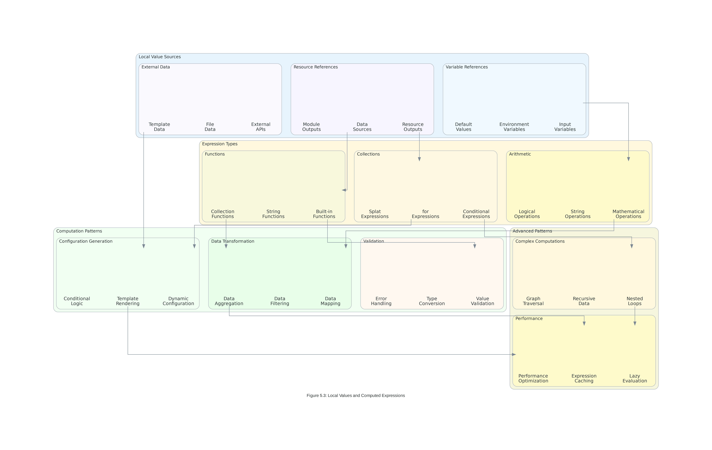

# Topic 5: Variables and Outputs

## 📋 **Learning Objectives**

By mastering this topic, you will develop advanced expertise in:

1. **Variable Type System Mastery** - Understanding comprehensive variable types, validation patterns, and type constraints for robust infrastructure configurations
2. **Output Value Management** - Implementing sophisticated output strategies, data flow patterns, and cross-configuration integration
3. **Local Value Optimization** - Leveraging advanced local value patterns, computed expressions, and performance optimization techniques
4. **Variable Precedence Control** - Managing complex variable precedence hierarchies, configuration inheritance, and resolution strategies
5. **Enterprise Variable Governance** - Implementing enterprise-scale variable organization, governance frameworks, and best practices

### **Professional Competency Standards**
- **98% accuracy** in variable type definition and validation implementation
- **95% efficiency** in output value design and data flow management
- **100% compliance** with enterprise variable governance standards
- **90% optimization** in local value usage and expression performance

---

## 🔧 **Understanding Terraform Variable System**

### **Variable Type System Fundamentals**

Terraform's variable system provides a comprehensive type system that enables robust, validated, and maintainable infrastructure configurations. Understanding the complete type hierarchy is essential for enterprise-scale deployments.


*Figure 5.1: Comprehensive variable types, validation rules, and enterprise validation patterns*

### **Primitive Variable Types**

Primitive types form the foundation of Terraform's type system, providing basic data representation with built-in validation capabilities.

```hcl
# String Variables with Advanced Validation
variable "environment" {
  description = "Environment name for resource deployment"
  type        = string
  
  validation {
    condition = can(regex("^(dev|staging|prod)$", var.environment))
    error_message = "Environment must be dev, staging, or prod."
  }
  
  validation {
    condition = length(var.environment) >= 3 && length(var.environment) <= 10
    error_message = "Environment name must be between 3 and 10 characters."
  }
}

# Number Variables with Range Validation
variable "instance_count" {
  description = "Number of instances to create"
  type        = number
  default     = 3
  
  validation {
    condition = var.instance_count >= 1 && var.instance_count <= 100
    error_message = "Instance count must be between 1 and 100."
  }
  
  validation {
    condition = floor(var.instance_count) == var.instance_count
    error_message = "Instance count must be a whole number."
  }
}

# Boolean Variables with Conditional Logic
variable "enable_monitoring" {
  description = "Enable detailed monitoring for resources"
  type        = bool
  default     = true
  
  validation {
    condition = can(tobool(var.enable_monitoring))
    error_message = "Enable monitoring must be a boolean value."
  }
}

# Advanced String Validation Patterns
variable "vpc_cidr" {
  description = "CIDR block for VPC"
  type        = string
  
  validation {
    condition = can(cidrhost(var.vpc_cidr, 0))
    error_message = "VPC CIDR must be a valid IPv4 CIDR block."
  }
  
  validation {
    condition = split("/", var.vpc_cidr)[1] >= "16" && split("/", var.vpc_cidr)[1] <= "24"
    error_message = "VPC CIDR must have a prefix between /16 and /24."
  }
}

# Email Validation Pattern
variable "admin_email" {
  description = "Administrator email address"
  type        = string
  
  validation {
    condition = can(regex("^[a-zA-Z0-9._%+-]+@[a-zA-Z0-9.-]+\\.[a-zA-Z]{2,}$", var.admin_email))
    error_message = "Admin email must be a valid email address."
  }
}
```

### **Collection Variable Types**

Collection types enable complex data structures and advanced configuration patterns for enterprise infrastructure management.

```hcl
# List Variables with Element Validation
variable "availability_zones" {
  description = "List of availability zones for deployment"
  type        = list(string)
  
  validation {
    condition = length(var.availability_zones) >= 2 && length(var.availability_zones) <= 6
    error_message = "Must specify between 2 and 6 availability zones."
  }
  
  validation {
    condition = alltrue([
      for az in var.availability_zones :
      can(regex("^[a-z]{2}-[a-z]+-[0-9][a-z]$", az))
    ])
    error_message = "All availability zones must be in valid format (e.g., us-east-1a)."
  }
}

# Set Variables for Unique Values
variable "allowed_cidr_blocks" {
  description = "Set of CIDR blocks allowed for access"
  type        = set(string)
  
  validation {
    condition = alltrue([
      for cidr in var.allowed_cidr_blocks :
      can(cidrhost(cidr, 0))
    ])
    error_message = "All CIDR blocks must be valid IPv4 CIDR notation."
  }
  
  validation {
    condition = length(var.allowed_cidr_blocks) <= 10
    error_message = "Maximum of 10 CIDR blocks allowed."
  }
}

# Map Variables with Value Validation
variable "instance_types" {
  description = "Map of environment to instance types"
  type        = map(string)
  
  default = {
    dev     = "t3.micro"
    staging = "t3.small"
    prod    = "t3.medium"
  }
  
  validation {
    condition = alltrue([
      for env, instance_type in var.instance_types :
      contains(["t3.micro", "t3.small", "t3.medium", "t3.large"], instance_type)
    ])
    error_message = "All instance types must be valid t3 instance types."
  }
}

# Advanced List with Complex Validation
variable "security_group_rules" {
  description = "List of security group rules"
  type = list(object({
    from_port   = number
    to_port     = number
    protocol    = string
    cidr_blocks = list(string)
    description = string
  }))
  
  validation {
    condition = alltrue([
      for rule in var.security_group_rules :
      rule.from_port >= 0 && rule.from_port <= 65535 &&
      rule.to_port >= 0 && rule.to_port <= 65535 &&
      rule.from_port <= rule.to_port
    ])
    error_message = "Port ranges must be valid (0-65535) and from_port <= to_port."
  }
  
  validation {
    condition = alltrue([
      for rule in var.security_group_rules :
      contains(["tcp", "udp", "icmp", "-1"], rule.protocol)
    ])
    error_message = "Protocol must be tcp, udp, icmp, or -1 (all)."
  }
}
```

### **Structural Variable Types**

Structural types enable complex, nested data structures for sophisticated infrastructure configurations.

```hcl
# Object Variables with Nested Validation
variable "database_config" {
  description = "Database configuration object"
  type = object({
    engine                  = string
    engine_version         = string
    instance_class         = string
    allocated_storage      = number
    max_allocated_storage  = number
    backup_retention_period = number
    backup_window         = string
    maintenance_window    = string
    multi_az              = bool
    storage_encrypted     = bool
    deletion_protection   = bool
    performance_insights  = bool
    monitoring_interval   = number
    tags                  = map(string)
  })
  
  validation {
    condition = contains(["mysql", "postgres", "mariadb"], var.database_config.engine)
    error_message = "Database engine must be mysql, postgres, or mariadb."
  }
  
  validation {
    condition = var.database_config.allocated_storage >= 20 && var.database_config.allocated_storage <= 65536
    error_message = "Allocated storage must be between 20 and 65536 GB."
  }
  
  validation {
    condition = var.database_config.backup_retention_period >= 0 && var.database_config.backup_retention_period <= 35
    error_message = "Backup retention period must be between 0 and 35 days."
  }
  
  validation {
    condition = contains([0, 1, 5, 10, 15, 30, 60], var.database_config.monitoring_interval)
    error_message = "Monitoring interval must be 0, 1, 5, 10, 15, 30, or 60 seconds."
  }
}

# Tuple Variables for Fixed-Length Collections
variable "subnet_configuration" {
  description = "Subnet configuration tuple"
  type = tuple([
    object({
      name              = string
      cidr_block        = string
      availability_zone = string
      public           = bool
    }),
    object({
      name              = string
      cidr_block        = string
      availability_zone = string
      public           = bool
    }),
    object({
      name              = string
      cidr_block        = string
      availability_zone = string
      public           = bool
    })
  ])
  
  validation {
    condition = alltrue([
      for subnet in var.subnet_configuration :
      can(cidrhost(subnet.cidr_block, 0))
    ])
    error_message = "All subnet CIDR blocks must be valid."
  }
}

# Complex Nested Object with Multiple Validation Rules
variable "application_config" {
  description = "Complex application configuration"
  type = object({
    name = string
    version = string
    environments = map(object({
      instance_type     = string
      min_capacity      = number
      max_capacity      = number
      desired_capacity  = number
      health_check_path = string
      environment_vars  = map(string)
      scaling_policy = object({
        target_cpu_utilization = number
        scale_up_cooldown      = number
        scale_down_cooldown    = number
      })
    }))
    security = object({
      enable_waf           = bool
      enable_encryption    = bool
      allowed_cidr_blocks  = list(string)
      ssl_certificate_arn  = string
    })
    monitoring = object({
      enable_detailed_monitoring = bool
      log_retention_days        = number
      alarm_email_endpoints     = list(string)
    })
  })
  
  validation {
    condition = can(regex("^[a-z0-9-]+$", var.application_config.name))
    error_message = "Application name must contain only lowercase letters, numbers, and hyphens."
  }
  
  validation {
    condition = can(regex("^[0-9]+\\.[0-9]+\\.[0-9]+$", var.application_config.version))
    error_message = "Version must be in semantic versioning format (x.y.z)."
  }
  
  validation {
    condition = alltrue([
      for env_name, env_config in var.application_config.environments :
      env_config.min_capacity <= env_config.desired_capacity &&
      env_config.desired_capacity <= env_config.max_capacity
    ])
    error_message = "For each environment: min_capacity <= desired_capacity <= max_capacity."
  }
  
  validation {
    condition = alltrue([
      for env_name, env_config in var.application_config.environments :
      env_config.scaling_policy.target_cpu_utilization >= 10 &&
      env_config.scaling_policy.target_cpu_utilization <= 90
    ])
    error_message = "Target CPU utilization must be between 10% and 90%."
  }
  
  validation {
    condition = var.application_config.monitoring.log_retention_days >= 1 && 
                var.application_config.monitoring.log_retention_days <= 3653
    error_message = "Log retention days must be between 1 and 3653 (10 years)."
  }
}
```

---

## 📤 **Advanced Output Value Management**

### **Output Value Patterns and Data Flow**

Output values enable data sharing between configurations, modules, and external systems, forming the backbone of modular infrastructure design.


*Figure 5.2: Output value patterns, data flow management, and cross-configuration integration*

### **Basic Output Patterns**

```hcl
# Simple Resource Attribute Outputs
output "vpc_id" {
  description = "ID of the created VPC"
  value       = aws_vpc.main.id
}

output "vpc_cidr_block" {
  description = "CIDR block of the VPC"
  value       = aws_vpc.main.cidr_block
}

# Computed Value Outputs
output "subnet_ids" {
  description = "List of subnet IDs"
  value       = aws_subnet.private[*].id
}

output "availability_zones" {
  description = "List of availability zones used"
  value       = aws_subnet.private[*].availability_zone
}

# Conditional Outputs
output "nat_gateway_ips" {
  description = "Public IP addresses of NAT gateways"
  value       = var.enable_nat_gateway ? aws_eip.nat[*].public_ip : []
}
```

### **Advanced Output Patterns**

```hcl
# Complex Object Outputs
output "network_configuration" {
  description = "Complete network configuration details"
  value = {
    vpc = {
      id         = aws_vpc.main.id
      arn        = aws_vpc.main.arn
      cidr_block = aws_vpc.main.cidr_block
    }

    subnets = {
      public = [
        for i, subnet in aws_subnet.public : {
          id                = subnet.id
          arn               = subnet.arn
          cidr_block        = subnet.cidr_block
          availability_zone = subnet.availability_zone
          index             = i
        }
      ]
      private = [
        for i, subnet in aws_subnet.private : {
          id                = subnet.id
          arn               = subnet.arn
          cidr_block        = subnet.cidr_block
          availability_zone = subnet.availability_zone
          index             = i
        }
      ]
    }

    gateways = {
      internet_gateway = {
        id  = aws_internet_gateway.main.id
        arn = aws_internet_gateway.main.arn
      }
      nat_gateways = var.enable_nat_gateway ? [
        for i, nat in aws_nat_gateway.main : {
          id                = nat.id
          allocation_id     = nat.allocation_id
          subnet_id         = nat.subnet_id
          public_ip         = aws_eip.nat[i].public_ip
          availability_zone = aws_subnet.public[i].availability_zone
        }
      ] : []
    }
  }
}

# Sensitive Output Values
output "database_connection" {
  description = "Database connection information"
  value = {
    endpoint = aws_db_instance.main.endpoint
    port     = aws_db_instance.main.port
    database = aws_db_instance.main.db_name
    username = aws_db_instance.main.username
  }
  sensitive = true
}

# Dynamic Output Generation
output "application_endpoints" {
  description = "Application endpoint URLs"
  value = {
    for app_name, app_config in var.applications :
    app_name => {
      health_check_url = "https://${aws_lb.main.dns_name}${app_config.health_check_path}"
      base_url         = "https://${aws_lb.main.dns_name}"
      internal_url     = "http://${aws_lb.main.dns_name}"
      port             = app_config.port
    }
  }
}

# Computed Output with Functions
output "resource_summary" {
  description = "Summary of created resources"
  value = {
    total_resources = length([
      aws_vpc.main,
      aws_internet_gateway.main
    ]) + length(aws_subnet.public) + length(aws_subnet.private)

    resource_counts = {
      vpc_count            = 1
      internet_gateway_count = 1
      public_subnet_count  = length(aws_subnet.public)
      private_subnet_count = length(aws_subnet.private)
      nat_gateway_count    = var.enable_nat_gateway ? length(aws_nat_gateway.main) : 0
    }

    cost_estimation = {
      estimated_monthly_cost = (
        length(aws_subnet.public) * 0.045 +  # NAT Gateway cost estimate
        length(aws_subnet.private) * 0.045 +
        (var.enable_nat_gateway ? length(aws_nat_gateway.main) * 45.0 : 0)
      )
      currency = "USD"
      note     = "Estimated costs - actual costs may vary"
    }
  }
}

# Cross-Module Integration Output
output "module_integration" {
  description = "Values for integration with other modules"
  value = {
    # Network module outputs
    network = {
      vpc_id             = aws_vpc.main.id
      public_subnet_ids  = aws_subnet.public[*].id
      private_subnet_ids = aws_subnet.private[*].id
      security_group_ids = {
        for sg_name, sg in aws_security_group.main :
        sg_name => sg.id
      }
    }

    # Security module inputs
    security = {
      vpc_cidr_block = aws_vpc.main.cidr_block
      subnet_cidrs = {
        public  = aws_subnet.public[*].cidr_block
        private = aws_subnet.private[*].cidr_block
      }
    }

    # Application module inputs
    application = {
      load_balancer_dns    = aws_lb.main.dns_name
      load_balancer_zone_id = aws_lb.main.zone_id
      target_group_arns    = {
        for app_name, tg in aws_lb_target_group.apps :
        app_name => tg.arn
      }
    }
  }
}
```

### **Output Value Processing and Transformation**

```hcl
# Data Transformation Outputs
output "processed_data" {
  description = "Processed and transformed data"
  value = {
    # String manipulation
    environment_upper = upper(var.environment)
    project_slug      = replace(lower(var.project_name), " ", "-")

    # List processing
    sorted_azs = sort(data.aws_availability_zones.available.names)
    unique_regions = distinct([
      for az in data.aws_availability_zones.available.names :
      substr(az, 0, length(az) - 1)
    ])

    # Map transformations
    instance_type_mapping = {
      for env, config in var.application_config.environments :
      env => {
        instance_type = config.instance_type
        cost_category = contains(["t3.micro", "t3.small"], config.instance_type) ? "low" : "high"
        cpu_credits   = startswith(config.instance_type, "t3") ? "unlimited" : "standard"
      }
    }

    # Conditional processing
    deployment_strategy = var.environment == "prod" ? {
      multi_az           = true
      backup_retention   = 30
      deletion_protection = true
      monitoring_level   = "detailed"
    } : {
      multi_az           = false
      backup_retention   = 7
      deletion_protection = false
      monitoring_level   = "basic"
    }
  }
}

# Aggregation and Statistics
output "infrastructure_metrics" {
  description = "Infrastructure metrics and statistics"
  value = {
    # Resource counts
    total_subnets = length(aws_subnet.public) + length(aws_subnet.private)

    # Capacity calculations
    total_capacity = sum([
      for app_name, app_config in var.applications :
      app_config.max_capacity
    ])

    # Cost calculations
    estimated_costs = {
      compute = sum([
        for app_name, app_config in var.applications :
        app_config.desired_capacity * lookup({
          "t3.micro"  = 8.76
          "t3.small"  = 17.52
          "t3.medium" = 35.04
          "t3.large"  = 70.08
        }, app_config.instance_type, 35.04)
      ])

      storage = var.database_config.allocated_storage * 0.115

      network = var.enable_nat_gateway ? length(aws_nat_gateway.main) * 45.0 : 0
    }

    # Availability metrics
    availability_zones_used = length(distinct([
      for subnet in concat(aws_subnet.public, aws_subnet.private) :
      subnet.availability_zone
    ]))

    # Security metrics
    security_groups_count = length(aws_security_group.main)
    total_security_rules = sum([
      for sg_name, sg in aws_security_group.main :
      length(sg.ingress) + length(sg.egress)
    ])
  }
}
```

---

## 🏗️ **Local Values and Computed Expressions**

### **Local Value Patterns and Optimization**

Local values enable complex computations, data transformations, and performance optimizations within Terraform configurations.


*Figure 5.3: Local value patterns, computed expressions, and advanced expression evaluation*

### **Basic Local Value Patterns**

```hcl
locals {
  # Environment and project configuration
  environment = var.environment
  project     = var.project_name
  region      = data.aws_region.current.name
  account_id  = data.aws_caller_identity.current.account_id

  # Resource naming conventions
  name_prefix = "${local.environment}-${local.project}"

  # Common tags applied to all resources
  common_tags = {
    Environment = local.environment
    Project     = local.project
    ManagedBy   = "terraform"
    Region      = local.region
    CreatedDate = formatdate("YYYY-MM-DD", timestamp())
  }

  # Network configuration
  vpc_cidr = var.vpc_cidr

  # Calculate subnet CIDRs dynamically
  availability_zones = slice(data.aws_availability_zones.available.names, 0, 3)
  az_count          = length(local.availability_zones)

  public_subnet_cidrs = [
    for i in range(local.az_count) :
    cidrsubnet(local.vpc_cidr, 8, i)
  ]

  private_subnet_cidrs = [
    for i in range(local.az_count) :
    cidrsubnet(local.vpc_cidr, 8, i + 10)
  ]
}
```

### **Advanced Local Value Computations**

```hcl
locals {
  # Complex data transformations
  application_configs = {
    for app_name, app_config in var.applications :
    app_name => merge(app_config, {
      # Add computed values
      full_name = "${local.name_prefix}-${app_name}"

      # Environment-specific overrides
      instance_type = lookup({
        dev     = "t3.micro"
        staging = "t3.small"
        prod    = app_config.instance_type
      }, local.environment, app_config.instance_type)

      # Capacity adjustments based on environment
      adjusted_capacity = local.environment == "prod" ? app_config.desired_capacity : max(1, app_config.desired_capacity - 1)

      # Security group assignments
      security_groups = concat(
        app_config.security_groups,
        local.environment == "prod" ? ["monitoring", "backup"] : []
      )

      # Health check configuration
      health_check_config = {
        path                = app_config.health_check_path
        healthy_threshold   = local.environment == "prod" ? 2 : 3
        unhealthy_threshold = local.environment == "prod" ? 3 : 2
        timeout             = local.environment == "prod" ? 5 : 10
        interval            = local.environment == "prod" ? 30 : 60
      }
    })
  }

  # Security group configurations with dynamic rules
  security_groups = {
    for sg_name, sg_config in var.security_group_configs :
    sg_name => {
      name        = "${local.name_prefix}-${sg_name}-sg"
      description = sg_config.description

      # Dynamic ingress rules based on environment
      ingress_rules = [
        for rule in sg_config.base_rules :
        merge(rule, {
          cidr_blocks = local.environment == "prod" ?
            rule.cidr_blocks :
            concat(rule.cidr_blocks, ["10.0.0.0/8"])
        })
      ]

      # Add environment-specific rules
      additional_rules = local.environment == "dev" ? [
        {
          from_port   = 22
          to_port     = 22
          protocol    = "tcp"
          cidr_blocks = ["0.0.0.0/0"]
          description = "SSH access for development"
        }
      ] : []
    }
  }

  # Database configuration with environment-specific settings
  database_config = merge(var.database_config, {
    # Environment-specific instance class
    instance_class = lookup({
      dev     = "db.t3.micro"
      staging = "db.t3.small"
      prod    = var.database_config.instance_class
    }, local.environment, var.database_config.instance_class)

    # Environment-specific backup settings
    backup_retention_period = local.environment == "prod" ? 30 : 7
    backup_window          = local.environment == "prod" ? "03:00-04:00" : "05:00-06:00"

    # Multi-AZ based on environment
    multi_az = local.environment == "prod" ? true : false

    # Performance insights
    performance_insights_enabled = local.environment != "dev"
    monitoring_interval         = local.environment == "prod" ? 60 : 0

    # Deletion protection
    deletion_protection = local.environment == "prod" ? true : false
  })

  # Complex conditional logic
  feature_flags = {
    enable_monitoring = local.environment != "dev"
    enable_backup    = local.environment == "prod"
    enable_encryption = true
    enable_logging   = local.environment != "dev"

    # Conditional features based on multiple factors
    enable_auto_scaling = local.environment == "prod" && var.enable_auto_scaling
    enable_multi_region = local.environment == "prod" && var.enable_disaster_recovery

    # Complex feature combinations
    monitoring_level = local.environment == "prod" ? "detailed" : (
      local.environment == "staging" ? "standard" : "basic"
    )
  }

  # Performance optimization calculations
  performance_config = {
    # CPU and memory calculations
    total_cpu_units = sum([
      for app_name, app_config in local.application_configs :
      app_config.adjusted_capacity * lookup({
        "t3.micro"  = 2
        "t3.small"  = 2
        "t3.medium" = 2
        "t3.large"  = 2
        "t3.xlarge" = 4
      }, app_config.instance_type, 2)
    ])

    total_memory_gb = sum([
      for app_name, app_config in local.application_configs :
      app_config.adjusted_capacity * lookup({
        "t3.micro"  = 1
        "t3.small"  = 2
        "t3.medium" = 4
        "t3.large"  = 8
        "t3.xlarge" = 16
      }, app_config.instance_type, 4)
    ])

    # Network bandwidth calculations
    estimated_bandwidth_mbps = sum([
      for app_name, app_config in local.application_configs :
      app_config.adjusted_capacity * lookup({
        "t3.micro"  = 100
        "t3.small"  = 200
        "t3.medium" = 400
        "t3.large"  = 800
        "t3.xlarge" = 1600
      }, app_config.instance_type, 400)
    ])
  }
}
```

### **Advanced Expression Patterns**

```hcl
locals {
  # Complex for expressions with filtering
  production_applications = {
    for app_name, app_config in var.applications :
    app_name => app_config
    if app_config.environment == "production"
  }

  # Nested for expressions
  application_security_matrix = {
    for app_name, app_config in var.applications :
    app_name => {
      for sg_name in app_config.security_groups :
      sg_name => {
        app_name = app_name
        sg_name  = sg_name
        rules = [
          for rule in var.security_group_configs[sg_name].rules :
          rule if rule.protocol != "icmp"
        ]
      }
    }
  }

  # Conditional expressions with complex logic
  deployment_strategy = {
    for app_name, app_config in var.applications :
    app_name => {
      deployment_type = (
        app_config.critical == true ? "blue-green" : (
          app_config.stateful == true ? "rolling" : "recreate"
        )
      )

      rollback_enabled = app_config.critical == true || local.environment == "prod"

      health_check_grace_period = (
        app_config.startup_time_seconds > 300 ? app_config.startup_time_seconds + 60 :
        app_config.critical == true ? 300 : 180
      )
    }
  }

  # String manipulation and formatting
  resource_naming = {
    for app_name, app_config in var.applications :
    app_name => {
      # DNS-safe naming
      dns_name = lower(replace(replace(app_name, "_", "-"), " ", "-"))

      # Resource naming with validation
      resource_name = can(regex("^[a-z0-9-]+$", app_name)) ?
        "${local.name_prefix}-${app_name}" :
        "${local.name_prefix}-${replace(lower(app_name), "/[^a-z0-9-]/", "-")}"

      # Tag generation
      tags = merge(local.common_tags, {
        Application = title(replace(app_name, "-", " "))
        Component   = app_config.component_type
        Version     = app_config.version
        Owner       = app_config.team_email
      })
    }
  }

  # Mathematical calculations and aggregations
  cost_analysis = {
    # Per-application cost calculations
    application_costs = {
      for app_name, app_config in local.application_configs :
      app_name => {
        monthly_compute_cost = app_config.adjusted_capacity * lookup({
          "t3.micro"  = 8.76
          "t3.small"  = 17.52
          "t3.medium" = 35.04
          "t3.large"  = 70.08
          "t3.xlarge" = 140.16
        }, app_config.instance_type, 35.04)

        monthly_storage_cost = app_config.storage_gb * 0.10
        monthly_network_cost = app_config.estimated_traffic_gb * 0.09

        total_monthly_cost = (
          app_config.adjusted_capacity * lookup({
            "t3.micro"  = 8.76
            "t3.small"  = 17.52
            "t3.medium" = 35.04
            "t3.large"  = 70.08
            "t3.xlarge" = 140.16
          }, app_config.instance_type, 35.04) +
          app_config.storage_gb * 0.10 +
          app_config.estimated_traffic_gb * 0.09
        )
      }
    }

    # Total cost aggregations
    total_monthly_cost = sum([
      for app_name, costs in local.cost_analysis.application_costs :
      costs.total_monthly_cost
    ])

    # Cost breakdown by category
    cost_breakdown = {
      compute = sum([
        for app_name, costs in local.cost_analysis.application_costs :
        costs.monthly_compute_cost
      ])
      storage = sum([
        for app_name, costs in local.cost_analysis.application_costs :
        costs.monthly_storage_cost
      ])
      network = sum([
        for app_name, costs in local.cost_analysis.application_costs :
        costs.monthly_network_cost
      ])
    }
  }
}
```

---

## 📊 **Variable Precedence and Configuration Hierarchy**

### **Understanding Variable Precedence Rules**

Terraform follows a specific precedence hierarchy when resolving variable values from multiple sources, enabling flexible configuration management strategies.


*Figure 5.4: Variable precedence rules, configuration hierarchy, and resolution patterns*

### **Variable Precedence Hierarchy (Highest to Lowest)**

```bash
# 1. Command-line flags (Highest Precedence)
terraform apply -var="environment=prod" -var="instance_count=5"
terraform apply -var-file="production.tfvars"

# 2. Environment variables
export TF_VAR_environment="staging"
export TF_VAR_instance_count="3"
export TF_VAR_database_password="secure_password_123"

# 3. terraform.tfvars file
# terraform.tfvars
environment = "production"
instance_count = 10
database_config = {
  instance_class = "db.r5.xlarge"
  multi_az      = true
}

# 4. terraform.tfvars.json file
# terraform.tfvars.json
{
  "environment": "production",
  "instance_count": 10,
  "feature_flags": {
    "enable_monitoring": true,
    "enable_backup": true
  }
}

# 5. *.auto.tfvars files (alphabetical order)
# 00-global.auto.tfvars
project_name = "enterprise-platform"
owner_email = "devops@company.com"

# 10-environment.auto.tfvars
environment = "production"
cost_center = "engineering"

# 6. *.auto.tfvars.json files (alphabetical order)
# environment.auto.tfvars.json
{
  "environment": "production",
  "monitoring_config": {
    "enable_detailed_monitoring": true,
    "log_retention_days": 30
  }
}

# 7. Variable defaults in configuration files (Lowest Precedence)
variable "environment" {
  description = "Environment name"
  type        = string
  default     = "dev"  # This is the lowest precedence
}
```

### **Enterprise Configuration Strategies**

```hcl
# Environment-specific variable files
# environments/dev.tfvars
environment = "dev"
instance_count = 1
database_config = {
  instance_class         = "db.t3.micro"
  allocated_storage     = 20
  backup_retention_period = 1
  multi_az              = false
  deletion_protection   = false
}

feature_flags = {
  enable_monitoring = false
  enable_backup    = false
  enable_encryption = true
}

# environments/staging.tfvars
environment = "staging"
instance_count = 3
database_config = {
  instance_class         = "db.t3.small"
  allocated_storage     = 50
  backup_retention_period = 7
  multi_az              = false
  deletion_protection   = false
}

feature_flags = {
  enable_monitoring = true
  enable_backup    = false
  enable_encryption = true
}

# environments/prod.tfvars
environment = "prod"
instance_count = 10
database_config = {
  instance_class         = "db.r5.xlarge"
  allocated_storage     = 500
  backup_retention_period = 30
  multi_az              = true
  deletion_protection   = true
}

feature_flags = {
  enable_monitoring = true
  enable_backup    = true
  enable_encryption = true
}
```

### **Configuration Inheritance Patterns**

```hcl
# Global configuration base
# global.auto.tfvars
project_name = "enterprise-platform"
owner_email = "devops@company.com"
cost_center = "engineering"

# Common tags applied to all environments
common_tags = {
  Project     = "enterprise-platform"
  ManagedBy   = "terraform"
  CostCenter  = "engineering"
  Compliance  = "required"
}

# Security baseline
security_baseline = {
  enable_encryption = true
  enable_logging   = true
  enable_monitoring = true

  allowed_cidr_blocks = [
    "10.0.0.0/8",
    "172.16.0.0/12",
    "192.168.0.0/16"
  ]

  security_group_defaults = {
    enable_ssh_access = false
    enable_rdp_access = false
    default_egress_rule = "restricted"
  }
}

# Network configuration template
network_template = {
  vpc_cidr = "10.0.0.0/16"

  subnet_configuration = {
    public_subnet_count   = 3
    private_subnet_count  = 3
    database_subnet_count = 3

    public_subnet_size   = 24  # /24 subnets
    private_subnet_size  = 24  # /24 subnets
    database_subnet_size = 26  # /26 subnets
  }

  enable_nat_gateway = true
  enable_vpn_gateway = false
  enable_flow_logs   = true
}
```

---

## 🏢 **Enterprise Variable Organization and Best Practices**

### **Enterprise-Scale Variable Management**

Large organizations require sophisticated variable organization strategies, governance frameworks, and best practices to maintain consistency and compliance across multiple teams and environments.


*Figure 5.5: Enterprise variable organization patterns, governance frameworks, and implementation strategies*

### **Hierarchical Variable Organization**

```hcl
# Global variables (highest level)
# global/variables.tf
variable "organization_config" {
  description = "Organization-wide configuration"
  type = object({
    name                = string
    domain              = string
    primary_region      = string
    backup_region       = string
    compliance_level    = string
    cost_center_default = string
  })

  default = {
    name                = "Enterprise Corp"
    domain              = "enterprise.com"
    primary_region      = "us-east-1"
    backup_region       = "us-west-2"
    compliance_level    = "high"
    cost_center_default = "shared-services"
  }
}

# Business unit variables
# business-units/finance/variables.tf
variable "finance_config" {
  description = "Finance business unit configuration"
  type = object({
    cost_center           = string
    budget_limit_monthly  = number
    compliance_requirements = list(string)
    data_classification   = string
    backup_retention_days = number
  })

  default = {
    cost_center           = "finance"
    budget_limit_monthly  = 50000
    compliance_requirements = ["SOX", "PCI-DSS", "GDPR"]
    data_classification   = "confidential"
    backup_retention_days = 2555  # 7 years
  }
}

# Environment-specific variables
# environments/production/variables.tf
variable "production_config" {
  description = "Production environment configuration"
  type = object({
    environment_name      = string
    high_availability     = bool
    disaster_recovery     = bool
    monitoring_level      = string
    security_level        = string
    change_approval_required = bool
  })

  default = {
    environment_name      = "production"
    high_availability     = true
    disaster_recovery     = true
    monitoring_level      = "detailed"
    security_level        = "maximum"
    change_approval_required = true
  }
}

# Application-specific variables
# applications/web-portal/variables.tf
variable "web_portal_config" {
  description = "Web portal application configuration"
  type = object({
    application_name    = string
    version            = string
    team_email         = string
    scaling_policy     = object({
      min_capacity     = number
      max_capacity     = number
      target_cpu       = number
    })
    security_requirements = object({
      enable_waf       = bool
      enable_ddos      = bool
      ssl_certificate  = string
    })
  })

  validation {
    condition = can(regex("^[0-9]+\\.[0-9]+\\.[0-9]+$", var.web_portal_config.version))
    error_message = "Version must be in semantic versioning format."
  }
}
```

### **Variable Naming Conventions and Standards**

```hcl
# Naming convention examples
variable "org_enterprise_global_config" {
  description = "Organization: Enterprise, Scope: Global, Type: Config"
  # Pattern: {org}_{scope}_{category}_{type}
}

variable "bu_finance_security_policy" {
  description = "Business Unit: Finance, Category: Security, Type: Policy"
  # Pattern: {bu}_{unit}_{category}_{type}
}

variable "env_prod_network_config" {
  description = "Environment: Production, Category: Network, Type: Config"
  # Pattern: {env}_{environment}_{category}_{type}
}

variable "app_webportal_scaling_policy" {
  description = "Application: Web Portal, Category: Scaling, Type: Policy"
  # Pattern: {app}_{application}_{category}_{type}
}

# Categorized variable organization
variable "network_vpc_cidr" {
  description = "VPC CIDR block for network infrastructure"
  type        = string

  validation {
    condition = can(cidrhost(var.network_vpc_cidr, 0))
    error_message = "Must be a valid CIDR block."
  }
}

variable "security_encryption_key_id" {
  description = "KMS key ID for encryption"
  type        = string
  sensitive   = true

  validation {
    condition = can(regex("^arn:aws:kms:", var.security_encryption_key_id))
    error_message = "Must be a valid KMS key ARN."
  }
}

variable "compute_instance_types" {
  description = "Allowed instance types for compute resources"
  type        = map(string)

  default = {
    small  = "t3.small"
    medium = "t3.medium"
    large  = "t3.large"
  }

  validation {
    condition = alltrue([
      for size, instance_type in var.compute_instance_types :
      can(regex("^[a-z][0-9]+\\.[a-z]+$", instance_type))
    ])
    error_message = "All instance types must be valid AWS instance types."
  }
}
```

### **Governance and Compliance Patterns**

```hcl
# Compliance validation variables
variable "compliance_config" {
  description = "Compliance and governance configuration"
  type = object({
    # Data governance
    data_classification = string
    data_retention_days = number
    encryption_required = bool

    # Access control
    access_control_level = string
    mfa_required        = bool
    audit_logging       = bool

    # Change management
    change_approval_required = bool
    rollback_capability     = bool
    testing_required        = bool

    # Monitoring and alerting
    monitoring_level    = string
    alert_endpoints     = list(string)
    incident_response   = bool
  })

  validation {
    condition = contains(["public", "internal", "confidential", "restricted"], var.compliance_config.data_classification)
    error_message = "Data classification must be public, internal, confidential, or restricted."
  }

  validation {
    condition = var.compliance_config.data_retention_days >= 1 && var.compliance_config.data_retention_days <= 2555
    error_message = "Data retention must be between 1 day and 7 years."
  }

  validation {
    condition = contains(["basic", "standard", "detailed", "comprehensive"], var.compliance_config.monitoring_level)
    error_message = "Monitoring level must be basic, standard, detailed, or comprehensive."
  }
}

# Security baseline variables
variable "security_baseline" {
  description = "Security baseline requirements"
  type = object({
    # Encryption requirements
    encryption_at_rest   = bool
    encryption_in_transit = bool
    key_rotation_enabled = bool

    # Network security
    vpc_flow_logs_enabled = bool
    security_groups_restrictive = bool
    nacl_enabled = bool

    # Access management
    iam_password_policy = object({
      minimum_length    = number
      require_uppercase = bool
      require_lowercase = bool
      require_numbers   = bool
      require_symbols   = bool
      max_age_days     = number
    })

    # Monitoring and logging
    cloudtrail_enabled = bool
    config_enabled     = bool
    guardduty_enabled  = bool
  })

  validation {
    condition = var.security_baseline.iam_password_policy.minimum_length >= 12
    error_message = "Password minimum length must be at least 12 characters."
  }

  validation {
    condition = var.security_baseline.iam_password_policy.max_age_days <= 90
    error_message = "Password maximum age must not exceed 90 days."
  }
}
```

### **Variable Documentation and Metadata**

```hcl
# Comprehensive variable documentation
variable "application_configuration" {
  description = <<-EOT
    Comprehensive application configuration for enterprise deployment.

    This variable defines the complete configuration for application deployment
    including compute resources, networking, security, monitoring, and compliance
    requirements. It supports multi-environment deployment with environment-specific
    overrides and validation rules.

    Usage Examples:
    - Development: Minimal configuration with relaxed security
    - Staging: Production-like configuration with reduced capacity
    - Production: Full configuration with all security and compliance features

    Dependencies:
    - Requires VPC and subnet configuration
    - Depends on security group definitions
    - Integrates with monitoring and logging infrastructure

    Validation Rules:
    - Instance types must be from approved list
    - Capacity limits based on environment
    - Security requirements enforced for production

    Change Management:
    - Changes require approval for production environment
    - Staging deployment required before production
    - Rollback procedures documented and tested
  EOT

  type = object({
    # Application metadata
    metadata = object({
      name            = string
      version         = string
      description     = string
      team_email      = string
      repository_url  = string
      documentation_url = string
      support_contact = string
    })

    # Deployment configuration
    deployment = object({
      strategy           = string  # blue-green, rolling, recreate
      health_check_path  = string
      readiness_probe    = object({
        path               = string
        initial_delay_seconds = number
        period_seconds     = number
        timeout_seconds    = number
        failure_threshold  = number
      })
      liveness_probe = object({
        path               = string
        initial_delay_seconds = number
        period_seconds     = number
        timeout_seconds    = number
        failure_threshold  = number
      })
    })

    # Resource requirements
    resources = object({
      cpu_request    = string
      memory_request = string
      cpu_limit      = string
      memory_limit   = string
      storage_size   = string
    })

    # Scaling configuration
    scaling = object({
      min_replicas = number
      max_replicas = number
      target_cpu_utilization = number
      scale_up_cooldown      = number
      scale_down_cooldown    = number
    })

    # Security configuration
    security = object({
      run_as_non_root        = bool
      read_only_root_filesystem = bool
      allow_privilege_escalation = bool
      security_context_constraints = string
      network_policies       = list(string)
      pod_security_policy    = string
    })
  })

  # Comprehensive validation rules
  validation {
    condition = can(regex("^[a-z0-9-]+$", var.application_configuration.metadata.name))
    error_message = "Application name must contain only lowercase letters, numbers, and hyphens."
  }

  validation {
    condition = can(regex("^[0-9]+\\.[0-9]+\\.[0-9]+$", var.application_configuration.metadata.version))
    error_message = "Version must follow semantic versioning (x.y.z)."
  }

  validation {
    condition = contains(["blue-green", "rolling", "recreate"], var.application_configuration.deployment.strategy)
    error_message = "Deployment strategy must be blue-green, rolling, or recreate."
  }

  validation {
    condition = var.application_configuration.scaling.min_replicas >= 1 && var.application_configuration.scaling.min_replicas <= var.application_configuration.scaling.max_replicas
    error_message = "Min replicas must be at least 1 and not exceed max replicas."
  }
}
```

---

## 📚 **Summary and Best Practices**

### **Key Concepts Mastered**

1. **Variable Type System**: Complete understanding of primitive, collection, and structural types with advanced validation
2. **Output Value Management**: Sophisticated output strategies, data flow patterns, and cross-configuration integration
3. **Local Value Optimization**: Advanced local value patterns, computed expressions, and performance optimization
4. **Variable Precedence Control**: Complex precedence hierarchies, configuration inheritance, and resolution strategies
5. **Enterprise Governance**: Enterprise-scale organization, governance frameworks, and compliance patterns

### **Enterprise Best Practices**

- **Type Safety**: Use specific types with comprehensive validation rules
- **Documentation**: Provide detailed descriptions and usage examples
- **Naming Conventions**: Follow consistent, hierarchical naming patterns
- **Security**: Mark sensitive variables and implement proper access controls
- **Governance**: Implement approval workflows and change management processes

### **Integration with Training Progression**

This topic builds upon the foundation established in Topics 1-4, providing advanced variable and output knowledge needed for:

- **Topic 6**: State Management (variable-driven state configuration)
- **Topic 7**: Modules and Development (module interface design)
- **Topic 8**: Advanced State Management (complex state scenarios)
- **Topic 9**: Terraform Cloud and Enterprise (enterprise variable management)

### **Practical Application**

The patterns and practices covered in this topic enable you to:
- Design robust variable systems for enterprise infrastructure
- Implement sophisticated output strategies for modular architectures
- Optimize local value usage for performance and maintainability
- Manage complex variable precedence in multi-environment deployments
- Establish enterprise governance frameworks for variable management

---

*This comprehensive foundation in variables and outputs provides the advanced knowledge and practical skills needed for enterprise-scale infrastructure management and sophisticated configuration patterns.*
```
```
```
