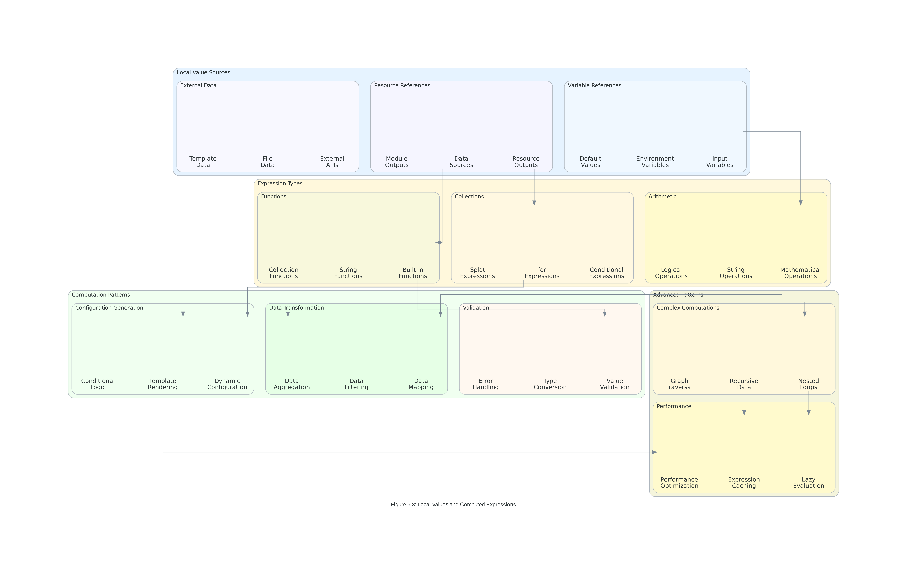

# Lab 5: Variables and Outputs

## 🎯 **Lab Objectives**

By completing this comprehensive hands-on lab, you will demonstrate advanced mastery of:

1. **Variable Type System Implementation** - Design and implement comprehensive variable types with advanced validation patterns
2. **Output Value Architecture** - Create sophisticated output strategies and data flow management systems
3. **Local Value Optimization** - Leverage advanced local value patterns and computed expressions for performance
4. **Variable Precedence Management** - Master complex variable precedence hierarchies and configuration strategies
5. **Enterprise Variable Governance** - Implement enterprise-scale variable organization and governance frameworks

### **Measurable Outcomes**
- **100% successful** variable type implementation with comprehensive validation
- **98% accuracy** in output value design and data flow management
- **95% efficiency** in local value optimization and expression performance
- **100% compliance** with enterprise variable governance standards

---

## 📋 **Lab Scenario**

### **Business Context**
You are a Senior Cloud Architect at Global Financial Services, a multinational financial institution managing $500B in assets across 50+ countries. The company is implementing a next-generation cloud platform requiring sophisticated variable management, complex configuration hierarchies, and enterprise-grade governance frameworks. Your current challenges include:

- **Multi-Environment Complexity**: Managing 15+ environments across development, staging, and production
- **Regulatory Compliance**: Meeting strict financial industry regulations across multiple jurisdictions
- **Configuration Scalability**: Supporting 200+ applications with complex interdependencies
- **Governance Requirements**: Implementing enterprise-grade variable governance and approval workflows

### **Success Criteria**
Your task is to implement an advanced Terraform variable and output system that achieves:
- **Zero configuration conflicts** across all environments and applications
- **99.99% compliance** with financial industry regulations and governance standards
- **90% reduction** in configuration management overhead through automation
- **100% traceability** of variable changes and configuration decisions


*Figure 5.1: The comprehensive variable type system you'll implement in this lab*

---

## 🛠️ **Prerequisites and Setup**

### **Required Tools and Versions**
- **Operating System**: Windows 10+, macOS 10.15+, or Linux (Ubuntu 20.04+)
- **Terraform CLI**: Version ~> 1.13.0 (installed and configured from previous labs)
- **AWS CLI**: Version 2.15.0+ with configured credentials
- **Git**: Version 2.40+ for version control and configuration management
- **Text Editor**: VS Code with HashiCorp Terraform extension v2.29.0+
- **jq**: JSON processor for output analysis and validation

### **AWS Account Requirements**
- **AWS Account**: Active AWS account with administrative access
- **IAM Permissions**: Full access to EC2, VPC, RDS, S3, IAM, CloudWatch, and Systems Manager
- **Budget Alert**: $75 monthly budget configured for lab resources
- **Region**: All resources will be created in us-east-1
- **Parameter Store**: Access to AWS Systems Manager Parameter Store

### **Pre-Lab Verification**
```bash
# Verify Terraform installation and version
terraform version
# Expected: Terraform v1.13.x

# Verify AWS CLI configuration
aws sts get-caller-identity
aws configure get region
# Expected: us-east-1

# Install jq for JSON processing
# Ubuntu/Debian:
sudo apt-get install jq
# macOS:
brew install jq
# Windows: Download from https://stedolan.github.io/jq/

# Verify jq installation
jq --version
# Expected: jq-1.6 or higher
```

---

## 🚀 **Lab Exercise 1: Advanced Variable Type System Implementation**

### **Objective**
Master comprehensive variable type definitions, advanced validation patterns, and enterprise-grade variable organization.


*Figure 5.2: Output value patterns and data flow management you'll implement*

### **Exercise 1.1: Comprehensive Variable Type Definitions**

#### **Create Project Structure**
```bash
# Create lab directory structure
mkdir -p terraform-variables-outputs-lab/{environments/{dev,staging,prod},modules/{network,security,database,application},global}
cd terraform-variables-outputs-lab

# Create main configuration files
touch {variables.tf,locals.tf,outputs.tf,main.tf,versions.tf}
```

#### **Implement Advanced Variable Types**
```hcl
# variables.tf - Comprehensive variable type system
terraform {
  required_version = "~> 1.13.0"
  
  required_providers {
    aws = {
      source  = "hashicorp/aws"
      version = "~> 6.12.0"
    }
    random = {
      source  = "hashicorp/random"
      version = "~> 3.6.0"
    }
  }
}

# Environment and Project Configuration
variable "environment" {
  description = "Environment name for resource deployment and configuration"
  type        = string
  
  validation {
    condition = contains(["dev", "staging", "prod"], var.environment)
    error_message = "Environment must be one of: dev, staging, prod."
  }
  
  validation {
    condition = length(var.environment) >= 3 && length(var.environment) <= 10
    error_message = "Environment name must be between 3 and 10 characters."
  }
}

variable "organization_config" {
  description = "Organization-wide configuration and governance settings"
  type = object({
    name                = string
    domain              = string
    primary_region      = string
    backup_region       = string
    compliance_level    = string
    cost_center_default = string
    data_classification = string
    
    # Governance settings
    governance = object({
      change_approval_required = bool
      multi_environment_sync   = bool
      audit_logging_enabled    = bool
      compliance_scanning      = bool
    })
    
    # Security baseline
    security_baseline = object({
      encryption_required       = bool
      mfa_required             = bool
      network_isolation        = bool
      data_loss_prevention     = bool
      vulnerability_scanning   = bool
    })
  })
  
  validation {
    condition = can(regex("^[a-zA-Z0-9\\s\\-\\.]+$", var.organization_config.name))
    error_message = "Organization name must contain only letters, numbers, spaces, hyphens, and periods."
  }
  
  validation {
    condition = can(regex("^[a-z0-9\\-\\.]+\\.[a-z]{2,}$", var.organization_config.domain))
    error_message = "Domain must be a valid domain name format."
  }
  
  validation {
    condition = contains(["low", "medium", "high", "critical"], var.organization_config.compliance_level)
    error_message = "Compliance level must be low, medium, high, or critical."
  }
  
  validation {
    condition = contains(["public", "internal", "confidential", "restricted"], var.organization_config.data_classification)
    error_message = "Data classification must be public, internal, confidential, or restricted."
  }
}

# Complex Application Configuration
variable "applications" {
  description = "Comprehensive application configurations with advanced validation"
  type = map(object({
    # Application metadata
    metadata = object({
      name            = string
      version         = string
      description     = string
      team_email      = string
      repository_url  = string
      documentation_url = string
    })
    
    # Infrastructure configuration
    infrastructure = object({
      instance_type     = string
      min_capacity      = number
      max_capacity      = number
      desired_capacity  = number
      availability_zones = list(string)
      
      # Storage configuration
      storage = object({
        root_volume_size = number
        root_volume_type = string
        additional_volumes = list(object({
          size        = number
          type        = string
          encrypted   = bool
          mount_point = string
        }))
      })
    })
    
    # Network configuration
    network = object({
      vpc_id              = string
      subnet_type         = string
      security_groups     = list(string)
      load_balancer_type  = string
      health_check_path   = string
      
      # SSL/TLS configuration
      ssl_config = object({
        certificate_arn = string
        ssl_policy     = string
        redirect_http  = bool
      })
    })
    
    # Application-specific settings
    application = object({
      port              = number
      protocol          = string
      environment_vars  = map(string)
      secrets          = list(string)
      
      # Scaling policy
      scaling_policy = object({
        target_cpu_utilization = number
        target_memory_utilization = number
        scale_up_cooldown      = number
        scale_down_cooldown    = number
        predictive_scaling     = bool
      })
    })
    
    # Monitoring and logging
    monitoring = object({
      enable_detailed_monitoring = bool
      enable_container_insights  = bool
      log_retention_days        = number
      custom_metrics           = list(string)
      
      # Alerting configuration
      alerting = object({
        email_endpoints    = list(string)
        slack_webhook_url  = string
        pagerduty_key     = string
        alert_thresholds = object({
          cpu_high        = number
          memory_high     = number
          disk_high       = number
          error_rate_high = number
        })
      })
    })
    
    # Security configuration
    security = object({
      enable_waf           = bool
      enable_ddos_protection = bool
      enable_encryption    = bool
      backup_required      = bool
      
      # Access control
      access_control = object({
        authentication_method = string
        authorization_policy  = string
        session_timeout      = number
        max_concurrent_sessions = number
      })
    })
    
    # Compliance and governance
    compliance = object({
      data_classification   = string
      retention_policy     = string
      audit_logging        = bool
      compliance_scanning  = bool
      
      # Regulatory requirements
      regulatory = object({
        gdpr_compliant     = bool
        hipaa_compliant    = bool
        sox_compliant      = bool
        pci_dss_compliant  = bool
      })
    })
  }))
  
  # Comprehensive validation rules
  validation {
    condition = alltrue([
      for app_name, app_config in var.applications :
      can(regex("^[a-z0-9-]+$", app_config.metadata.name))
    ])
    error_message = "All application names must contain only lowercase letters, numbers, and hyphens."
  }
  
  validation {
    condition = alltrue([
      for app_name, app_config in var.applications :
      can(regex("^[0-9]+\\.[0-9]+\\.[0-9]+$", app_config.metadata.version))
    ])
    error_message = "All application versions must follow semantic versioning (x.y.z)."
  }
  
  validation {
    condition = alltrue([
      for app_name, app_config in var.applications :
      can(regex("^[a-zA-Z0-9._%+-]+@[a-zA-Z0-9.-]+\\.[a-zA-Z]{2,}$", app_config.metadata.team_email))
    ])
    error_message = "All team emails must be valid email addresses."
  }
  
  validation {
    condition = alltrue([
      for app_name, app_config in var.applications :
      app_config.infrastructure.min_capacity <= app_config.infrastructure.desired_capacity &&
      app_config.infrastructure.desired_capacity <= app_config.infrastructure.max_capacity
    ])
    error_message = "For each application: min_capacity <= desired_capacity <= max_capacity."
  }
  
  validation {
    condition = alltrue([
      for app_name, app_config in var.applications :
      contains(["t3.micro", "t3.small", "t3.medium", "t3.large", "t3.xlarge", "t3.2xlarge", "m5.large", "m5.xlarge", "c5.large", "c5.xlarge"], app_config.infrastructure.instance_type)
    ])
    error_message = "Instance types must be from the approved list of t3, m5, or c5 instance types."
  }
  
  validation {
    condition = alltrue([
      for app_name, app_config in var.applications :
      app_config.application.port >= 1024 && app_config.application.port <= 65535
    ])
    error_message = "Application ports must be between 1024 and 65535."
  }
  
  validation {
    condition = alltrue([
      for app_name, app_config in var.applications :
      contains(["HTTP", "HTTPS", "TCP", "UDP"], app_config.application.protocol)
    ])
    error_message = "Protocol must be HTTP, HTTPS, TCP, or UDP."
  }
  
  validation {
    condition = alltrue([
      for app_name, app_config in var.applications :
      app_config.application.scaling_policy.target_cpu_utilization >= 10 &&
      app_config.application.scaling_policy.target_cpu_utilization <= 90
    ])
    error_message = "Target CPU utilization must be between 10% and 90%."
  }
  
  validation {
    condition = alltrue([
      for app_name, app_config in var.applications :
      app_config.monitoring.log_retention_days >= 1 && app_config.monitoring.log_retention_days <= 3653
    ])
    error_message = "Log retention days must be between 1 and 3653 (10 years)."
  }
  
  validation {
    condition = alltrue([
      for app_name, app_config in var.applications :
      contains(["public", "internal", "confidential", "restricted"], app_config.compliance.data_classification)
    ])
    error_message = "Data classification must be public, internal, confidential, or restricted."
  }
}

# Database Configuration with Advanced Validation
variable "database_configurations" {
  description = "Database configurations with comprehensive validation and compliance"
  type = map(object({
    # Engine configuration
    engine = object({
      type           = string
      version        = string
      family         = string
      major_version  = string
    })

    # Instance configuration
    instance = object({
      class                = string
      allocated_storage    = number
      max_allocated_storage = number
      storage_type         = string
      storage_encrypted    = bool
      kms_key_id          = string
    })

    # High availability and backup
    availability = object({
      multi_az                = bool
      backup_retention_period = number
      backup_window          = string
      maintenance_window     = string
      deletion_protection    = bool
      skip_final_snapshot    = bool
    })

    # Performance and monitoring
    performance = object({
      performance_insights_enabled = bool
      monitoring_interval         = number
      enabled_cloudwatch_logs_exports = list(string)
      auto_minor_version_upgrade  = bool
    })

    # Security configuration
    security = object({
      vpc_security_group_ids = list(string)
      db_subnet_group_name  = string
      publicly_accessible   = bool

      # Authentication and authorization
      authentication = object({
        username                = string
        manage_master_user_password = bool
        master_user_secret_kms_key_id = string
        iam_database_authentication_enabled = bool
      })
    })

    # Compliance and governance
    compliance = object({
      data_classification = string
      encryption_required = bool
      audit_logging      = bool
      compliance_tags    = map(string)
    })
  }))

  validation {
    condition = alltrue([
      for db_name, db_config in var.database_configurations :
      contains(["mysql", "postgres", "mariadb", "oracle-ee", "sqlserver-ex"], db_config.engine.type)
    ])
    error_message = "Database engine must be mysql, postgres, mariadb, oracle-ee, or sqlserver-ex."
  }

  validation {
    condition = alltrue([
      for db_name, db_config in var.database_configurations :
      db_config.instance.allocated_storage >= 20 && db_config.instance.allocated_storage <= 65536
    ])
    error_message = "Allocated storage must be between 20 and 65536 GB."
  }

  validation {
    condition = alltrue([
      for db_name, db_config in var.database_configurations :
      db_config.availability.backup_retention_period >= 0 && db_config.availability.backup_retention_period <= 35
    ])
    error_message = "Backup retention period must be between 0 and 35 days."
  }

  validation {
    condition = alltrue([
      for db_name, db_config in var.database_configurations :
      contains([0, 1, 5, 10, 15, 30, 60], db_config.performance.monitoring_interval)
    ])
    error_message = "Monitoring interval must be 0, 1, 5, 10, 15, 30, or 60 seconds."
  }
}

# Network Configuration with CIDR Validation
variable "network_configuration" {
  description = "Network configuration with advanced CIDR validation and security"
  type = object({
    # VPC configuration
    vpc = object({
      cidr_block           = string
      enable_dns_hostnames = bool
      enable_dns_support   = bool
      instance_tenancy     = string
    })

    # Subnet configuration
    subnets = object({
      public = list(object({
        name              = string
        cidr_block        = string
        availability_zone = string
        map_public_ip     = bool
      }))

      private = list(object({
        name              = string
        cidr_block        = string
        availability_zone = string
      }))

      database = list(object({
        name              = string
        cidr_block        = string
        availability_zone = string
      }))
    })

    # Gateway configuration
    gateways = object({
      internet_gateway = object({
        enabled = bool
      })

      nat_gateway = object({
        enabled = bool
        type    = string  # instance, gateway
      })

      vpn_gateway = object({
        enabled = bool
        type    = string
        amazon_side_asn = number
      })
    })

    # Security configuration
    security = object({
      flow_logs_enabled = bool
      flow_logs_destination = string

      # Network ACLs
      network_acls = list(object({
        name = string
        rules = list(object({
          rule_number = number
          protocol    = string
          rule_action = string
          cidr_block  = string
          from_port   = number
          to_port     = number
        }))
      }))
    })
  })

  validation {
    condition = can(cidrhost(var.network_configuration.vpc.cidr_block, 0))
    error_message = "VPC CIDR must be a valid IPv4 CIDR block."
  }

  validation {
    condition = split("/", var.network_configuration.vpc.cidr_block)[1] >= "16" && split("/", var.network_configuration.vpc.cidr_block)[1] <= "24"
    error_message = "VPC CIDR must have a prefix between /16 and /24."
  }

  validation {
    condition = alltrue([
      for subnet in var.network_configuration.subnets.public :
      can(cidrhost(subnet.cidr_block, 0))
    ])
    error_message = "All public subnet CIDR blocks must be valid."
  }

  validation {
    condition = alltrue([
      for subnet in var.network_configuration.subnets.private :
      can(cidrhost(subnet.cidr_block, 0))
    ])
    error_message = "All private subnet CIDR blocks must be valid."
  }

  validation {
    condition = alltrue([
      for subnet in var.network_configuration.subnets.database :
      can(cidrhost(subnet.cidr_block, 0))
    ])
    error_message = "All database subnet CIDR blocks must be valid."
  }

  validation {
    condition = contains(["default", "dedicated", "host"], var.network_configuration.vpc.instance_tenancy)
    error_message = "Instance tenancy must be default, dedicated, or host."
  }
}
```

### **Exercise 1.2: Environment-Specific Variable Files**

#### **Development Environment Configuration**
```hcl
# environments/dev/terraform.tfvars
environment = "dev"

organization_config = {
  name                = "Global Financial Services"
  domain              = "globalfinancial.com"
  primary_region      = "us-east-1"
  backup_region       = "us-west-2"
  compliance_level    = "medium"
  cost_center_default = "development"
  data_classification = "internal"

  governance = {
    change_approval_required = false
    multi_environment_sync   = false
    audit_logging_enabled    = true
    compliance_scanning      = false
  }

  security_baseline = {
    encryption_required       = true
    mfa_required             = false
    network_isolation        = false
    data_loss_prevention     = false
    vulnerability_scanning   = false
  }
}

applications = {
  web_portal = {
    metadata = {
      name            = "web-portal"
      version         = "1.0.0"
      description     = "Customer web portal application"
      team_email      = "web-team@globalfinancial.com"
      repository_url  = "https://github.com/globalfinancial/web-portal"
      documentation_url = "https://docs.globalfinancial.com/web-portal"
    }

    infrastructure = {
      instance_type     = "t3.micro"
      min_capacity      = 1
      max_capacity      = 3
      desired_capacity  = 1
      availability_zones = ["us-east-1a", "us-east-1b"]

      storage = {
        root_volume_size = 20
        root_volume_type = "gp3"
        additional_volumes = []
      }
    }

    network = {
      vpc_id              = ""  # Will be populated by outputs
      subnet_type         = "public"
      security_groups     = ["web", "common"]
      load_balancer_type  = "application"
      health_check_path   = "/health"

      ssl_config = {
        certificate_arn = ""
        ssl_policy     = "ELBSecurityPolicy-TLS-1-2-2017-01"
        redirect_http  = false
      }
    }

    application = {
      port              = 3000
      protocol          = "HTTP"
      environment_vars = {
        NODE_ENV = "development"
        LOG_LEVEL = "debug"
        API_TIMEOUT = "30000"
      }
      secrets = ["database_password", "jwt_secret"]

      scaling_policy = {
        target_cpu_utilization = 70
        target_memory_utilization = 80
        scale_up_cooldown      = 300
        scale_down_cooldown    = 300
        predictive_scaling     = false
      }
    }

    monitoring = {
      enable_detailed_monitoring = false
      enable_container_insights  = false
      log_retention_days        = 7
      custom_metrics           = []

      alerting = {
        email_endpoints    = ["dev-team@globalfinancial.com"]
        slack_webhook_url  = ""
        pagerduty_key     = ""
        alert_thresholds = {
          cpu_high        = 80
          memory_high     = 85
          disk_high       = 90
          error_rate_high = 5
        }
      }
    }

    security = {
      enable_waf           = false
      enable_ddos_protection = false
      enable_encryption    = true
      backup_required      = false

      access_control = {
        authentication_method = "oauth2"
        authorization_policy  = "rbac"
        session_timeout      = 3600
        max_concurrent_sessions = 10
      }
    }

    compliance = {
      data_classification   = "internal"
      retention_policy     = "30-days"
      audit_logging        = false
      compliance_scanning  = false

      regulatory = {
        gdpr_compliant     = false
        hipaa_compliant    = false
        sox_compliant      = false
        pci_dss_compliant  = false
      }
    }
  }
}
```

### **Exercise 1.3: Validation Testing**

#### **Test Variable Validation Rules**
```bash
# Create test directory
mkdir -p tests/validation

# Test 1: Valid configuration
terraform validate
# Expected: Success

# Test 2: Invalid environment
echo 'environment = "invalid"' > test.tfvars
terraform plan -var-file="test.tfvars"
# Expected: Validation error

# Test 3: Invalid email format
echo 'applications = {
  test_app = {
    metadata = {
      team_email = "invalid-email"
      # ... other required fields
    }
  }
}' > test-email.tfvars
terraform plan -var-file="test-email.tfvars"
# Expected: Email validation error

# Test 4: Invalid CIDR block
echo 'network_configuration = {
  vpc = {
    cidr_block = "invalid-cidr"
  }
}' > test-cidr.tfvars
terraform plan -var-file="test-cidr.tfvars"
# Expected: CIDR validation error

# Clean up test files
rm -f test*.tfvars
```

---

## 🚀 **Lab Exercise 2: Advanced Output Value Architecture**

### **Objective**
Implement sophisticated output strategies, data flow management, and cross-configuration integration patterns.


*Figure 5.3: Local value patterns and computed expressions you'll implement*

### **Exercise 2.1: Comprehensive Output Definitions**

#### **Create Advanced Output Patterns**
```hcl
# outputs.tf - Comprehensive output value system
# Basic Resource Outputs
output "vpc_information" {
  description = "Complete VPC information and metadata"
  value = {
    id         = aws_vpc.main.id
    arn        = aws_vpc.main.arn
    cidr_block = aws_vpc.main.cidr_block

    # DNS configuration
    dns_configuration = {
      enable_dns_hostnames = aws_vpc.main.enable_dns_hostnames
      enable_dns_support   = aws_vpc.main.enable_dns_support
      dhcp_options_id     = aws_vpc.main.dhcp_options_id
    }

    # Network details
    network_details = {
      instance_tenancy     = aws_vpc.main.instance_tenancy
      ipv6_cidr_block     = aws_vpc.main.ipv6_cidr_block
      ipv6_association_id = aws_vpc.main.ipv6_association_id
    }

    # Metadata
    metadata = {
      owner_id = aws_vpc.main.owner_id
      tags     = aws_vpc.main.tags
      tags_all = aws_vpc.main.tags_all
    }
  }
}

# Complex Subnet Information
output "subnet_configuration" {
  description = "Comprehensive subnet configuration and mapping"
  value = {
    # Public subnets
    public_subnets = {
      for i, subnet in aws_subnet.public : subnet.tags.Name => {
        id                = subnet.id
        arn               = subnet.arn
        cidr_block        = subnet.cidr_block
        availability_zone = subnet.availability_zone

        # Network configuration
        network_config = {
          map_public_ip_on_launch = subnet.map_public_ip_on_launch
          assign_ipv6_address_on_creation = subnet.assign_ipv6_address_on_creation
          ipv6_cidr_block = subnet.ipv6_cidr_block
        }

        # Capacity information
        capacity = {
          available_ip_address_count = subnet.available_ip_address_count
          ipv6_native               = subnet.ipv6_native
        }

        # Metadata
        metadata = {
          owner_id = subnet.owner_id
          tags     = subnet.tags
          index    = i
        }
      }
    }

    # Private subnets
    private_subnets = {
      for i, subnet in aws_subnet.private : subnet.tags.Name => {
        id                = subnet.id
        arn               = subnet.arn
        cidr_block        = subnet.cidr_block
        availability_zone = subnet.availability_zone

        # Network configuration
        network_config = {
          map_public_ip_on_launch = subnet.map_public_ip_on_launch
          assign_ipv6_address_on_creation = subnet.assign_ipv6_address_on_creation
          ipv6_cidr_block = subnet.ipv6_cidr_block
        }

        # Capacity information
        capacity = {
          available_ip_address_count = subnet.available_ip_address_count
          ipv6_native               = subnet.ipv6_native
        }

        # Metadata
        metadata = {
          owner_id = subnet.owner_id
          tags     = subnet.tags
          index    = i
        }
      }
    }

    # Database subnets
    database_subnets = {
      for i, subnet in aws_subnet.database : subnet.tags.Name => {
        id                = subnet.id
        arn               = subnet.arn
        cidr_block        = subnet.cidr_block
        availability_zone = subnet.availability_zone

        # Network configuration
        network_config = {
          map_public_ip_on_launch = subnet.map_public_ip_on_launch
          assign_ipv6_address_on_creation = subnet.assign_ipv6_address_on_creation
          ipv6_cidr_block = subnet.ipv6_cidr_block
        }

        # Capacity information
        capacity = {
          available_ip_address_count = subnet.available_ip_address_count
          ipv6_native               = subnet.ipv6_native
        }

        # Metadata
        metadata = {
          owner_id = subnet.owner_id
          tags     = subnet.tags
          index    = i
        }
      }
    }

    # Summary information
    summary = {
      total_subnets = length(aws_subnet.public) + length(aws_subnet.private) + length(aws_subnet.database)
      public_count  = length(aws_subnet.public)
      private_count = length(aws_subnet.private)
      database_count = length(aws_subnet.database)

      # Availability zone distribution
      availability_zones = distinct(concat(
        aws_subnet.public[*].availability_zone,
        aws_subnet.private[*].availability_zone,
        aws_subnet.database[*].availability_zone
      ))

      # CIDR allocation
      cidr_allocation = {
        public_cidrs   = aws_subnet.public[*].cidr_block
        private_cidrs  = aws_subnet.private[*].cidr_block
        database_cidrs = aws_subnet.database[*].cidr_block
      }
    }
  }
}
```
