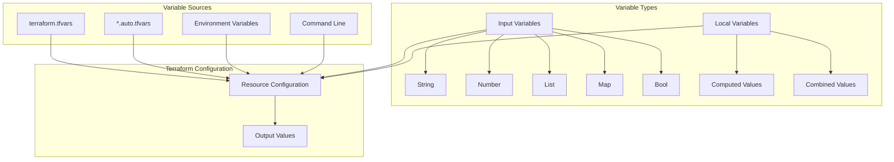
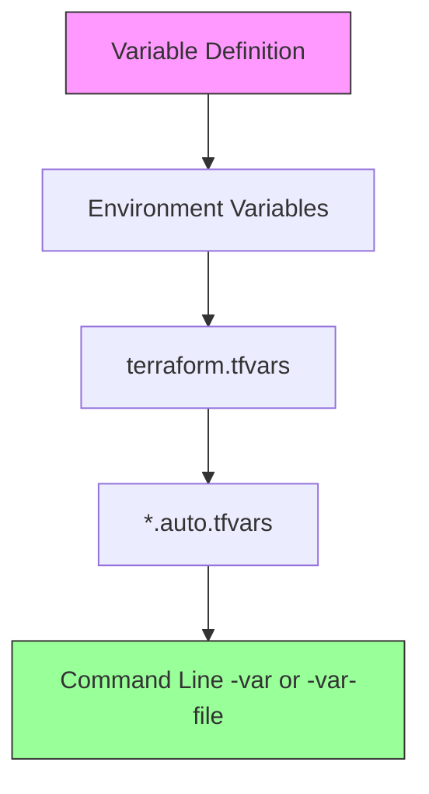
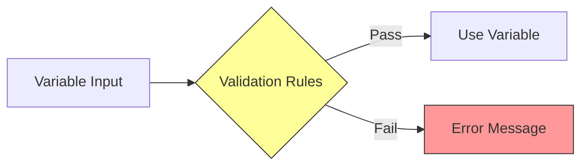
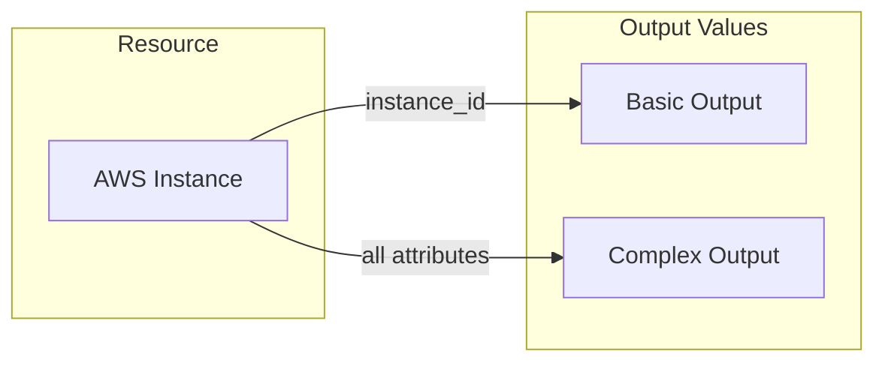
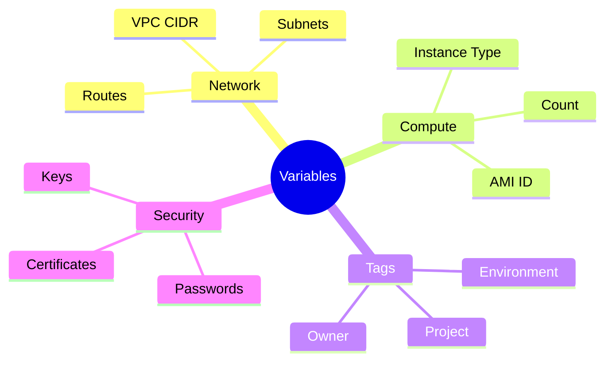
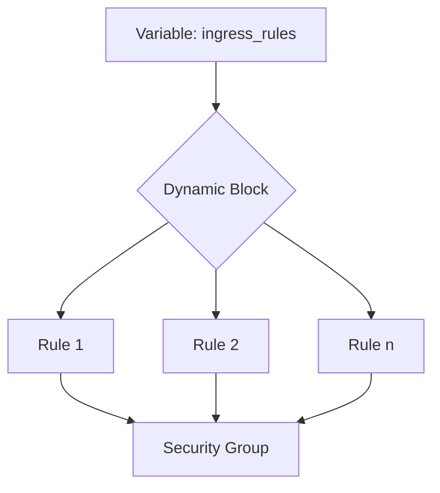
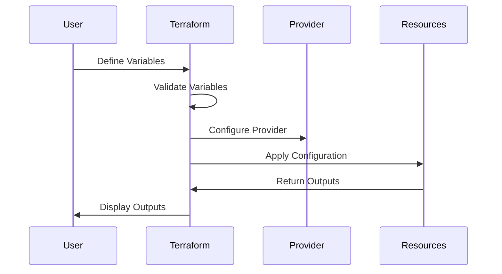

# Terraform Variables and Outputs - Diagrams

## 1. Variable Types and Flow

## 2. Variable Precedence

## 3. Variable Validation Flow

## 4. Output Structure

## 5. Variable Organization

## 6. Dynamic Blocks Pattern

## 7. Variable Usage Flow
