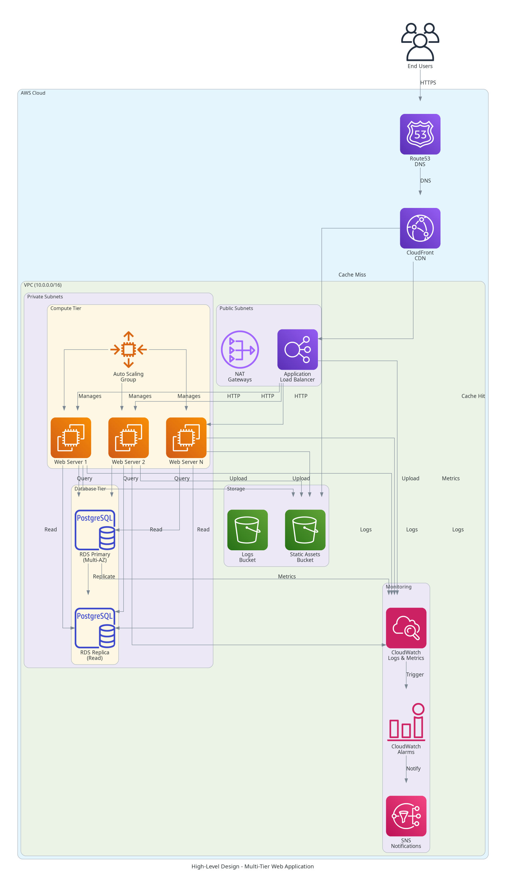
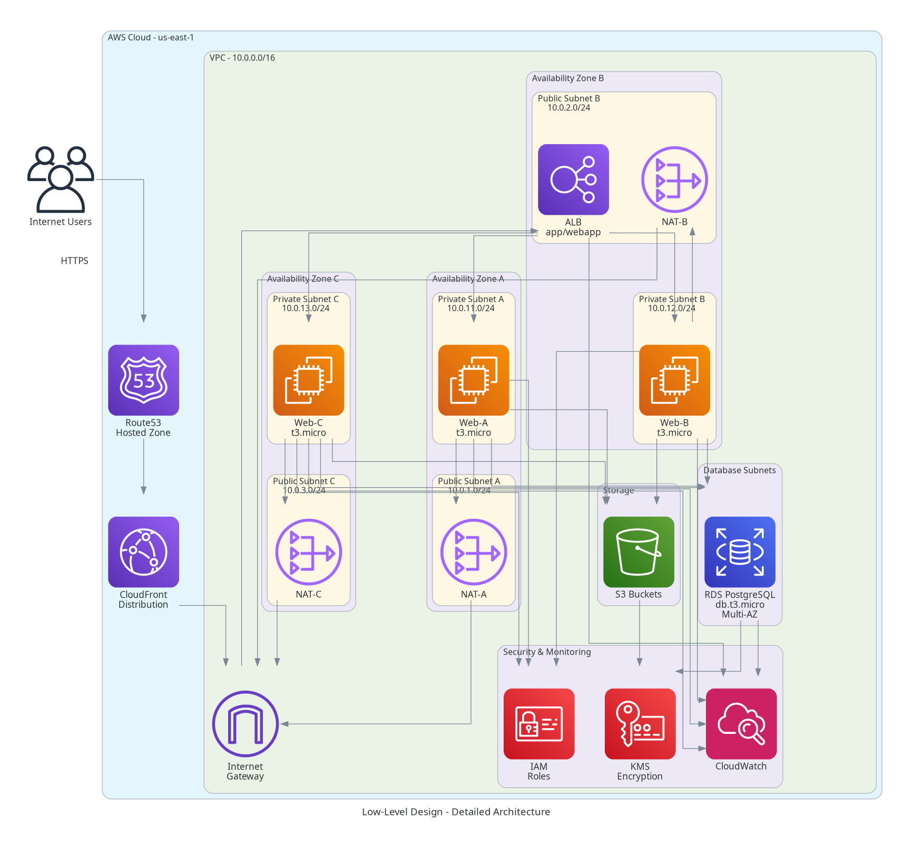
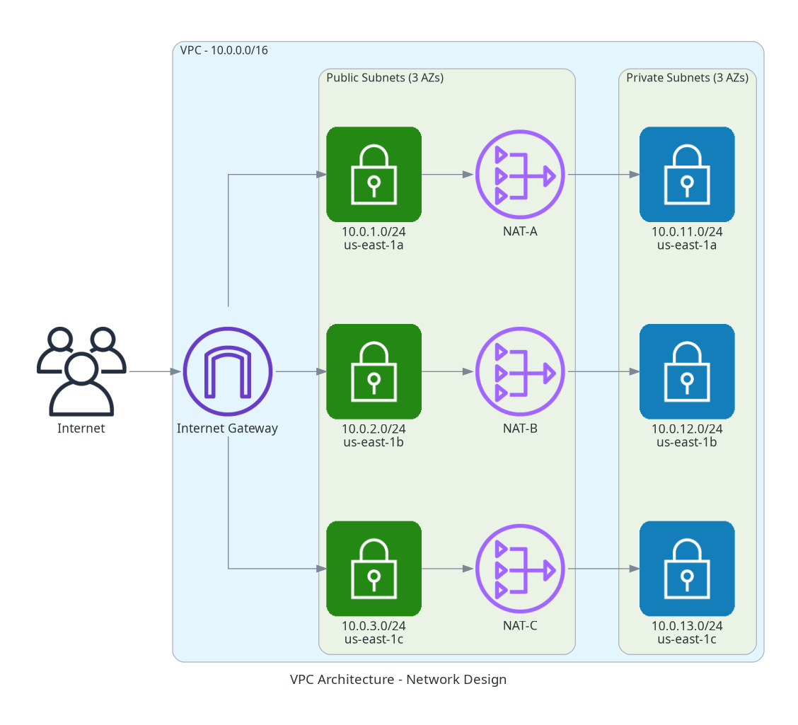
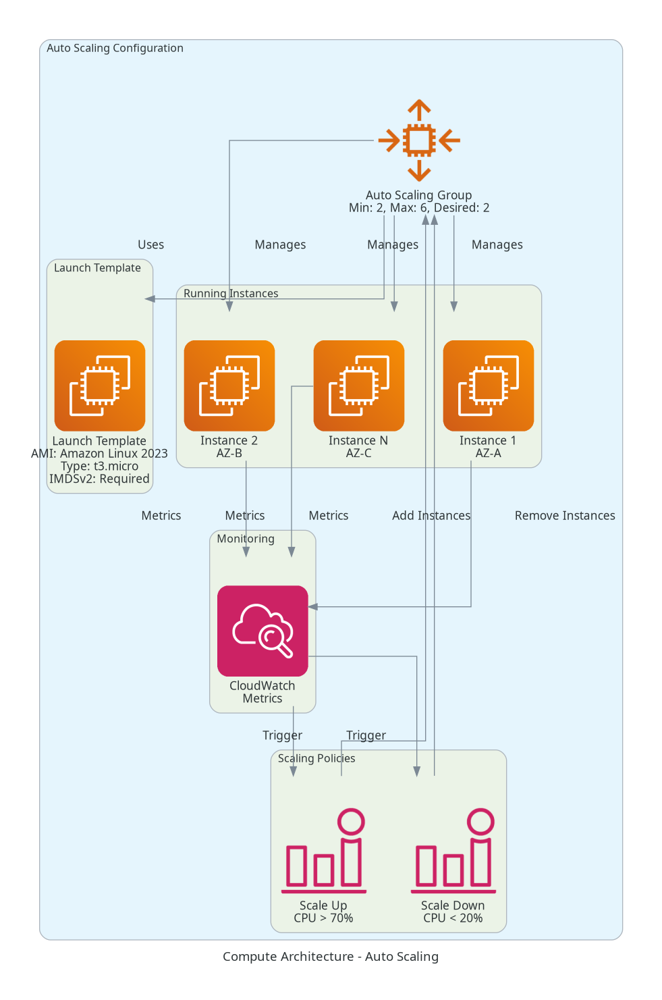
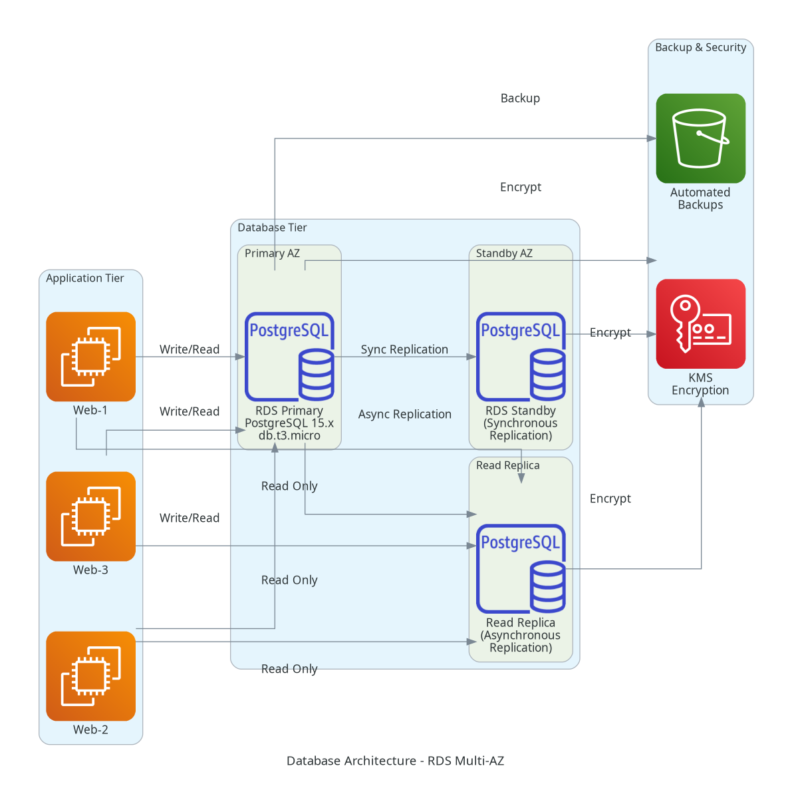
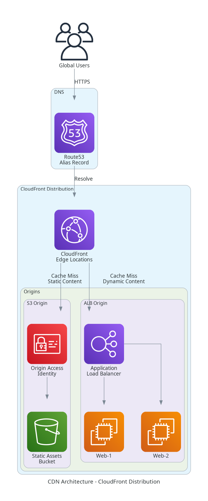
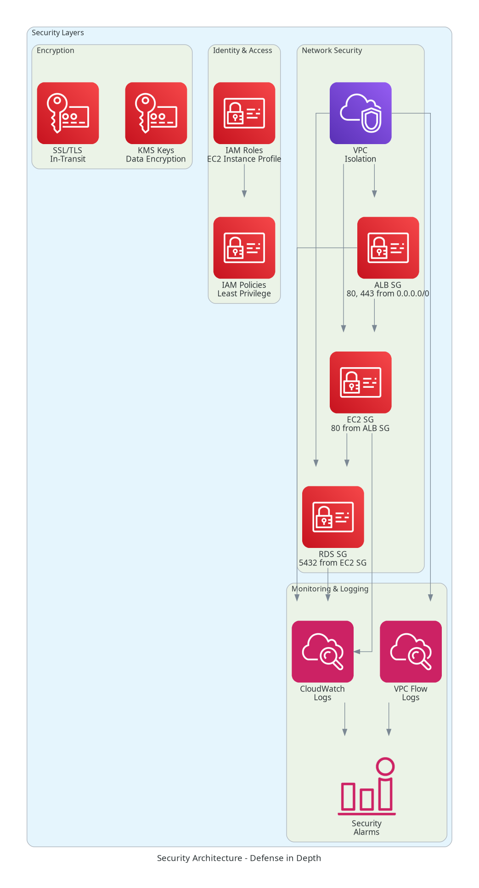
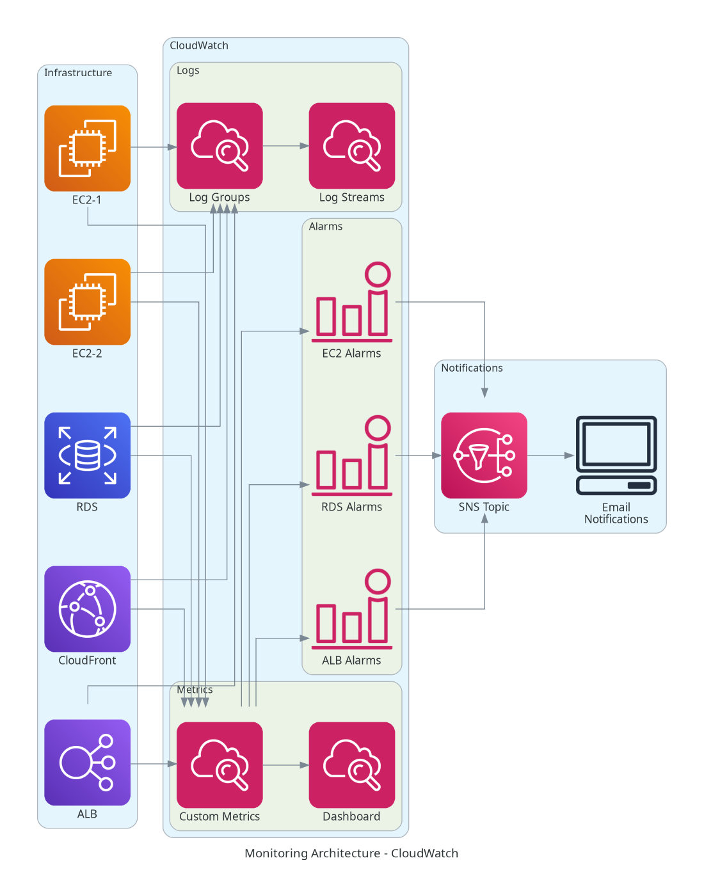
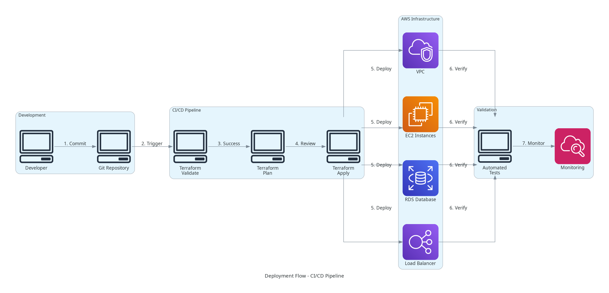

# Project 1: Multi-Tier Web Application Infrastructure

**Terraform Capstone Project for HashiCorp Terraform Associate Certification**

## 📋 PROJECT OVERVIEW

**Difficulty**: Intermediate  
**Duration**: 8-10 hours  
**Terraform Version**: ~> 1.13.0  
**AWS Provider Version**: ~> 6.12.0

### Description
Design and deploy a complete, production-ready multi-tier web application infrastructure on AWS using Terraform. This project implements a highly available, scalable architecture with proper networking, compute, database, storage, and content delivery components.

### Architecture
This project deploys a three-tier architecture:
- **Presentation Tier**: CloudFront CDN + Application Load Balancer
- **Application Tier**: Auto Scaling Group with EC2 instances across 3 AZs
- **Data Tier**: RDS PostgreSQL Multi-AZ + S3 for static assets

---

## 🎯 LEARNING OBJECTIVES

By completing this project, you will:

1. ✅ Design and implement VPC with public/private subnet architecture across 3 Availability Zones
2. ✅ Deploy EC2 instances with Auto Scaling Groups for high availability
3. ✅ Configure Application Load Balancer for intelligent traffic distribution
4. ✅ Set up RDS PostgreSQL database with Multi-AZ deployment for fault tolerance
5. ✅ Implement S3 bucket for static asset storage with proper security
6. ✅ Configure CloudFront CDN for global content delivery
7. ✅ Manage DNS with Route53 for custom domain routing
8. ✅ Implement proper resource dependencies (implicit and explicit)
9. ✅ Use Terraform variables and outputs effectively
10. ✅ Manage Terraform state with remote backend (S3 + DynamoDB)

---

## 🏗️ ARCHITECTURE COMPONENTS

### Networking Layer
- **VPC**: Custom VPC with CIDR 10.0.0.0/16
- **Subnets**: 6 subnets across 3 Availability Zones
  - 3 Public Subnets (10.0.1.0/24, 10.0.2.0/24, 10.0.3.0/24)
  - 3 Private Subnets (10.0.11.0/24, 10.0.12.0/24, 10.0.13.0/24)
- **Internet Gateway**: For public subnet internet access
- **NAT Gateways**: 3 NAT Gateways (one per AZ) for private subnet outbound access
- **Route Tables**: Separate route tables for public and private subnets

### Compute Layer
- **Launch Template**: EC2 launch configuration with user data
- **Auto Scaling Group**: 2-6 instances across 3 AZs
- **Instance Type**: t3.micro (configurable)
- **AMI**: Latest Amazon Linux 2023
- **Security**: IAM instance profile with SSM access

### Load Balancing
- **Application Load Balancer**: Internet-facing ALB in public subnets
- **Target Group**: Health checks on port 80
- **Listeners**: HTTP (port 80) and HTTPS (port 443)
- **Health Checks**: /health endpoint with 30s interval

### Database Layer
- **RDS PostgreSQL**: Version 15.x
- **Deployment**: Multi-AZ for high availability
- **Instance Class**: db.t3.micro (configurable)
- **Storage**: 20GB gp3 with encryption
- **Backup**: 7-day retention, automated backups
- **Subnet Group**: Private subnets across 3 AZs

### Storage Layer
- **S3 Bucket**: For static assets (images, CSS, JS)
- **Versioning**: Enabled
- **Encryption**: AES-256 server-side encryption
- **Lifecycle**: Transition to IA after 90 days
- **Bucket Policy**: CloudFront OAI access

### Content Delivery
- **CloudFront Distribution**: Global CDN
- **Origin**: S3 bucket with OAI
- **Cache Behavior**: Default TTL 86400s
- **SSL/TLS**: CloudFront default certificate
- **Geo Restriction**: None (global access)

### DNS
- **Route53 Hosted Zone**: Custom domain
- **A Record**: Alias to ALB
- **CNAME Record**: Alias to CloudFront

### Security
- **Security Groups**:
  - ALB SG: Allow 80, 443 from 0.0.0.0/0
  - EC2 SG: Allow 80 from ALB SG
  - RDS SG: Allow 5432 from EC2 SG
- **IAM Roles**:
  - EC2 Instance Role: SSM, CloudWatch, S3 read
  - Lambda Execution Role (if needed)
- **NACLs**: Default allow all (can be customized)

### Monitoring
- **CloudWatch Log Groups**: Application logs
- **CloudWatch Alarms**: CPU, memory, disk, ALB targets
- **SNS Topics**: Alert notifications
- **CloudWatch Dashboard**: Centralized monitoring

---

## 📊 ARCHITECTURE DIAGRAMS

### High-Level Design (HLD)


### Low-Level Design (LLD)


### VPC Architecture


### Compute Architecture


### Database Architecture


### CDN Architecture


### Security Architecture


### Monitoring Architecture


### Deployment Flow


---

## 🚀 QUICK START

### Prerequisites
- AWS Account with appropriate permissions
- Terraform 1.13.0+ installed
- AWS CLI configured with credentials
- S3 bucket for Terraform state (create manually first)
- DynamoDB table for state locking (create manually first)

### Step 1: Clone and Navigate
```bash
cd Project-1-Multi-Tier-Web-Application
```

### Step 2: Configure Variables
Edit `terraform-manifests/terraform.tfvars`:
```hcl
aws_region     = "us-east-1"
environment    = "dev"
project_name   = "webapp"
vpc_cidr       = "10.0.0.0/16"
instance_type  = "t3.micro"
db_instance_class = "db.t3.micro"
```

### Step 3: Initialize Terraform
```bash
cd terraform-manifests
terraform init
```

### Step 4: Validate Configuration
```bash
terraform validate
terraform fmt -check
```

### Step 5: Plan Deployment
```bash
terraform plan -out=tfplan
```

### Step 6: Deploy Infrastructure
```bash
terraform apply tfplan
```

### Step 7: Verify Deployment
```bash
# Get outputs
terraform output

# Test ALB endpoint
curl $(terraform output -raw alb_dns_name)
```

### Step 8: Cleanup (when done)
```bash
terraform destroy
```

---

## 📁 PROJECT STRUCTURE

```
Project-1-Multi-Tier-Web-Application/
├── README.md                          # This file
├── Makefile                           # Automation targets
├── PROJECT-1-COMPLETION-SUMMARY.md    # Completion report
│
├── docs/
│   ├── architecture.md                # Detailed architecture
│   ├── theory.md                      # Terraform concepts
│   ├── commands.md                    # Command reference
│   ├── troubleshooting.md             # Common issues
│   ├── examples.md                    # Step-by-step examples
│   └── validation.md                  # Testing procedures
│
├── diagrams/
│   ├── generate_diagrams.py           # Diagram generation script
│   ├── requirements.txt               # Python dependencies
│   └── [10 PNG diagram files]
│
├── terraform-manifests/
│   ├── providers.tf                   # Provider configuration
│   ├── variables.tf                   # Input variables
│   ├── terraform.tfvars               # Default values
│   ├── outputs.tf                     # Output values
│   ├── locals.tf                      # Local values
│   ├── data.tf                        # Data sources
│   ├── vpc.tf                         # VPC resources
│   ├── compute.tf                     # EC2, ASG resources
│   ├── alb.tf                         # Load balancer
│   ├── rds.tf                         # Database
│   ├── s3.tf                          # Storage
│   ├── cloudfront.tf                  # CDN
│   ├── route53.tf                     # DNS
│   ├── security.tf                    # Security groups, IAM
│   └── monitoring.tf                  # CloudWatch
│
└── scripts/
    ├── deploy.sh                      # Deployment automation
    ├── validate.sh                    # Validation automation
    └── cleanup.sh                     # Cleanup automation
```

---

## 🔧 TERRAFORM CONCEPTS COVERED

### Core Concepts
- ✅ Resource blocks and meta-arguments
- ✅ Data sources for dynamic lookups
- ✅ Variables (string, number, bool, list, map, object)
- ✅ Outputs for exposing values
- ✅ Local values for computed expressions

### Advanced Concepts
- ✅ Resource dependencies (implicit with references)
- ✅ Resource dependencies (explicit with depends_on)
- ✅ Count meta-argument for multiple resources
- ✅ for_each for map-based resources
- ✅ Dynamic blocks for nested configurations
- ✅ Remote state backend (S3 + DynamoDB)
- ✅ State locking and encryption

### Best Practices
- ✅ Modular file organization
- ✅ Consistent naming conventions
- ✅ Comprehensive tagging strategy
- ✅ Sensitive data handling
- ✅ Variable validation rules
- ✅ Output descriptions

---

## 📚 DOCUMENTATION

Comprehensive documentation is available in the `docs/` directory:

- **[Architecture](docs/architecture.md)**: Detailed architecture explanation
- **[Theory](docs/theory.md)**: Terraform concepts and exam topics
- **[Commands](docs/commands.md)**: Complete command reference
- **[Troubleshooting](docs/troubleshooting.md)**: Common issues and solutions
- **[Examples](docs/examples.md)**: Step-by-step deployment examples
- **[Validation](docs/validation.md)**: Testing and validation procedures

---

## ✅ SUCCESS CRITERIA

Your deployment is successful when:

- [ ] All Terraform configurations validate without errors
- [ ] Infrastructure deploys successfully across 3 AZs
- [ ] ALB health checks pass for all targets
- [ ] RDS database is accessible from EC2 instances
- [ ] S3 bucket is accessible via CloudFront
- [ ] CloudWatch alarms are configured and active
- [ ] All resources are properly tagged
- [ ] State is stored remotely in S3 with locking
- [ ] Cleanup destroys all resources successfully

---

## 🎓 EXAM TOPICS COVERED

This project covers the following Terraform Associate exam domains:

- **IaC Concepts (20%)**: Infrastructure as Code principles, benefits
- **Terraform Basics (40%)**: Resources, variables, outputs, state
- **Terraform Workflow (40%)**: Init, plan, apply, destroy

---

## 🔗 REFERENCES

- [Terraform AWS Provider Documentation](https://registry.terraform.io/providers/hashicorp/aws/latest/docs)
- [AWS VPC Documentation](https://docs.aws.amazon.com/vpc/)
- [AWS EC2 Auto Scaling](https://docs.aws.amazon.com/autoscaling/)
- [AWS RDS Documentation](https://docs.aws.amazon.com/rds/)
- [AWS CloudFront Documentation](https://docs.aws.amazon.com/cloudfront/)
- [Terraform Best Practices](https://www.terraform-best-practices.com/)

---

**Project Status**: ✅ Complete and Ready for Deployment  
**Last Updated**: October 27, 2025  
**Terraform Version**: 1.13.0+  
**AWS Provider Version**: 6.12.0+

