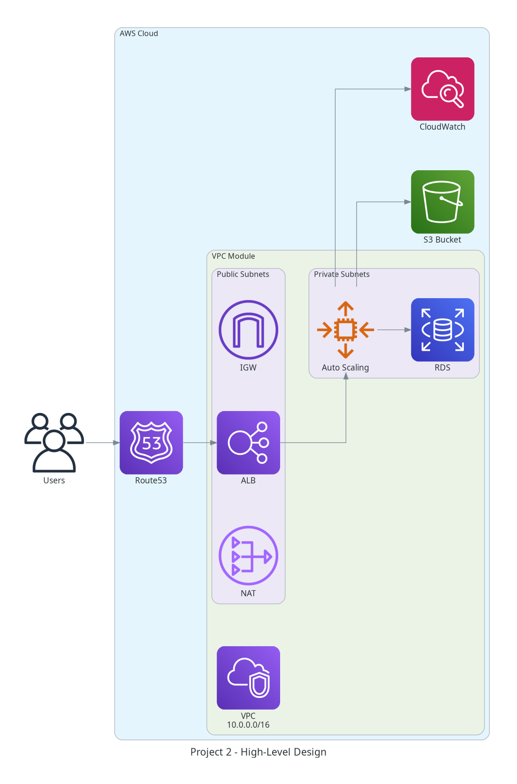
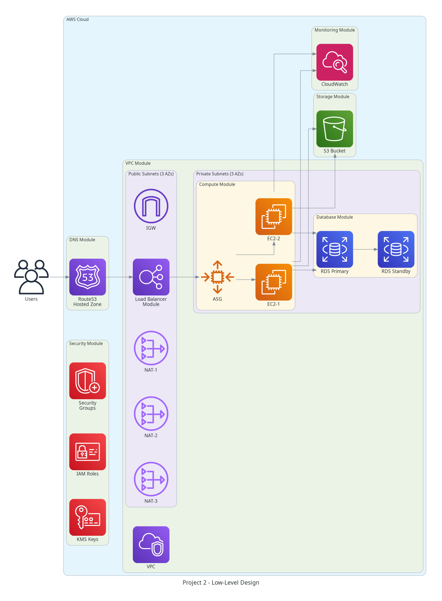
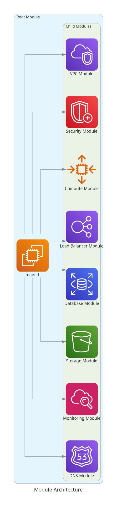
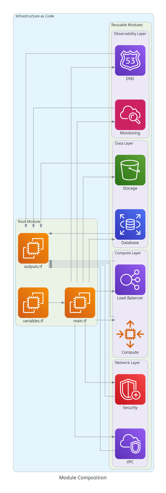
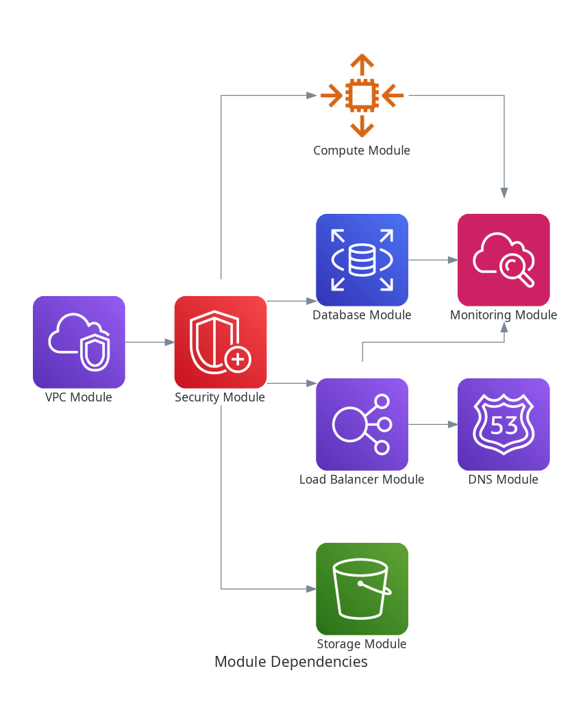
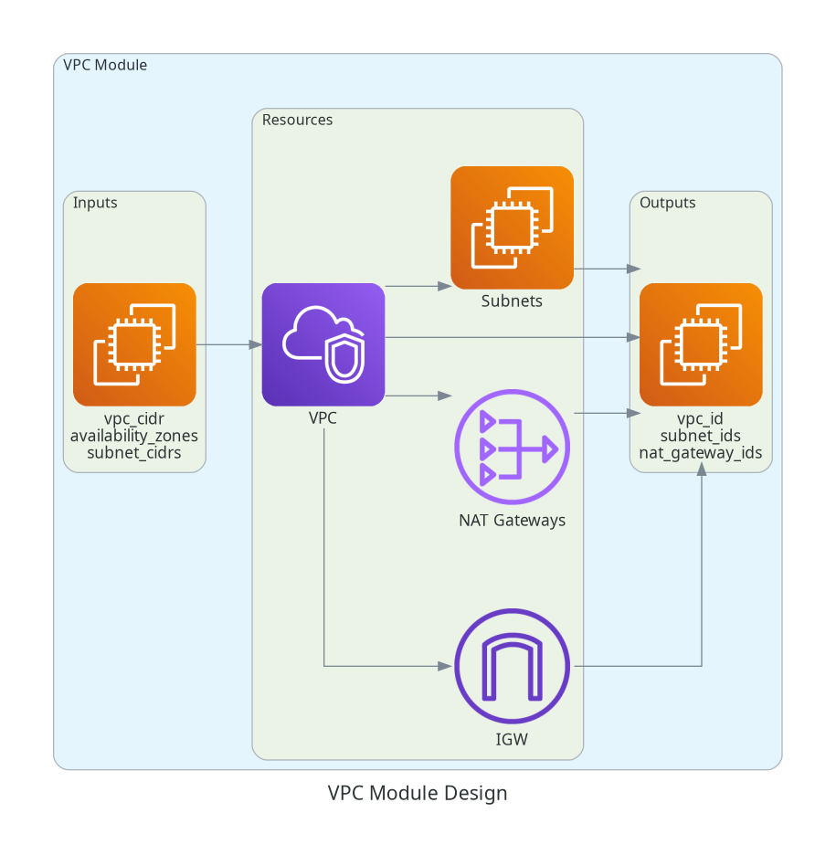
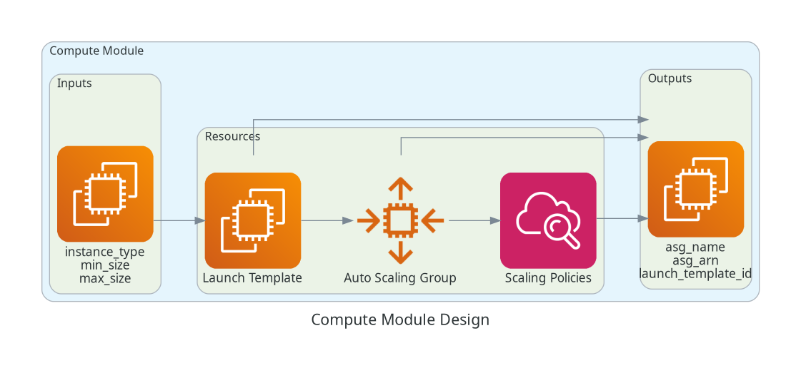
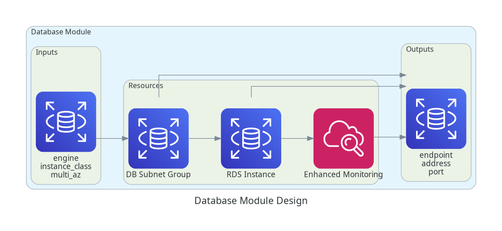
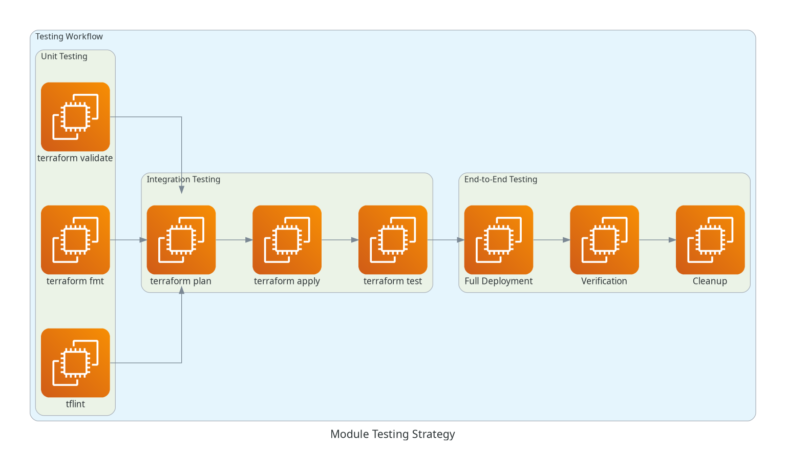

# Project 2: Modular Infrastructure with Terraform Modules

**Difficulty**: Intermediate-Advanced  
**Duration**: 10-12 hours  
**Terraform Topics**: Topic 7 (Modules), Topics 5-6 (Variables, State)  
**Exam Domains**: Terraform Modules (60%), Terraform Basics (20%), State Management (20%)

---

## TABLE OF CONTENTS

1. [Overview](#overview)
2. [Learning Objectives](#learning-objectives)
3. [Architecture](#architecture)
4. [Modules](#modules)
5. [Prerequisites](#prerequisites)
6. [Quick Start](#quick-start)
7. [Project Structure](#project-structure)
8. [Usage](#usage)
9. [Module Documentation](#module-documentation)
10. [Testing](#testing)
11. [Best Practices](#best-practices)
12. [Troubleshooting](#troubleshooting)
13. [Resources](#resources)

---

## OVERVIEW

This project demonstrates the creation of a **library of reusable Terraform modules** and their composition into a complete infrastructure. The focus is on module design, versioning, testing, and best practices for module development.

### What You'll Build

- **8 Reusable Terraform Modules**: VPC, Compute, Database, Load Balancer, Storage, Monitoring, Security, DNS
- **Root Module**: Composition of all child modules into a complete infrastructure
- **Module Documentation**: Comprehensive README for each module
- **Module Testing**: Independent testing for each module
- **Module Registry**: Private module registry setup (optional)

### Key Features

✅ **Modular Design**: DRY principles, reusable components  
✅ **Configurable**: Flexible input variables for different use cases  
✅ **Well-Documented**: README, examples, and inline comments  
✅ **Tested**: Independent module testing  
✅ **Versioned**: Proper semantic versioning  
✅ **Production-Ready**: Following Terraform module best practices  

---

## LEARNING OBJECTIVES

By completing this project, you will learn:

1. **Module Design**: How to design reusable Terraform modules
2. **Module Structure**: Proper file organization and naming conventions
3. **Input Variables**: Defining flexible and validated inputs
4. **Output Values**: Exposing module outputs for composition
5. **Module Composition**: Combining modules in a root module
6. **Module Sources**: Using local, registry, and git sources
7. **Module Versioning**: Semantic versioning and version constraints
8. **Module Testing**: Testing modules independently
9. **Module Documentation**: Writing comprehensive module docs
10. **Best Practices**: Following Terraform module conventions

---

## ARCHITECTURE

### High-Level Design

```
Root Module
├── VPC Module (Network Foundation)
├── Security Module (Security Groups, IAM)
├── Compute Module (EC2, ASG)
├── Load Balancer Module (ALB)
├── Database Module (RDS)
├── Storage Module (S3)
├── Monitoring Module (CloudWatch)
└── DNS Module (Route53)
```

### Module Dependencies

```
VPC Module
  ↓
Security Module
  ↓
├─→ Compute Module
├─→ Load Balancer Module
├─→ Database Module
└─→ Storage Module
  ↓
Monitoring Module
  ↓
DNS Module
```

### Infrastructure Components

- **VPC**: 10.0.0.0/16 with 6 subnets across 3 AZs
- **Compute**: Auto Scaling Group with 2-6 instances
- **Load Balancer**: Application Load Balancer
- **Database**: RDS PostgreSQL Multi-AZ
- **Storage**: S3 buckets for static assets and logs
- **Monitoring**: CloudWatch logs, metrics, alarms
- **Security**: Security groups, IAM roles, KMS encryption
- **DNS**: Route53 hosted zone and records

---

## 📊 ARCHITECTURE DIAGRAMS

### High-Level Design (HLD)


### Low-Level Design (LLD)


### Module Architecture


### Module Composition


### Module Dependencies


### VPC Module Design


### Compute Module Design


### Database Module Design


### Testing Strategy


---

## MODULES

### 1. VPC Module (`modules/vpc/`)

**Purpose**: Create a configurable VPC with subnets, gateways, and routing

**Inputs**:
- `vpc_cidr` - VPC CIDR block
- `availability_zones` - List of AZs
- `public_subnet_cidrs` - Public subnet CIDRs
- `private_subnet_cidrs` - Private subnet CIDRs
- `enable_nat_gateway` - Enable NAT gateways
- `single_nat_gateway` - Use single NAT gateway

**Outputs**:
- `vpc_id` - VPC ID
- `public_subnet_ids` - Public subnet IDs
- `private_subnet_ids` - Private subnet IDs
- `nat_gateway_ids` - NAT gateway IDs

### 2. Security Module (`modules/security/`)

**Purpose**: Create security groups, IAM roles, and KMS keys

**Inputs**:
- `vpc_id` - VPC ID
- `allowed_cidr_blocks` - Allowed CIDR blocks
- `enable_kms_encryption` - Enable KMS encryption

**Outputs**:
- `alb_security_group_id` - ALB security group ID
- `ec2_security_group_id` - EC2 security group ID
- `rds_security_group_id` - RDS security group ID
- `ec2_instance_profile_name` - EC2 instance profile name
- `kms_key_id` - KMS key ID

### 3. Compute Module (`modules/compute/`)

**Purpose**: Create EC2 instances with Auto Scaling Group

**Inputs**:
- `vpc_id` - VPC ID
- `subnet_ids` - Subnet IDs for instances
- `security_group_ids` - Security group IDs
- `instance_type` - EC2 instance type
- `min_size` - Minimum instances
- `max_size` - Maximum instances
- `desired_capacity` - Desired instances

**Outputs**:
- `autoscaling_group_id` - ASG ID
- `autoscaling_group_name` - ASG name
- `launch_template_id` - Launch template ID

### 4. Load Balancer Module (`modules/load-balancer/`)

**Purpose**: Create Application Load Balancer with target groups

**Inputs**:
- `vpc_id` - VPC ID
- `subnet_ids` - Subnet IDs for ALB
- `security_group_ids` - Security group IDs
- `enable_https` - Enable HTTPS listener
- `certificate_arn` - ACM certificate ARN

**Outputs**:
- `alb_id` - ALB ID
- `alb_arn` - ALB ARN
- `alb_dns_name` - ALB DNS name
- `target_group_arn` - Target group ARN

### 5. Database Module (`modules/database/`)

**Purpose**: Create RDS database with configurable engine

**Inputs**:
- `vpc_id` - VPC ID
- `subnet_ids` - Subnet IDs for RDS
- `security_group_ids` - Security group IDs
- `engine` - Database engine (postgres, mysql, mariadb)
- `engine_version` - Engine version
- `instance_class` - DB instance class
- `allocated_storage` - Storage size in GB
- `multi_az` - Enable Multi-AZ

**Outputs**:
- `db_instance_id` - DB instance ID
- `db_instance_endpoint` - DB endpoint
- `db_instance_address` - DB address
- `db_instance_port` - DB port

### 6. Storage Module (`modules/storage/`)

**Purpose**: Create S3 buckets with policies and lifecycle rules

**Inputs**:
- `bucket_name` - S3 bucket name
- `enable_versioning` - Enable versioning
- `enable_encryption` - Enable encryption
- `kms_key_id` - KMS key ID
- `lifecycle_rules` - Lifecycle rules

**Outputs**:
- `bucket_id` - S3 bucket ID
- `bucket_arn` - S3 bucket ARN
- `bucket_domain_name` - S3 bucket domain name

### 7. Monitoring Module (`modules/monitoring/`)

**Purpose**: Create CloudWatch dashboards, alarms, and log groups

**Inputs**:
- `alb_arn` - ALB ARN
- `autoscaling_group_name` - ASG name
- `db_instance_id` - DB instance ID
- `sns_topic_arn` - SNS topic ARN

**Outputs**:
- `dashboard_arn` - CloudWatch dashboard ARN
- `log_group_name` - Log group name
- `alarm_arns` - CloudWatch alarm ARNs

### 8. DNS Module (`modules/dns/`)

**Purpose**: Create Route53 hosted zone and DNS records

**Inputs**:
- `domain_name` - Domain name
- `alb_dns_name` - ALB DNS name
- `alb_zone_id` - ALB zone ID
- `create_hosted_zone` - Create hosted zone

**Outputs**:
- `hosted_zone_id` - Hosted zone ID
- `name_servers` - Name servers
- `record_fqdns` - Record FQDNs

---

## PREREQUISITES

### Required Tools

- **Terraform**: >= 1.13.0
- **AWS CLI**: >= 2.0
- **Git**: >= 2.0
- **Make**: (optional, for automation)
- **Python**: >= 3.8 (for diagram generation)

### AWS Requirements

- AWS Account with appropriate permissions
- AWS CLI configured with credentials
- S3 bucket for Terraform state (optional)
- DynamoDB table for state locking (optional)

### Knowledge Prerequisites

- Terraform fundamentals (resources, variables, outputs)
- AWS services (VPC, EC2, RDS, S3, ALB)
- Module concepts and composition
- Git basics

---

## QUICK START

### 1. Clone the Repository

```bash
cd Terraform-Capstone-Projects/Project-2-Modular-Infrastructure
```

### 2. Review Module Documentation

```bash
# Review each module's README
cat modules/vpc/README.md
cat modules/compute/README.md
# ... etc
```

### 3. Configure Variables

```bash
cd root-module/terraform-manifests
cp terraform.tfvars.example terraform.tfvars
vim terraform.tfvars  # Edit with your values
```

### 4. Deploy Infrastructure

```bash
# Using automation script
../scripts/deploy.sh

# Or manually
terraform init
terraform validate
terraform plan
terraform apply
```

### 5. Verify Deployment

```bash
# Using validation script
../scripts/validate.sh

# Or manually
terraform output
```

### 6. Cleanup

```bash
# Using cleanup script
../scripts/cleanup.sh

# Or manually
terraform destroy
```

---

## PROJECT STRUCTURE

```
Project-2-Modular-Infrastructure/
├── README.md                          # This file
├── PROJECT-2-COMPLETION-SUMMARY.md    # Completion report
├── .gitignore                         # Git ignore patterns
├── .terraform-version                 # Terraform version
├── Makefile                           # Build automation
│
├── docs/                              # Documentation
│   ├── architecture.md                # Architecture documentation
│   ├── theory.md                      # Module theory and concepts
│   ├── commands.md                    # Command reference
│   ├── troubleshooting.md             # Troubleshooting guide
│   ├── examples.md                    # Usage examples
│   └── validation.md                  # Testing procedures
│
├── diagrams/                          # Architecture diagrams
│   ├── generate_diagrams.py           # Diagram generation script
│   ├── requirements.txt               # Python dependencies
│   └── *.png                          # Generated diagrams
│
├── modules/                           # Reusable modules
│   ├── vpc/                           # VPC module
│   │   ├── main.tf
│   │   ├── variables.tf
│   │   ├── outputs.tf
│   │   ├── README.md
│   │   └── versions.tf
│   ├── compute/                       # Compute module
│   ├── database/                      # Database module
│   ├── load-balancer/                 # Load balancer module
│   ├── storage/                       # Storage module
│   ├── monitoring/                    # Monitoring module
│   ├── security/                      # Security module
│   └── dns/                           # DNS module
│
├── root-module/                       # Root module composition
│   └── terraform-manifests/
│       ├── main.tf                    # Module composition
│       ├── providers.tf               # Provider configuration
│       ├── variables.tf               # Input variables
│       ├── outputs.tf                 # Output values
│       ├── terraform.tfvars           # Variable values
│       └── terraform.tfvars.example   # Example values
│
└── scripts/                           # Automation scripts
    ├── deploy.sh                      # Deployment automation
    ├── validate.sh                    # Validation script
    └── cleanup.sh                     # Cleanup script
```

---

## USAGE

### Using Individual Modules

Each module can be used independently:

```hcl
module "vpc" {
  source = "./modules/vpc"
  
  vpc_cidr           = "10.0.0.0/16"
  availability_zones = ["us-east-1a", "us-east-1b", "us-east-1c"]
  public_subnet_cidrs  = ["10.0.1.0/24", "10.0.2.0/24", "10.0.3.0/24"]
  private_subnet_cidrs = ["10.0.11.0/24", "10.0.12.0/24", "10.0.13.0/24"]
  
  tags = {
    Environment = "dev"
    Project     = "modular-infrastructure"
  }
}
```

### Using Root Module

The root module composes all modules:

```bash
cd root-module/terraform-manifests
terraform init
terraform plan
terraform apply
```

---

## MODULE DOCUMENTATION

Each module includes comprehensive documentation:

- **README.md**: Module overview, usage, examples
- **Inline Comments**: Code documentation
- **Examples**: Usage examples in module README
- **Outputs**: All outputs documented

See individual module READMEs for detailed documentation.

---

## TESTING

### Module Testing

Test each module independently:

```bash
cd modules/vpc
terraform init
terraform validate
terraform plan
```

### Integration Testing

Test the complete infrastructure:

```bash
cd root-module/terraform-manifests
terraform init
terraform validate
terraform plan
terraform apply
```

### Automated Testing

```bash
# Run all tests
make test

# Test specific module
make test-vpc
make test-compute
```

---

## BEST PRACTICES

This project follows Terraform module best practices:

✅ **Standard Module Structure**: main.tf, variables.tf, outputs.tf, README.md  
✅ **Semantic Versioning**: v1.0.0, v1.1.0, v2.0.0  
✅ **Input Validation**: Variable validation rules  
✅ **Output Documentation**: All outputs documented  
✅ **README Documentation**: Comprehensive module docs  
✅ **Examples**: Usage examples in README  
✅ **Minimal Required Inputs**: Sensible defaults  
✅ **Nested Modules**: Logical module composition  
✅ **Version Constraints**: Provider version pinning  
✅ **Testing**: Independent module testing  

---

## TROUBLESHOOTING

### Common Issues

1. **Module Not Found**: Check module source path
2. **Variable Not Defined**: Check variable names and types
3. **Output Not Available**: Check output names
4. **Circular Dependency**: Review module dependencies

See `docs/troubleshooting.md` for detailed troubleshooting guide.

---

## RESOURCES

### Documentation

- [Terraform Module Documentation](https://www.terraform.io/docs/language/modules/index.html)
- [Module Best Practices](https://www.terraform.io/docs/language/modules/develop/index.html)
- [Module Registry](https://registry.terraform.io/)

### Related Projects

- **Project 1**: Multi-Tier Web Application Infrastructure
- **Project 3**: Multi-Environment Infrastructure Pipeline
- **Project 4**: Infrastructure Migration and Import
- **Project 5**: Enterprise-Grade Secure Infrastructure

---

**Project Status**: ✅ Complete  
**Version**: 1.0  
**Last Updated**: October 27, 2025  
**Author**: RouteCloud Training Team

