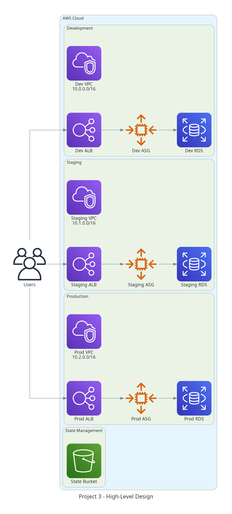
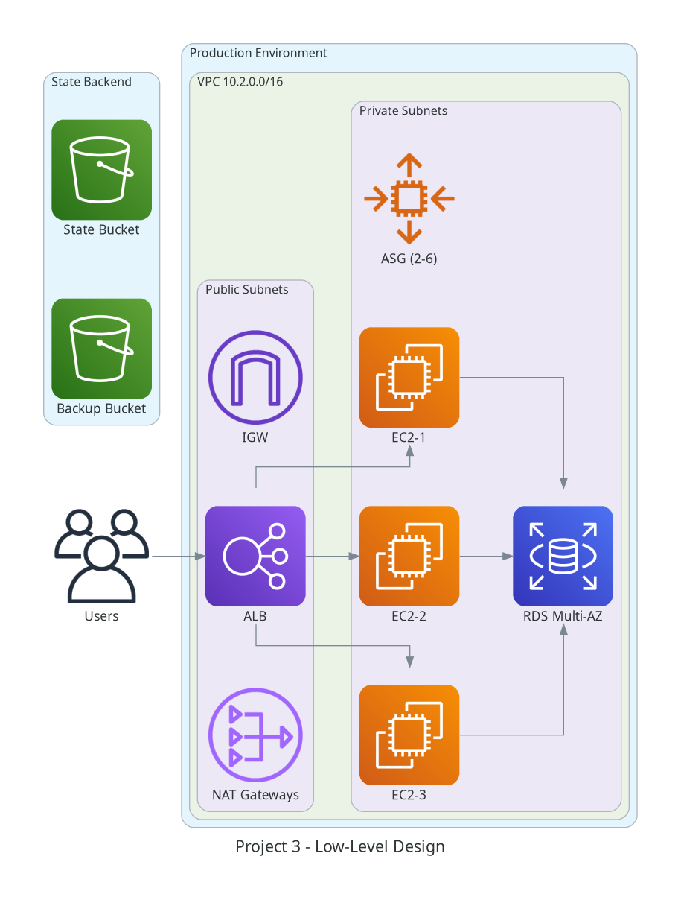
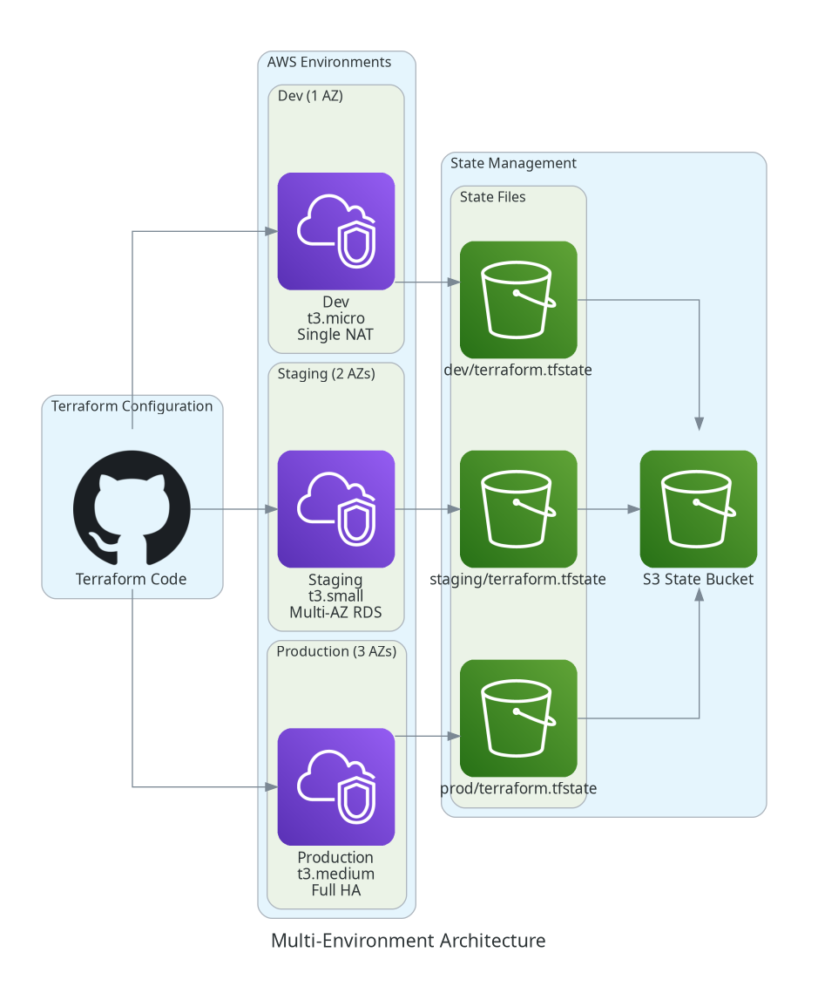
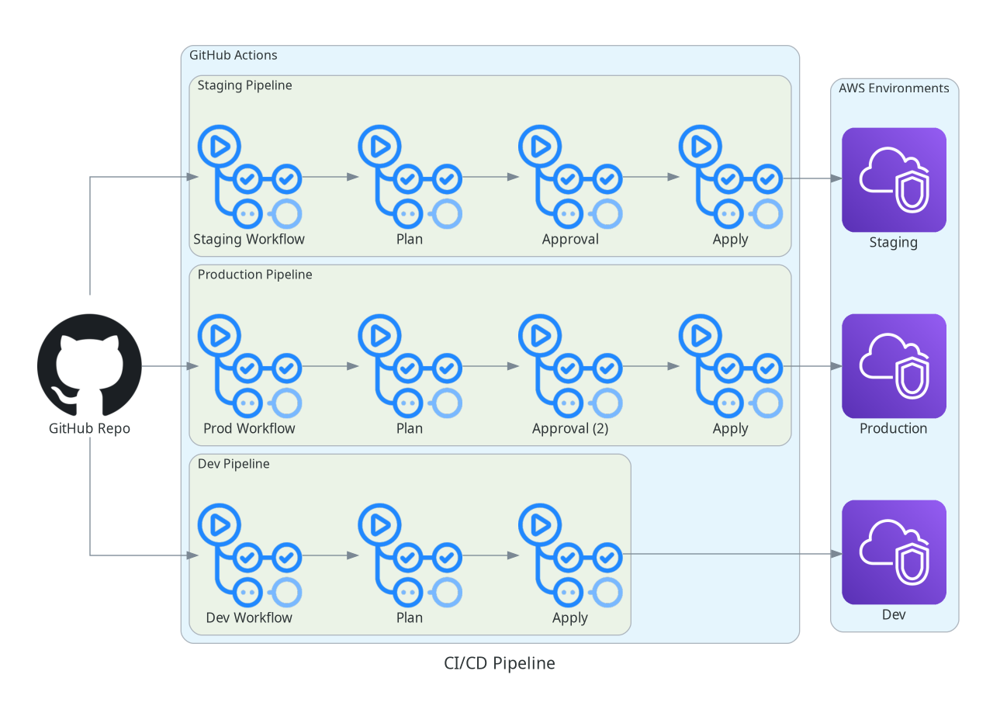
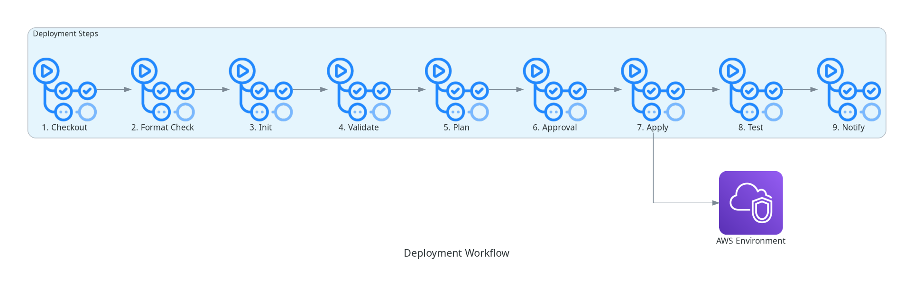
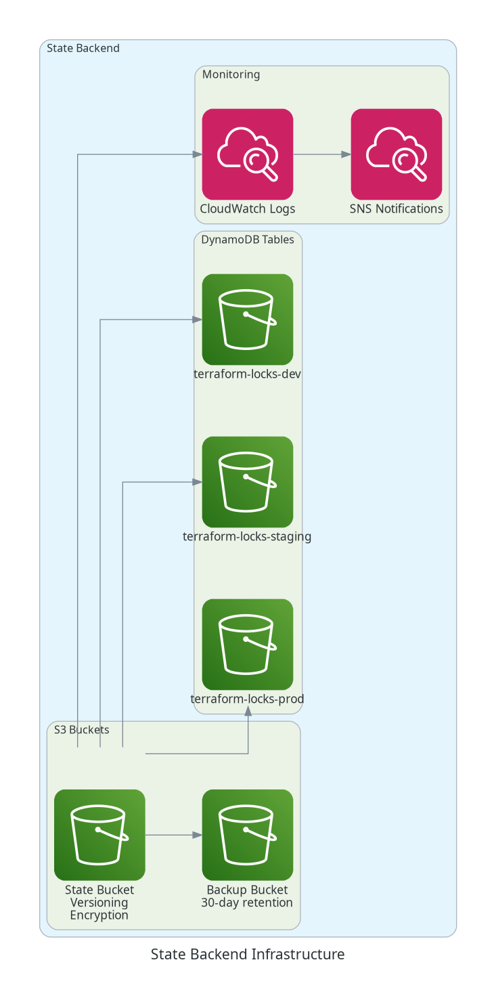
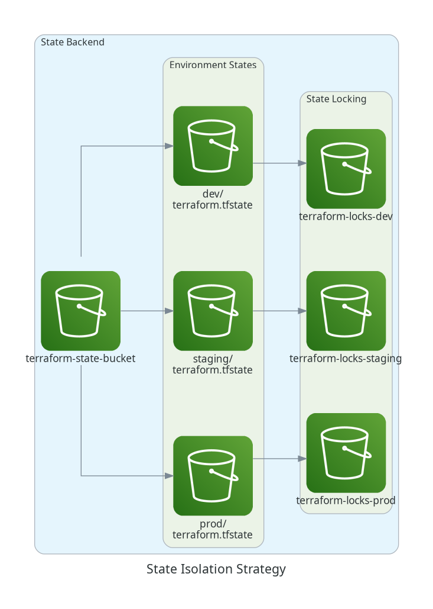
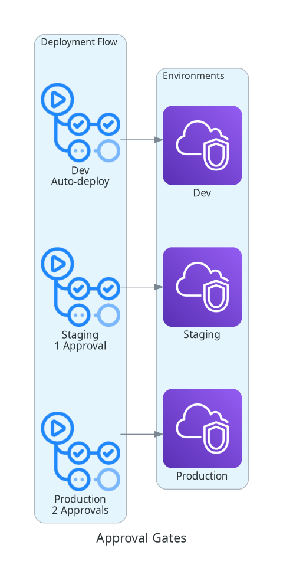
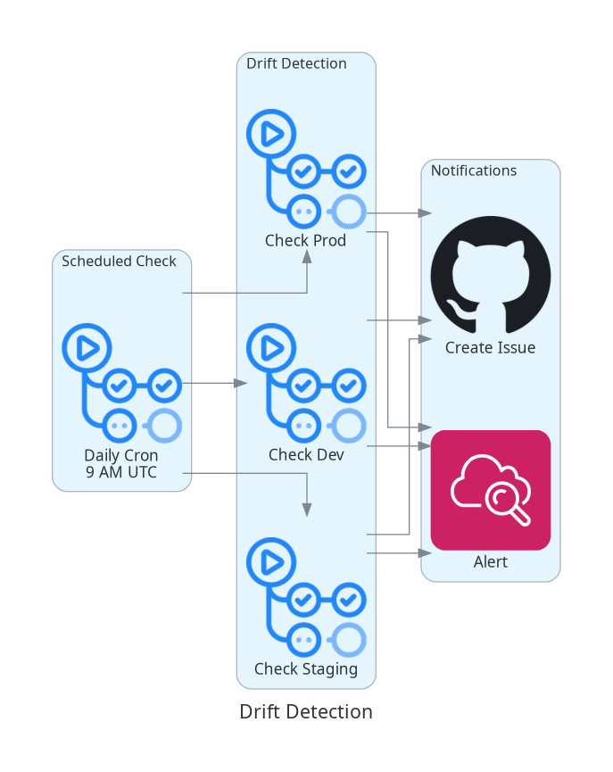

# Project 3: Multi-Environment Infrastructure Pipeline

## 🎯 PROJECT OVERVIEW

**Difficulty**: Advanced  
**Duration**: 10-12 hours  
**Focus**: State Management (50%), Terraform Workflow (30%), Terraform Basics (20%)

This project implements a complete multi-environment infrastructure setup with proper state isolation, workspace management, and CI/CD integration. Deploy identical infrastructure across Dev, Staging, and Production environments with automated pipelines.

---

## 📚 LEARNING OBJECTIVES

- ✅ Implement Terraform workspaces for environment isolation
- ✅ Design and implement state isolation strategies
- ✅ Configure remote state with S3 and DynamoDB locking
- ✅ Implement environment-specific configurations
- ✅ Create CI/CD pipeline with GitHub Actions
- ✅ Implement VCS-driven workflows with branch strategies
- ✅ Configure automatic plan on PR and apply on merge
- ✅ Implement state backup and recovery procedures
- ✅ Handle state conflicts and locking mechanisms
- ✅ Implement approval workflows for production deployments
- ✅ Use terraform_remote_state data source for cross-stack references
- ✅ Implement automated drift detection with issue creation
- ✅ Configure branch protection and PR requirements

---

## 🏗️ ARCHITECTURE

### Multi-Environment Strategy

This project deploys three separate environments with different configurations:

#### **Development Environment**
- Single Availability Zone
- Smaller instance types (t3.micro)
- Single NAT Gateway
- No Multi-AZ RDS
- Minimal monitoring
- Auto-destroy after hours (optional)

#### **Staging Environment**
- 2 Availability Zones
- Medium instance types (t3.small)
- 2 NAT Gateways
- Multi-AZ RDS
- Standard monitoring
- Production-like configuration

#### **Production Environment**
- 3 Availability Zones
- Large instance types (t3.medium)
- 3 NAT Gateways (HA)
- Multi-AZ RDS with read replicas
- Enhanced monitoring
- Automated backups
- Approval gates for changes

---

## 📊 ARCHITECTURE DIAGRAMS

### High-Level Design (HLD)


### Low-Level Design (LLD)


### Multi-Environment Architecture


### CI/CD Pipeline


### Deployment Workflow


### State Backend Architecture


### State Isolation Strategy


### Approval Gates


### Drift Detection


---

## 📁 PROJECT STRUCTURE

```
Project-3-Multi-Environment-Pipeline/
├── README.md
├── .gitignore
├── .terraform-version
├── Makefile
│
├── state-backend/                    # State backend setup
│   ├── main.tf                       # S3 bucket and DynamoDB table
│   ├── variables.tf
│   └── outputs.tf
│
├── terraform-manifests/              # Main infrastructure code
│   ├── providers.tf                  # Provider configuration
│   ├── backend.tf                    # Backend configuration
│   ├── variables.tf                  # Variable definitions
│   ├── main.tf                       # Main resources
│   ├── outputs.tf                    # Output values
│   └── locals.tf                     # Local values
│
├── environments/                     # Environment-specific configs
│   ├── dev/
│   │   ├── terraform.tfvars         # Dev variables
│   │   └── backend-config.hcl       # Dev backend config
│   ├── staging/
│   │   ├── terraform.tfvars         # Staging variables
│   │   └── backend-config.hcl       # Staging backend config
│   └── prod/
│       ├── terraform.tfvars         # Prod variables
│       └── backend-config.hcl       # Prod backend config
│
├── .github/workflows/                # CI/CD pipelines
│   ├── terraform-dev.yml            # Dev deployment
│   ├── terraform-staging.yml        # Staging deployment
│   ├── terraform-prod.yml           # Prod deployment (with approval)
│   └── drift-detection.yml          # Drift detection
│
├── scripts/                          # Automation scripts
│   ├── deploy.sh                    # Deployment script
│   ├── switch-env.sh                # Environment switcher
│   ├── backup-state.sh              # State backup
│   ├── restore-state.sh             # State restore
│   └── drift-check.sh               # Drift detection
│
├── docs/                             # Documentation
│   ├── architecture.md              # Architecture documentation
│   ├── state-management.md          # State management guide
│   ├── cicd-pipeline.md             # CI/CD documentation
│   ├── troubleshooting.md           # Troubleshooting guide
│   └── runbook.md                   # Operations runbook
│
└── diagrams/                         # Architecture diagrams
    ├── generate_diagrams.py
    ├── requirements.txt
    └── *.png                         # Generated diagrams
```

---

## 🚀 QUICK START

### Prerequisites

- Terraform >= 1.13.0
- AWS CLI configured
- AWS account with appropriate permissions
- GitHub account (for CI/CD)

### 1. Setup State Backend

```bash
# Deploy state backend infrastructure
cd state-backend
terraform init
terraform apply

# Note the outputs (bucket name, DynamoDB table)
```

### 2. Deploy Development Environment

```bash
cd ../terraform-manifests

# Initialize with dev backend
terraform init -backend-config=../environments/dev/backend-config.hcl

# Deploy dev environment
terraform apply -var-file=../environments/dev/terraform.tfvars
```

### 3. Deploy Staging Environment

```bash
# Initialize with staging backend
terraform init -reconfigure -backend-config=../environments/staging/backend-config.hcl

# Deploy staging environment
terraform apply -var-file=../environments/staging/terraform.tfvars
```

### 4. Deploy Production Environment

```bash
# Initialize with prod backend
terraform init -reconfigure -backend-config=../environments/prod/backend-config.hcl

# Deploy production environment
terraform apply -var-file=../environments/prod/terraform.tfvars
```

---

## 🔄 CI/CD PIPELINE

### Pipeline Stages

1. **Code Checkout**: Clone repository
2. **Format Check**: `terraform fmt -check`
3. **Initialize**: `terraform init`
4. **Validate**: `terraform validate`
5. **Plan**: `terraform plan`
6. **Approval**: Manual approval (staging/prod only)
7. **Apply**: `terraform apply`
8. **Validation**: Post-deployment checks
9. **Notification**: Slack/Email notification

### Workflow Triggers

- **Dev**: Push to `main` branch
- **Staging**: Push to `staging` branch or manual trigger
- **Production**: Manual trigger with approval required

---

## 🛠️ MAKEFILE TARGETS

```bash
make help              # Show all available targets
make init-dev          # Initialize dev environment
make init-staging      # Initialize staging environment
make init-prod         # Initialize production environment
make plan-dev          # Plan dev changes
make plan-staging      # Plan staging changes
make plan-prod         # Plan production changes
make apply-dev         # Apply dev changes
make apply-staging     # Apply staging changes
make apply-prod        # Apply production changes
make destroy-dev       # Destroy dev environment
make backup-state      # Backup all state files
make drift-check       # Check for configuration drift
```

---

## 📊 STATE MANAGEMENT

### State Isolation Strategy

Each environment has:
- **Separate S3 state file**: `terraform-state-{env}/terraform.tfstate`
- **Separate DynamoDB lock table**: `terraform-locks-{env}`
- **Separate backend configuration**: `environments/{env}/backend-config.hcl`

### State Backend Configuration

```hcl
terraform {
  backend "s3" {
    bucket         = "terraform-state-{account-id}"
    key            = "{env}/terraform.tfstate"
    region         = "us-east-1"
    encrypt        = true
    dynamodb_table = "terraform-locks-{env}"
  }
}
```

---

## 🔄 VCS-DRIVEN WORKFLOW

### GitHub Integration

This project implements a complete VCS-driven workflow using GitHub Actions for automated infrastructure deployment.

#### Workflow Architecture

```
┌─────────────────────────────────────────────────────────────┐
│                    GitHub Repository                         │
│  ┌──────────────┐  ┌──────────────┐  ┌──────────────┐      │
│  │ Feature      │  │ Staging      │  │ Main         │      │
│  │ Branch       │  │ Branch       │  │ Branch       │      │
│  └──────┬───────┘  └──────┬───────┘  └──────┬───────┘      │
│         │                  │                  │              │
│         ▼                  ▼                  ▼              │
│  ┌──────────────┐  ┌──────────────┐  ┌──────────────┐      │
│  │ PR to Main   │  │ PR to Main   │  │ Push to Main │      │
│  └──────┬───────┘  └──────┬───────┘  └──────┬───────┘      │
└─────────┼──────────────────┼──────────────────┼─────────────┘
          │                  │                  │
          ▼                  ▼                  ▼
   ┌─────────────┐    ┌─────────────┐    ┌─────────────┐
   │ Terraform   │    │ Terraform   │    │ Terraform   │
   │ Plan (Dev)  │    │ Plan (Stg)  │    │ Plan (Prod) │
   └─────────────┘    └─────────────┘    └─────────────┘
          │                  │                  │
          ▼                  ▼                  ▼
   ┌─────────────┐    ┌─────────────┐    ┌─────────────┐
   │ Auto Apply  │    │ Manual      │    │ Manual      │
   │ (Dev)       │    │ Approval    │    │ Approval    │
   └─────────────┘    └─────────────┘    └─────────────┘
```

#### Deployment Workflows

**Development Environment** (`terraform-dev.yml`):
- **Trigger**: Push to `main` branch or PR to `main`
- **Behavior**: Automatic plan on PR, automatic apply on merge
- **Purpose**: Fast iteration and testing

**Staging Environment** (`terraform-staging.yml`):
- **Trigger**: Manual workflow dispatch or push to `main`
- **Behavior**: Automatic plan, manual approval required for apply
- **Purpose**: Pre-production validation

**Production Environment** (`terraform-prod.yml`):
- **Trigger**: Manual workflow dispatch only
- **Behavior**: Automatic plan, manual approval required for apply
- **Purpose**: Controlled production deployments

**Drift Detection** (`drift-detection.yml`):
- **Trigger**: Scheduled (daily) or manual
- **Behavior**: Runs `terraform plan` to detect drift
- **Purpose**: Identify configuration drift

#### Branch Strategy

```
main (production-ready)
  ├── feature/add-monitoring
  ├── feature/update-instance-types
  └── hotfix/security-patch
```

**Branch Protection Rules**:
- Require pull request reviews (2 approvers)
- Require status checks to pass (Terraform Plan)
- Require branches to be up to date
- Restrict who can push to main

#### GitHub Actions Workflows

**Key Features**:
- ✅ Automatic `terraform fmt` check
- ✅ Automatic `terraform validate`
- ✅ Automatic `terraform plan` on PR
- ✅ Plan output posted as PR comment
- ✅ Manual approval for staging/prod
- ✅ Environment-specific configurations
- ✅ AWS credentials from GitHub Secrets
- ✅ State locking with DynamoDB
- ✅ Drift detection with issue creation

#### Setting Up GitHub Actions

**1. Configure GitHub Secrets**:

Navigate to repository **Settings** → **Secrets and variables** → **Actions**:

```
AWS_ACCESS_KEY_ID          # AWS access key
AWS_SECRET_ACCESS_KEY      # AWS secret key
TF_API_TOKEN               # Terraform Cloud token (optional)
```

**2. Configure Environments**:

Create three environments in GitHub:
- `development` (no protection rules)
- `staging` (require 1 reviewer)
- `production` (require 2 reviewers)

**3. Enable Branch Protection**:

For `main` branch:
- Require pull request reviews: 2
- Require status checks: `Terraform Plan - Dev`
- Require branches to be up to date

#### Workflow Examples

**Example 1: Feature Development**

```bash
# Create feature branch
git checkout -b feature/add-monitoring

# Make changes to Terraform code
vim terraform-manifests/main.tf

# Commit and push
git add .
git commit -m "Add CloudWatch monitoring"
git push origin feature/add-monitoring

# Create PR on GitHub
# GitHub Actions automatically runs terraform plan
# Review plan output in PR comment
# Request reviews from team
# Merge PR after approval
# Dev environment automatically deploys
```

**Example 2: Staging Deployment**

```bash
# After dev deployment is successful
# Navigate to GitHub Actions
# Select "Terraform Staging" workflow
# Click "Run workflow"
# Select branch: main
# Review plan output
# Approve deployment
# Monitor apply progress
```

**Example 3: Production Deployment**

```bash
# After staging validation
# Navigate to GitHub Actions
# Select "Terraform Production" workflow
# Click "Run workflow"
# Select branch: main
# Review plan output carefully
# Require 2 approvals
# Approve deployment
# Monitor apply progress
# Verify infrastructure changes
```

#### PR Comment Example

When a PR is created, GitHub Actions posts a comment:

```markdown
#### Terraform Format 🖌 `success`
#### Terraform Initialization ⚙️ `success`
#### Terraform Validation 🤖 `success`
#### Terraform Plan 📖 `success`

<details><summary>Show Plan</summary>

```
Terraform will perform the following actions:

  # aws_cloudwatch_dashboard.main will be created
  + resource "aws_cloudwatch_dashboard" "main" {
      + dashboard_arn  = (known after apply)
      + dashboard_body = jsonencode(...)
      + dashboard_name = "dev-monitoring"
      + id             = (known after apply)
    }

Plan: 1 to add, 0 to change, 0 to destroy.
```

</details>

*Environment: development*
*Pusher: @username, Action: `pull_request`*
```

#### Drift Detection

The drift detection workflow runs daily and:
1. Runs `terraform plan` for each environment
2. Checks for configuration drift
3. Creates GitHub issue if drift detected
4. Notifies team via issue assignment

**Example Drift Issue**:

```markdown
Title: ⚠️ Configuration Drift Detected - Production

**Environment**: production
**Detected**: 2025-10-28 10:00 UTC

**Drift Summary**:
- 2 resources modified outside Terraform
- 1 resource deleted outside Terraform

**Action Required**:
1. Review the drift in Terraform plan output
2. Determine if drift should be imported or reverted
3. Update Terraform code if needed
4. Run terraform apply to reconcile state

**Plan Output**:
[See workflow run for details]
```

---

## 🔐 SECURITY

- ✅ State encryption at rest (S3 SSE)
- ✅ State locking with DynamoDB
- ✅ IAM roles for CI/CD
- ✅ Secrets management with GitHub Secrets
- ✅ Approval gates for production
- ✅ Audit logging enabled

---

## 📈 MONITORING

- CloudWatch dashboards per environment
- State change notifications
- Drift detection alerts
- Pipeline failure notifications

---

## 🧪 TESTING

```bash
# Validate configuration
make validate

# Check formatting
make fmt-check

# Run security scan
make security-scan

# Check for drift
make drift-check
```

---

## 📖 DOCUMENTATION

- [Architecture Documentation](docs/architecture.md)
- [State Management Guide](docs/state-management.md)
- [CI/CD Pipeline Documentation](docs/cicd-pipeline.md)
- [VCS Workflow Guide](docs/vcs-workflow.md) ⭐ NEW
- [Troubleshooting Guide](docs/troubleshooting.md)
- [Operations Runbook](docs/runbook.md)

---

## 🎓 TERRAFORM CONCEPTS COVERED

### State Management (50%)
- Remote state backend (S3)
- State locking (DynamoDB)
- State encryption
- State isolation strategies
- terraform_remote_state data source
- State backup and recovery
- State manipulation commands

### Terraform Workflow (30%)
- Multi-environment deployments
- CI/CD integration with GitHub Actions
- VCS-driven workflows
- Approval workflows
- Drift detection
- Automated testing
- Branch-based deployment strategies

### Terraform Basics (20%)
- Workspaces
- Conditional expressions
- Environment variables
- Backend configuration

---

## 📝 NOTES

- Always backup state before major changes
- Use workspaces for environment isolation
- Implement approval gates for production
- Monitor for configuration drift
- Document all state manipulations

---

**Project Status**: Ready for Implementation
**Version**: 2.0
**Last Updated**: October 28, 2025
**Author**: RouteCloud Training Team
**Enhancements**: VCS-Driven Workflow Integration

