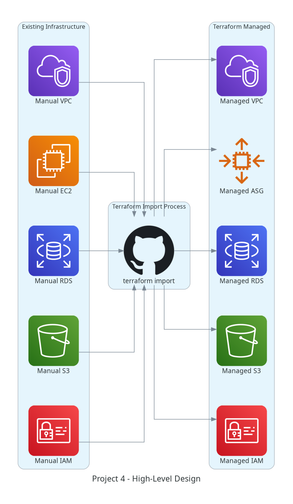
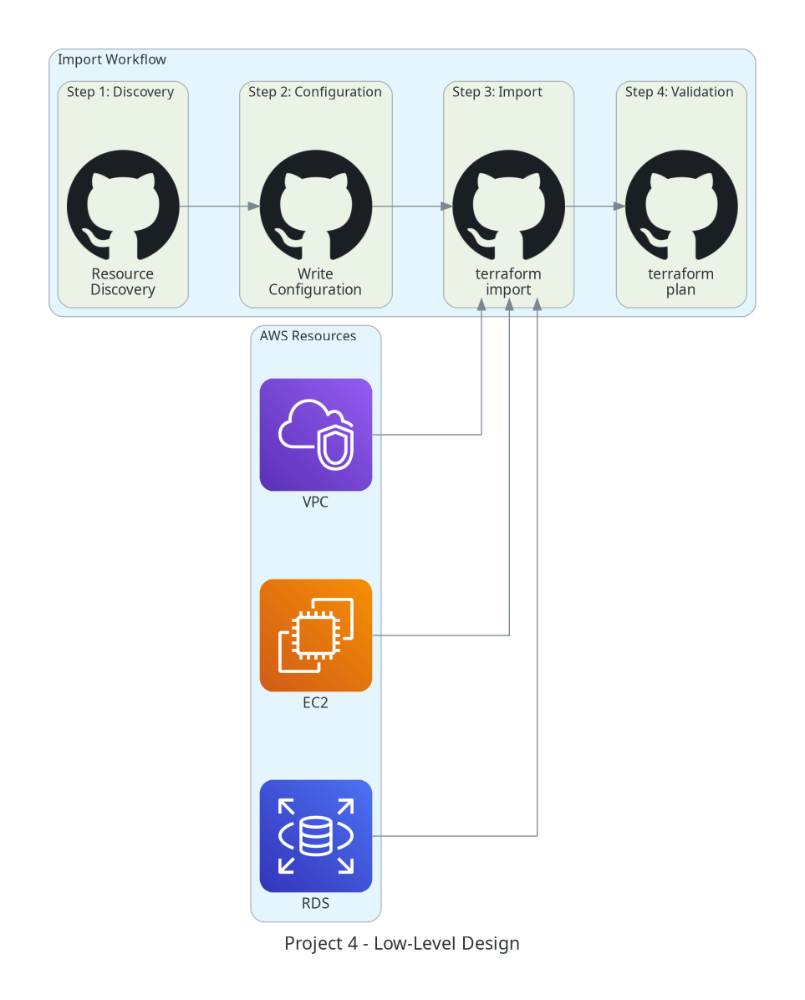
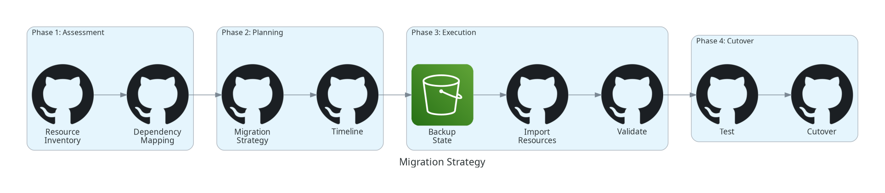
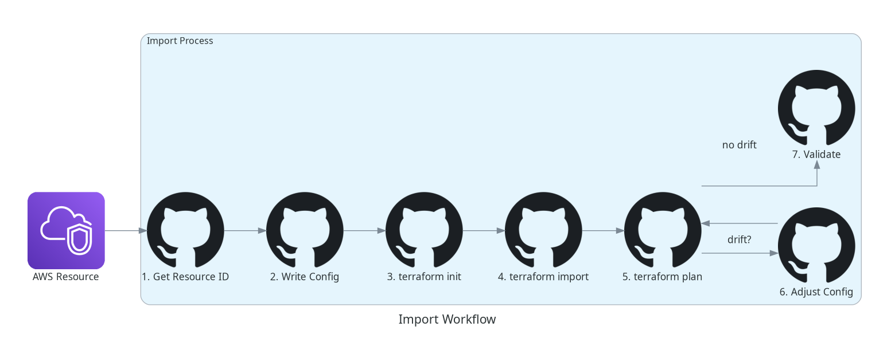
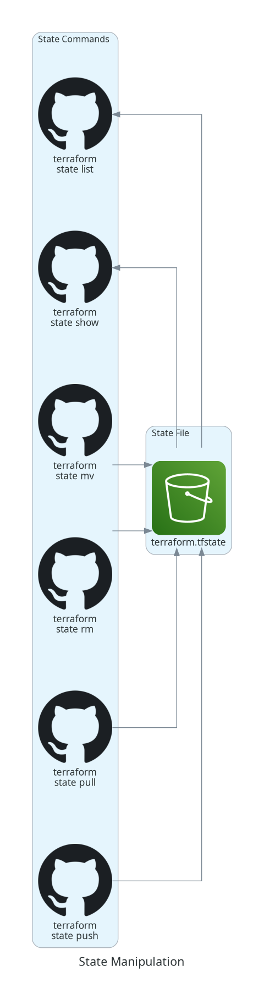
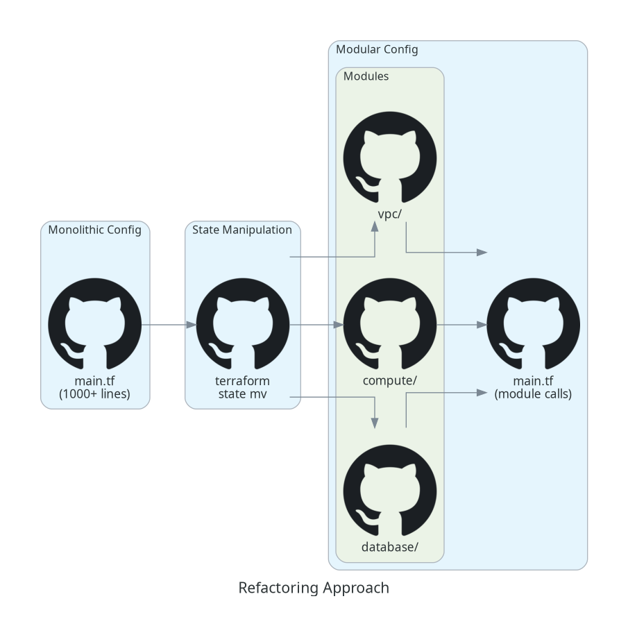
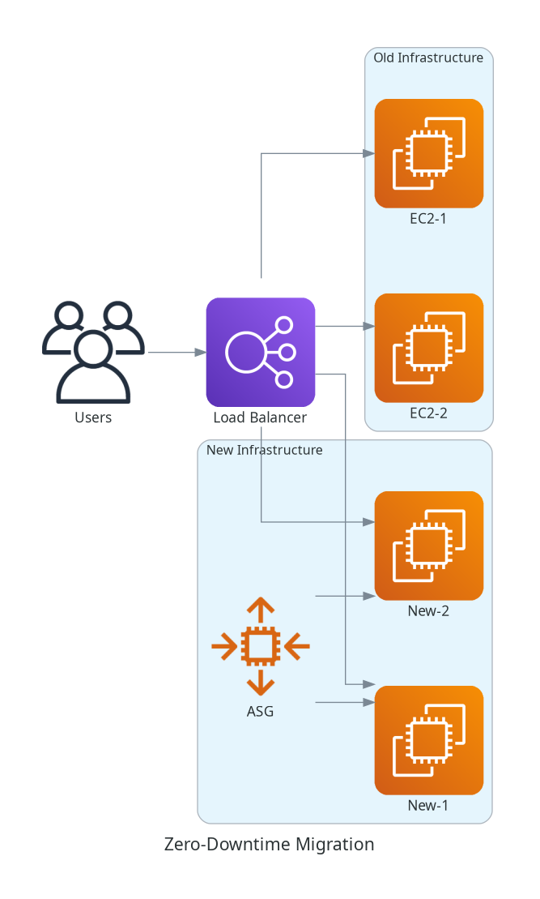
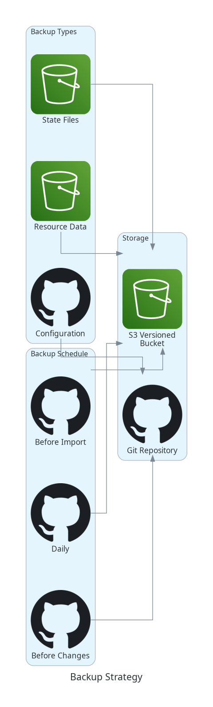
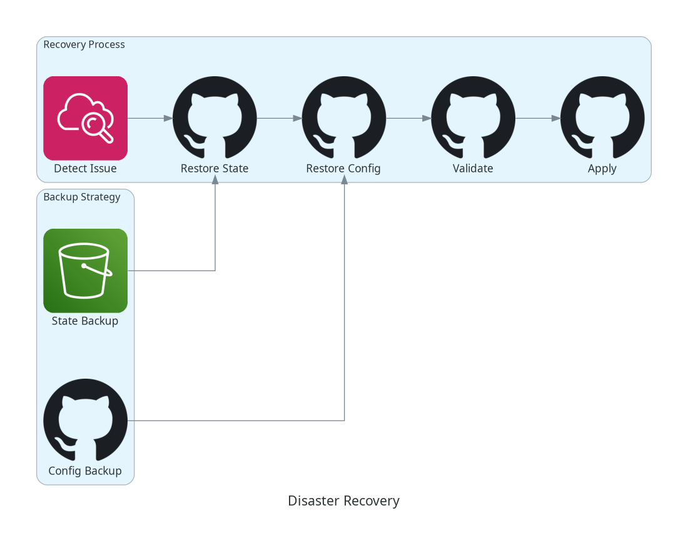
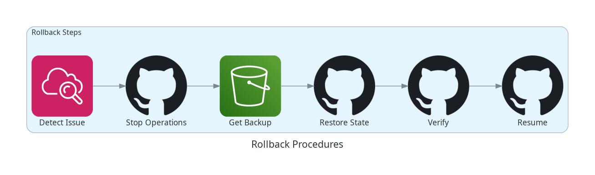

# Project 4: Infrastructure Migration and Import

## 📋 Project Overview

**Difficulty**: Advanced  
**Duration**: 10-12 hours  
**Terraform Topics**: Import, Advanced State Management, Troubleshooting  
**Exam Domains**: State Management (40%), Terraform Workflow (40%), Troubleshooting (20%)

This project demonstrates how to import existing AWS infrastructure into Terraform management, refactor configurations, and implement disaster recovery procedures. It covers real-world migration scenarios and zero-downtime strategies.

---

## 🎯 Learning Objectives

- ✅ Import existing AWS resources into Terraform
- ✅ Generate Terraform configuration from existing resources
- ✅ Refactor imported configurations
- ✅ Use state manipulation commands (mv, rm, replace)
- ✅ Implement zero-downtime migration strategies
- ✅ Handle resource recreation scenarios
- ✅ Implement disaster recovery procedures
- ✅ Create backup and restore automation
- ✅ Troubleshoot import issues
- ✅ Document migration procedures

---

## 🏗️ Architecture

This project includes 6 migration scenarios that demonstrate different aspects of infrastructure import and state management:

### Scenario 1: VPC and Subnets Import
Import manually-created VPC, subnets, route tables, and internet gateway into Terraform management.

### Scenario 2: EC2 to Auto Scaling Group
Import standalone EC2 instances and convert them to an Auto Scaling Group with zero downtime.

### Scenario 3: RDS Database Import
Import an existing RDS database with zero downtime and implement backup strategies.

### Scenario 4: S3 Buckets Import
Import S3 buckets with existing data, preserving all objects and configurations.

### Scenario 5: IAM Roles and Policies
Import IAM roles, policies, and attachments into Terraform management.

### Scenario 6: Monolithic to Modular Refactoring
Refactor a monolithic Terraform configuration into reusable modules using state manipulation.

---

## 📊 ARCHITECTURE DIAGRAMS

### High-Level Design (HLD)


### Low-Level Design (LLD)


### Migration Strategy


### Import Workflow


### State Manipulation


### Refactoring Approach


### Zero Downtime Migration


### Backup Strategy


### Disaster Recovery


### Rollback Procedures


---

## 📁 Project Structure

```
Project-4-Infrastructure-Migration/
├── README.md                          # This file
├── Makefile                           # Automation targets
├── .gitignore                         # Git ignore patterns
├── .terraform-version                 # Terraform version
│
├── docs/                              # Documentation
│   ├── migration-playbook.md          # Step-by-step migration guide
│   ├── state-manipulation-guide.md    # State command reference
│   ├── import-strategies.md           # Import best practices
│   ├── zero-downtime-migration.md     # Zero-downtime strategies
│   ├── disaster-recovery.md           # DR procedures
│   ├── troubleshooting.md             # Common issues and solutions
│   └── rollback-procedures.md         # Rollback strategies
│
├── diagrams/                          # Architecture diagrams
│   ├── generate_diagrams.py           # Diagram generation script
│   ├── requirements.txt               # Python dependencies
│   ├── hld.png                        # High-level design
│   ├── lld.png                        # Low-level design
│   ├── migration_strategy.png         # Migration strategy
│   ├── import_workflow.png            # Import workflow
│   ├── state_manipulation.png         # State manipulation
│   ├── zero_downtime_migration.png    # Zero-downtime migration
│   ├── disaster_recovery.png          # Disaster recovery
│   ├── backup_strategy.png            # Backup strategy
│   ├── rollback_procedures.png        # Rollback procedures
│   └── refactoring_approach.png       # Refactoring approach
│
├── scripts/                           # Automation scripts
│   ├── import-vpc.sh                  # VPC import automation
│   ├── import-ec2.sh                  # EC2 import automation
│   ├── import-rds.sh                  # RDS import automation
│   ├── import-s3.sh                   # S3 import automation
│   ├── import-iam.sh                  # IAM import automation
│   ├── backup-state.sh                # State backup script
│   ├── restore-state.sh               # State restore script
│   ├── validate-import.sh             # Import validation
│   └── generate-config.sh             # Config generation helper
│
├── scenarios/                         # Migration scenarios
│   ├── scenario-1-vpc/                # VPC import scenario
│   │   ├── existing/                  # Existing infrastructure
│   │   │   ├── main.tf                # Creates "existing" resources
│   │   │   └── outputs.tf             # Resource IDs for import
│   │   ├── imported/                  # Post-import configuration
│   │   │   ├── main.tf                # Imported resources
│   │   │   ├── variables.tf           # Variables
│   │   │   └── outputs.tf             # Outputs
│   │   └── README.md                  # Scenario documentation
│   │
│   ├── scenario-2-ec2-to-asg/         # EC2 to ASG conversion
│   │   ├── existing/                  # Existing EC2 instances
│   │   ├── imported/                  # ASG configuration
│   │   └── README.md                  # Scenario documentation
│   │
│   ├── scenario-3-rds/                # RDS import
│   │   ├── existing/                  # Existing RDS
│   │   ├── imported/                  # Imported RDS
│   │   └── README.md                  # Scenario documentation
│   │
│   ├── scenario-4-s3/                 # S3 import
│   │   ├── existing/                  # Existing S3 buckets
│   │   ├── imported/                  # Imported S3
│   │   └── README.md                  # Scenario documentation
│   │
│   ├── scenario-5-iam/                # IAM import
│   │   ├── existing/                  # Existing IAM
│   │   ├── imported/                  # Imported IAM
│   │   └── README.md                  # Scenario documentation
│   │
│   └── scenario-6-refactoring/        # Refactoring scenario
│       ├── existing/                  # Monolithic config
│       ├── imported/                  # Modular config
│       └── README.md                  # Scenario documentation
│
├── disaster-recovery/                 # DR procedures
│   ├── backup-procedures.md           # Backup procedures
│   ├── restore-procedures.md          # Restore procedures
│   ├── backup-automation.sh           # Automated backups
│   └── restore-automation.sh          # Automated restore
│
├── existing-infrastructure/           # Simulated existing resources
│   ├── main.tf                        # Creates all "existing" resources
│   ├── variables.tf                   # Variables
│   └── outputs.tf                     # Resource IDs
│
└── state-backups/                     # State backup directory
    └── .gitkeep                       # Keep directory in git
```

---

## 🚀 Quick Start

### Prerequisites

- Terraform 1.13.0+
- AWS CLI configured
- AWS account with appropriate permissions
- Python 3.8+ (for diagram generation)

### Step 1: Create Existing Infrastructure

First, create the "existing" infrastructure that we'll import:

```bash
cd existing-infrastructure
terraform init
terraform apply
```

This creates resources that simulate manually-created infrastructure.

### Step 2: Run a Migration Scenario

Choose a scenario and follow its README:

```bash
# Example: VPC Import
cd scenarios/scenario-1-vpc
cat README.md  # Read the scenario documentation

# Import the VPC
cd imported
terraform init
terraform import aws_vpc.main vpc-xxxxx  # Use actual VPC ID from step 1
```

### Step 3: Validate Import

```bash
# Verify no changes needed
terraform plan

# Should show: No changes. Your infrastructure matches the configuration.
```

---

## 📚 Migration Scenarios

### Scenario 1: VPC and Subnets Import
**Complexity**: Beginner  
**Duration**: 1-2 hours  
**Resources**: VPC, Subnets, Route Tables, Internet Gateway

Import a manually-created VPC with all its components.

**Key Commands**:
```bash
terraform import aws_vpc.main vpc-xxxxx
terraform import aws_subnet.public[0] subnet-xxxxx
terraform import aws_internet_gateway.main igw-xxxxx
```

### Scenario 2: EC2 to Auto Scaling Group
**Complexity**: Intermediate  
**Duration**: 2-3 hours  
**Resources**: EC2, Launch Template, Auto Scaling Group

Convert standalone EC2 instances to an Auto Scaling Group with zero downtime.

**Key Commands**:
```bash
terraform import aws_instance.web i-xxxxx
terraform state mv aws_instance.web aws_launch_template.web
```

### Scenario 3: RDS Database Import
**Complexity**: Advanced  
**Duration**: 2-3 hours  
**Resources**: RDS Instance, Subnet Group, Parameter Group

Import RDS database with zero downtime and implement backup strategies.

**Key Commands**:
```bash
terraform import aws_db_instance.main mydb
terraform import aws_db_subnet_group.main mydb-subnet-group
```

### Scenario 4: S3 Buckets Import
**Complexity**: Beginner  
**Duration**: 1-2 hours  
**Resources**: S3 Buckets, Bucket Policies, Lifecycle Rules

Import S3 buckets with existing data and configurations.

**Key Commands**:
```bash
terraform import aws_s3_bucket.data my-data-bucket
terraform import aws_s3_bucket_versioning.data my-data-bucket
```

### Scenario 5: IAM Roles and Policies
**Complexity**: Intermediate  
**Duration**: 1-2 hours  
**Resources**: IAM Roles, Policies, Policy Attachments

Import IAM roles and policies into Terraform management.

**Key Commands**:
```bash
terraform import aws_iam_role.app app-role
terraform import aws_iam_policy.app arn:aws:iam::123456789012:policy/app-policy
```

### Scenario 6: Monolithic to Modular Refactoring
**Complexity**: Advanced  
**Duration**: 3-4 hours  
**Resources**: All resources from previous scenarios

Refactor monolithic configuration into reusable modules.

**Key Commands**:
```bash
terraform state mv aws_vpc.main module.vpc.aws_vpc.main
terraform state mv aws_subnet.public module.vpc.aws_subnet.public
```

---

## 🛠️ State Manipulation Commands

### List Resources
```bash
terraform state list
```

### Show Resource Details
```bash
terraform state show aws_vpc.main
```

### Move Resources
```bash
terraform state mv aws_instance.web aws_instance.web_server
terraform state mv aws_vpc.main module.vpc.aws_vpc.main
```

### Remove Resources
```bash
terraform state rm aws_instance.old
```

### Pull/Push State
```bash
terraform state pull > backup.tfstate
terraform state push backup.tfstate
```

### Replace Provider
```bash
terraform state replace-provider registry.terraform.io/-/aws hashicorp/aws
```

---

## 📊 Makefile Targets

```bash
make help                    # Show all available targets
make setup                   # Create existing infrastructure
make scenario-1              # Run VPC import scenario
make scenario-2              # Run EC2 to ASG scenario
make scenario-3              # Run RDS import scenario
make scenario-4              # Run S3 import scenario
make scenario-5              # Run IAM import scenario
make scenario-6              # Run refactoring scenario
make backup-state            # Backup all state files
make restore-state           # Restore state from backup
make validate-all            # Validate all scenarios
make clean                   # Clean all Terraform files
make diagrams                # Generate architecture diagrams
```

---

## 🔒 Disaster Recovery

### Backup Procedures
- Automated state backups before each import
- S3 versioning for state files
- Local backup copies
- Backup validation

### Restore Procedures
- State file restoration
- Resource recreation
- Rollback strategies
- Validation steps

See `docs/disaster-recovery.md` for detailed procedures.

---

## 🎓 Key Concepts

### Import Strategies
- Resource discovery and inventory
- Import planning
- Configuration generation
- Validation and testing

### State Manipulation
- Moving resources between modules
- Removing resources from state
- Renaming resources
- Refactoring configurations

### Zero-Downtime Migration
- Blue-green deployments
- Rolling updates
- Database migrations
- DNS cutover strategies

---

## 📖 Documentation

- **[Migration Playbook](docs/migration-playbook.md)** - Step-by-step migration guide
- **[State Manipulation Guide](docs/state-manipulation-guide.md)** - State command reference
- **[Import Strategies](docs/import-strategies.md)** - Import best practices
- **[Zero-Downtime Migration](docs/zero-downtime-migration.md)** - Zero-downtime strategies
- **[Disaster Recovery](docs/disaster-recovery.md)** - DR procedures
- **[Troubleshooting](docs/troubleshooting.md)** - Common issues and solutions
- **[Rollback Procedures](docs/rollback-procedures.md)** - Rollback strategies

---

## 🎯 Success Criteria

- ✅ All 6 scenarios completed successfully
- ✅ All resources imported without errors
- ✅ `terraform plan` shows no changes after import
- ✅ State manipulation commands executed correctly
- ✅ Zero-downtime migration achieved
- ✅ Disaster recovery procedures tested
- ✅ All documentation complete
- ✅ All diagrams generated

---

## 📝 Notes

- Always backup state before manipulation
- Test imports in non-production first
- Validate configurations after import
- Document all import procedures
- Use import blocks (Terraform 1.5+) when possible

---

**Project Status**: Ready for Implementation  
**Version**: 1.0  
**Last Updated**: October 27, 2025

