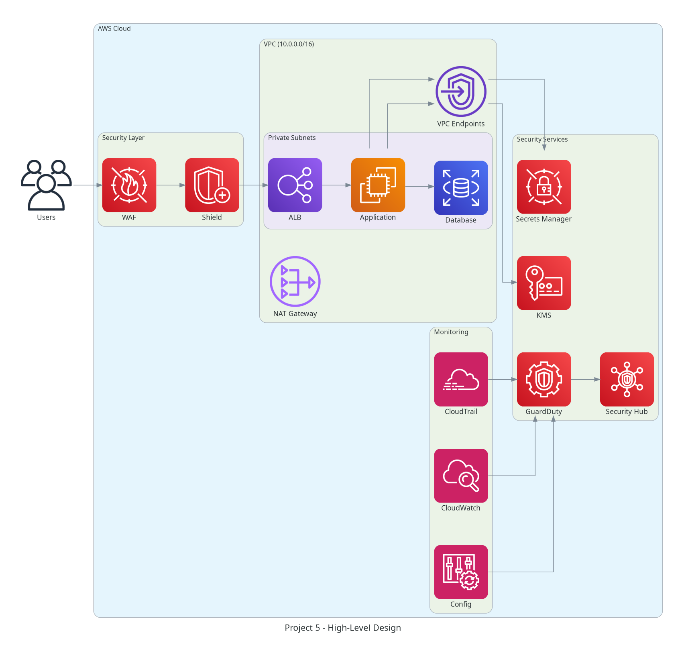
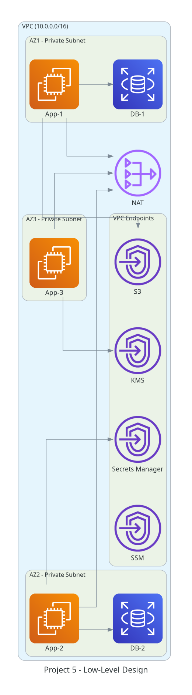
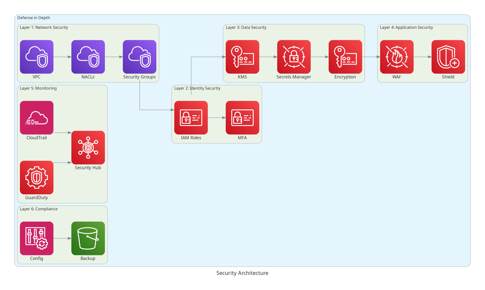
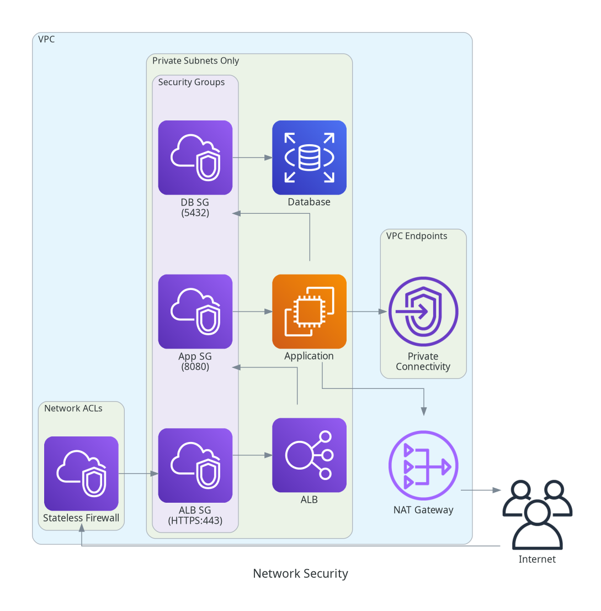
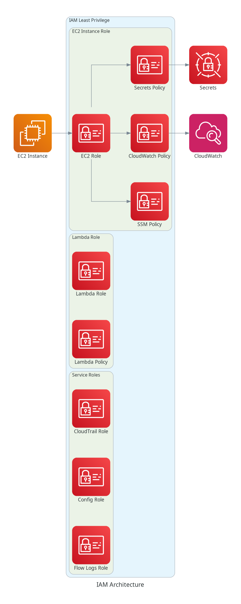
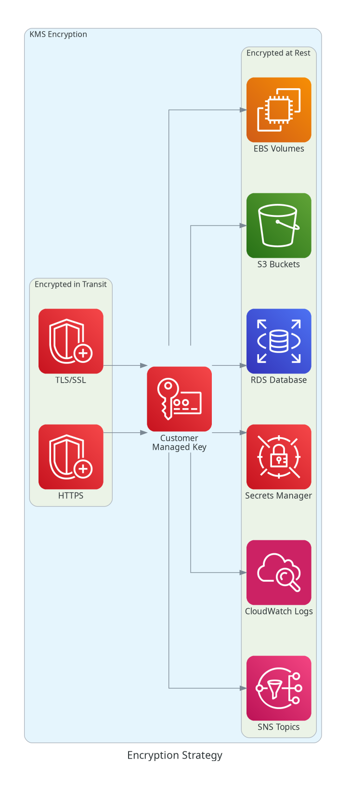
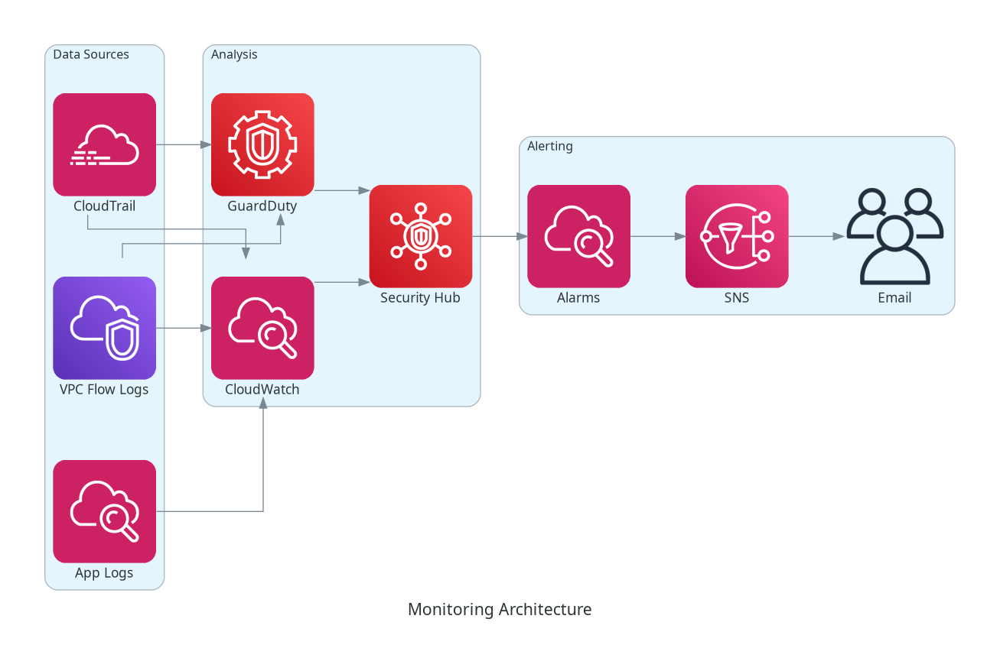
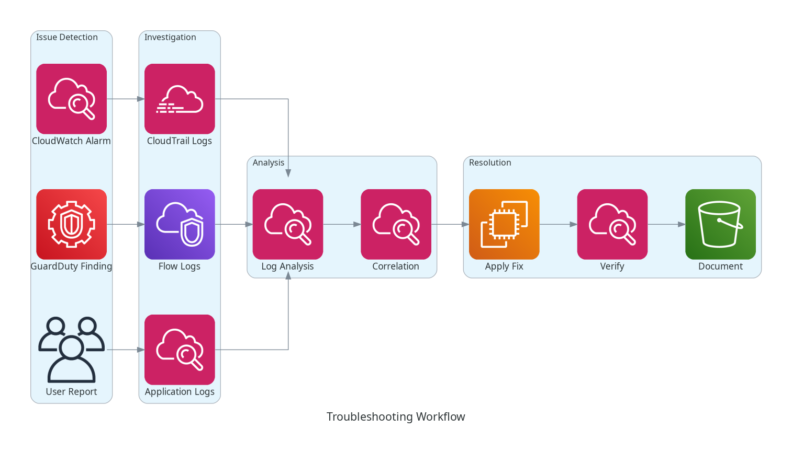

# Project 5: Enterprise-Grade Secure Infrastructure

## 📋 Overview

This project implements a comprehensive, enterprise-grade secure infrastructure on AWS using Terraform, demonstrating production-ready security practices, secrets management, encryption, compliance validation, comprehensive testing, and troubleshooting procedures. It showcases defense-in-depth security architecture with multiple layers of protection.

**Difficulty**: Advanced  
**Duration**: 12-15 hours  
**Terraform Topics**: Testing, Troubleshooting, Security  
**Exam Domains**: Terraform Basics (30%), Security (40%), Troubleshooting (30%)

## 🎯 Learning Objectives

- ✅ Implement secrets management with AWS Secrets Manager
- ✅ Configure KMS encryption for all data at rest
- ✅ Design secure VPC with defense in depth
- ✅ Implement IAM least privilege access
- ✅ Configure CloudTrail and CloudWatch logging
- ✅ Implement compliance validation (CIS benchmarks)
- ✅ Write comprehensive Terraform tests
- ✅ Implement security scanning (tfsec, checkov, terrascan)
- ✅ Create troubleshooting procedures
- ✅ Document security architecture

## 📊 ARCHITECTURE DIAGRAMS

### High-Level Design (HLD)


### Low-Level Design (LLD)


### Security Architecture


### Network Security


### IAM Architecture


### Encryption Strategy


### Secrets Management


### Compliance Framework


### Monitoring Architecture


### Troubleshooting Workflow


---

## 🏗️ Architecture Summary

### Security Layers

#### 1. Network Security Layer
- **VPC**: Isolated network with private subnets only
- **Subnets**: Multi-AZ private subnets (no public subnets)
- **NAT Gateway**: Outbound internet access for private subnets
- **VPC Endpoints**: Private connectivity to AWS services (S3, DynamoDB, Secrets Manager, KMS, CloudWatch)
- **Network ACLs**: Stateless firewall rules
- **Security Groups**: Stateful firewall rules (least privilege)
- **VPC Flow Logs**: Network traffic logging

#### 2. Identity and Access Management
- **IAM Roles**: Service-specific roles with least privilege
- **IAM Policies**: Fine-grained permissions
- **Instance Profiles**: EC2 instance IAM roles
- **MFA**: Multi-factor authentication enforcement
- **Password Policy**: Strong password requirements
- **Service Control Policies**: Organization-level guardrails

#### 3. Data Security Layer
- **KMS**: Customer-managed keys for encryption
- **Encryption at Rest**: All data encrypted (EBS, S3, RDS, Secrets Manager)
- **Encryption in Transit**: TLS/SSL for all communications
- **Secrets Manager**: Centralized secrets storage with rotation
- **Parameter Store**: Configuration management
- **S3 Bucket Encryption**: Default encryption enabled
- **RDS Encryption**: Database encryption with KMS

#### 4. Application Security Layer
- **WAF**: Web Application Firewall rules
- **Shield**: DDoS protection
- **Certificate Manager**: SSL/TLS certificates
- **Systems Manager Session Manager**: Secure instance access (no SSH keys)
- **Secrets Rotation**: Automatic secret rotation
- **Least Privilege**: Minimal permissions for all resources

#### 5. Monitoring and Detection
- **CloudTrail**: API call logging and audit trail
- **CloudWatch Logs**: Centralized logging
- **CloudWatch Alarms**: Proactive alerting
- **GuardDuty**: Threat detection
- **Security Hub**: Centralized security findings
- **Config**: Resource compliance monitoring
- **VPC Flow Logs**: Network traffic analysis

#### 6. Compliance and Governance
- **AWS Config Rules**: CIS benchmark compliance
- **Config Conformance Packs**: Automated compliance checking
- **Backup**: Automated backup policies
- **Tagging**: Mandatory resource tagging
- **Cost Allocation**: Cost tracking and optimization

## 📋 Prerequisites

- Terraform >= 1.13.0
- AWS CLI configured with appropriate credentials
- Python 3.8+ (for testing and diagram generation)
- tfsec, checkov, terrascan (for security scanning)
- infracost (for cost estimation)

## 🚀 Quick Start

### 1. Initialize Terraform

```bash
cd terraform
terraform init
```

### 2. Run Security Scans

```bash
make security-scan
```

### 3. Run Tests

```bash
make test
```

### 4. Plan Infrastructure

```bash
terraform plan -out=tfplan
```

### 5. Apply Infrastructure

```bash
terraform apply tfplan
```

## 🔐 Security Components

### Secrets Management

**AWS Secrets Manager**:
- Database credentials with automatic rotation
- API keys and tokens
- Encryption keys
- Application secrets

**Usage**:
```hcl
data "aws_secretsmanager_secret_version" "db_password" {
  secret_id = aws_secretsmanager_secret.db_password.id
}

resource "aws_db_instance" "main" {
  password = jsondecode(data.aws_secretsmanager_secret_version.db_password.secret_string)["password"]
}
```

### Encryption Strategy

**KMS Keys**:
- Separate keys for different services (EBS, S3, RDS, Secrets Manager)
- Key rotation enabled
- Key policies with least privilege
- CloudTrail logging of key usage

**Encrypted Resources**:
- EBS volumes (root and data)
- S3 buckets (default encryption)
- RDS databases
- Secrets Manager secrets
- CloudWatch Logs
- SNS topics
- SQS queues

### Network Security

**VPC Configuration**:
- CIDR: 10.0.0.0/16
- Private subnets: 10.0.1.0/24, 10.0.2.0/24, 10.0.3.0/24
- No public subnets (defense in depth)
- NAT Gateway for outbound internet
- VPC endpoints for AWS services

**Security Groups**:
- Application tier: Port 8080 from ALB only
- Database tier: Port 5432 from application tier only
- No direct internet access
- Egress restricted to required destinations

**Network ACLs**:
- Deny all by default
- Allow only required traffic
- Stateless rules for defense in depth

### IAM Security

**Least Privilege Principles**:
- Service-specific roles
- Fine-grained policies
- No wildcard permissions
- Condition-based access
- MFA enforcement

**Example IAM Policy**:
```hcl
resource "aws_iam_role_policy" "app" {
  name = "app-policy"
  role = aws_iam_role.app.id

  policy = jsonencode({
    Version = "2012-10-17"
    Statement = [
      {
        Effect = "Allow"
        Action = [
          "secretsmanager:GetSecretValue"
        ]
        Resource = aws_secretsmanager_secret.app.arn
      }
    ]
  })
}
```

## 🧪 Testing Strategy

### Test Types

#### 1. Format Tests
```bash
terraform fmt -check -recursive
```

#### 2. Validation Tests
```bash
terraform validate
```

#### 3. Security Tests
```bash
# tfsec
tfsec .

# checkov
checkov -d .

# terrascan
terrascan scan -t aws
```

#### 4. Compliance Tests
```bash
# AWS Config rules validation
make compliance-check
```

#### 5. Cost Tests
```bash
infracost breakdown --path .
```

#### 6. Integration Tests
```bash
# Terraform test framework
terraform test
```

### Test Files

- `tests/unit/` - Unit tests for individual resources
- `tests/integration/` - Integration tests for multi-resource scenarios
- `tests/security/` - Security validation tests
- `tests/compliance/` - Compliance validation tests

## 🔍 Troubleshooting

### Common Issues

#### 1. State Lock Conflicts
**Symptom**: "Error acquiring the state lock"

**Solution**:
```bash
# Check lock status
terraform force-unlock <LOCK_ID>

# Or use DynamoDB console to manually remove lock
```

#### 2. Resource Dependency Cycles
**Symptom**: "Cycle: resource depends on itself"

**Solution**:
- Review resource dependencies
- Use `depends_on` explicitly
- Break circular dependencies

#### 3. Provider Authentication Issues
**Symptom**: "Error: error configuring Terraform AWS Provider"

**Solution**:
```bash
# Verify AWS credentials
aws sts get-caller-identity

# Check environment variables
echo $AWS_PROFILE
echo $AWS_REGION
```

#### 4. Resource Creation Failures
**Symptom**: "Error creating resource"

**Solution**:
- Check CloudTrail for detailed error messages
- Verify IAM permissions
- Check service quotas
- Review resource configuration

#### 5. State Drift
**Symptom**: "Terraform detected changes outside of Terraform"

**Solution**:
```bash
# Detect drift
terraform plan -detailed-exitcode

# Refresh state
terraform refresh

# Import changes
terraform import <resource> <id>
```

## 📊 Makefile Targets

```bash
make help              # Show all available targets
make init              # Initialize Terraform
make plan              # Create execution plan
make apply             # Apply infrastructure changes
make destroy           # Destroy infrastructure
make validate          # Validate Terraform configuration
make fmt               # Format Terraform files
make security-scan     # Run security scans (tfsec, checkov, terrascan)
make test              # Run all tests
make compliance-check  # Check compliance
make cost-estimate     # Estimate infrastructure cost
make diagrams          # Generate architecture diagrams
make docs              # Generate documentation
make clean             # Clean temporary files
```

## 📁 Project Structure

```
Project-5-Enterprise-Secure-Infrastructure/
├── README.md
├── Makefile
├── .gitignore
├── .terraform-version
├── terraform/
│   ├── main.tf
│   ├── variables.tf
│   ├── outputs.tf
│   ├── versions.tf
│   ├── backend.tf
│   ├── modules/
│   │   ├── vpc/
│   │   ├── security/
│   │   ├── compute/
│   │   ├── secrets/
│   │   ├── monitoring/
│   │   └── compliance/
│   └── environments/
│       ├── dev/
│       ├── staging/
│       └── prod/
├── tests/
│   ├── unit/
│   ├── integration/
│   ├── security/
│   └── compliance/
├── security-scanning/
│   ├── tfsec.yml
│   ├── checkov.yml
│   └── terrascan.yml
├── scripts/
│   ├── setup.sh
│   ├── security-scan.sh
│   ├── compliance-check.sh
│   └── troubleshoot.sh
├── docs/
│   ├── security-architecture.md
│   ├── compliance-guide.md
│   ├── troubleshooting-guide.md
│   └── testing-guide.md
└── diagrams/
    ├── generate_diagrams.py
    └── requirements.txt
```

## 🎓 Key Concepts

### Terraform Security Best Practices
- Never commit secrets to version control
- Use Secrets Manager or Parameter Store
- Enable encryption for all data
- Implement least privilege IAM
- Use remote state with encryption
- Enable state locking
- Use workspaces for environments
- Implement resource tagging
- Use lifecycle rules
- Enable logging and monitoring

### Defense in Depth
- Multiple layers of security
- Network isolation
- Encryption at rest and in transit
- Identity and access management
- Monitoring and detection
- Compliance and governance

## 📚 Additional Resources

- [AWS Security Best Practices](https://aws.amazon.com/security/best-practices/)
- [CIS AWS Foundations Benchmark](https://www.cisecurity.org/benchmark/amazon_web_services)
- [Terraform Security Best Practices](https://www.terraform.io/docs/cloud/guides/recommended-practices/index.html)
- [tfsec Documentation](https://aquasecurity.github.io/tfsec/)
- [Checkov Documentation](https://www.checkov.io/)

## 📝 Notes

- This project implements production-grade security practices
- All resources are encrypted by default
- No public subnets or direct internet access
- Systems Manager Session Manager for secure access
- Comprehensive logging and monitoring
- Automated compliance checking
- Cost-optimized architecture

## ✅ Success Criteria

- [ ] All security scans pass (tfsec, checkov, terrascan)
- [ ] All tests pass (unit, integration, security, compliance)
- [ ] No secrets in code or state files
- [ ] All data encrypted at rest and in transit
- [ ] IAM follows least privilege
- [ ] CloudTrail and CloudWatch logging enabled
- [ ] GuardDuty and Security Hub enabled
- [ ] Config rules for CIS compliance
- [ ] VPC Flow Logs enabled
- [ ] No public subnets or internet gateways
- [ ] Systems Manager Session Manager configured
- [ ] Automated backup policies
- [ ] Cost within budget
- [ ] Documentation complete

---

**Project Status**: In Progress  
**Version**: 1.0  
**Last Updated**: October 27, 2025  
**Author**: RouteCloud Training Team

